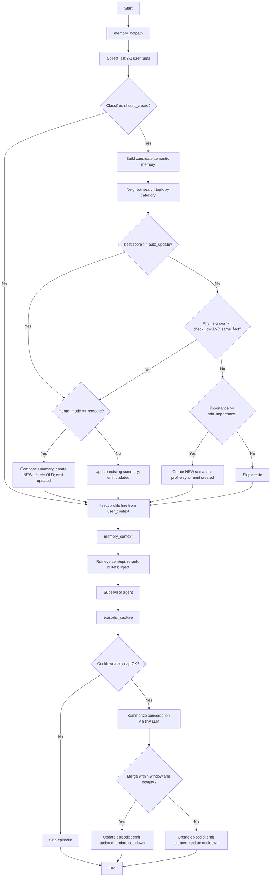

## Supervisor Memory Subsystem

This folder contains the memory pipeline for the supervisor graph, split into focused modules.

### Components
- Hot path (semantic creation + dedup/merge): [`hotpath.py`](./hotpath.py)
  - `memory_hotpath`
  - `_same_fact_classify`
  - `_compose_summaries`
- Context retrieval and injection: [`context.py`](./context.py)
  - `memory_context`
- Episodic capture: [`episodic.py`](./episodic.py)
  - `episodic_capture`
- Background profile sync: [`profile_sync.py`](./profile_sync.py)
  - `_profile_sync_from_memory`
- Shared helpers: [`utils.py`](./utils.py)
  - `_utc_now_iso`, `_parse_iso`, `_build_profile_line`

### End‑to‑end flow
1) `memory_hotpath` (before supervisor routing)
   - Collects the last 2–3 user turns and asks a tiny LLM whether to create a semantic memory.
   - The classifier prompt encodes explicit “DO NOT create” rules (e.g., meta/capability questions).
   - If no creation, injects a compact profile line built by `_build_profile_line` to ground the turn and exits.

2) If creation is recommended
   - Build a candidate semantic memory (category, summary, importance).
   - Search S3 Vectors for neighbors in the same namespace and category.
   - Dedup/merge strategy (top‑N):
     - For neighbors with score ≥ `MEMORY_MERGE_CHECK_LOW`, run `_same_fact_classify` across the top K.
     - Early‑exit on the first match.
     - If no match, create a new memory as‑is.

3) Merge mode
   - Mode: `recreate` (default in code). When a match is found and merge is needed:
     - Compose an enriched summary with `_compose_summaries` (LLM, with deterministic fallbacks).
     - Write a NEW memory with the composed summary and delete the old memory.
   - If `merge_mode` is not `recreate`, `do_update` performs an in‑place update (kept for flexibility).

4) Background sync
   - On create/update, `_profile_sync_from_memory` proposes structured updates to `UserContext` (e.g., tone, city, goals) and persists them.

5) `memory_context` (retrieval before supervisor reasoning)
   - Retrieves top semantic and episodic memories related to the current user text.
   - Reranks with a hybrid score (similarity + importance + recency + pinned).
   - Injects a human‑readable bullet list and a “Now: …” line into the turn as `HumanMessage`.

6) `episodic_capture` (after the supervisor turn)
   - Applies cooldowns and daily caps using the session store.
   - Summarizes the recent conversation to an episodic memory with a date bucket label.
   - Merges into recent episodic memories if within a time window and above novelty threshold.

### Key decisions and checks
- Classifier gate (in `memory_hotpath`):
  - Only creates semantic memories for stable user facts/preferences/goals.
  - Hard negatives: time‑bound events, one‑off actions, capability/meta questions.

- Top‑N dedup (`memory_hotpath`):
  - Env knob `MEMORY_MERGE_TOPK` controls the number of neighbors to check.
  - `MEMORY_MERGE_CHECK_LOW` controls the similarity threshold to LLM‑check.

- Merge behavior:
  - `recreate` mode composes to a new record and deletes the old one.
  - In‑place update mode simply refreshes summary/last_accessed.

- Episodic control (`episodic_capture`):
  - `EPISODIC_COOLDOWN_TURNS`, `EPISODIC_COOLDOWN_MINUTES`, `EPISODIC_MAX_PER_DAY`.
  - Merge window: `EPISODIC_MERGE_WINDOW_HOURS`; novelty: `EPISODIC_NOVELTY_MIN`.

### User context injection and usage
- Profile grounding: on every turn, `memory_hotpath` injects a compact profile line built from the persisted `user_context` via [`_build_profile_line`](./utils.py) — both when a semantic memory is created and when it is not. This is a single `HumanMessage` that subtly primes tone and personalization without exposing storage details.
- Retrieval turn context: `memory_context` builds the "Now: …" bullet using the user's timezone from `user_context.locale_info.time_zone` (falling back to UTC). It then injects both memory bullets and the time line as a `HumanMessage` for the supervisor.
- Background updates: `_profile_sync_from_memory` proposes structured updates (e.g., tone, language, city, goals) that mutate the `user_context` in Postgres, which in turn changes future injected profile lines and timezone handling.

### Environment knobs
- Semantic merge/dedup
  - `MEMORY_MERGE_TOPK` (default 5)
  - `MEMORY_MERGE_CHECK_LOW` (e.g., 0.60)
  - `MEMORY_MERGE_AUTO_UPDATE` (e.g., 0.85)
  - `MEMORY_MERGE_MODE` (`recreate`|`update`; default used in code is `recreate`)
  - `MEMORY_SEMANTIC_MIN_IMPORTANCE` (drop low‑importance creations; updates still allowed)

- Context retrieval
  - `MEMORY_CONTEXT_TOPK`, `MEMORY_CONTEXT_TOPN`
  - `MEMORY_RERANK_WEIGHTS` (sim, imp, recency, pinned)

- Episodic
  - `EPISODIC_WINDOW_N`, `EPISODIC_COOLDOWN_TURNS`, `EPISODIC_COOLDOWN_MINUTES`,
    `EPISODIC_MAX_PER_DAY`, `EPISODIC_MERGE_WINDOW_HOURS`, `EPISODIC_NOVELTY_MIN`

### Integration
- The supervisor graph wires these nodes in `app/agents/supervisor/agent.py`:
  - `memory_hotpath` → `memory_context` → supervisor model → `episodic_capture`.

For implementation details, open the linked modules and look for the functions listed above.

### Flow diagram

