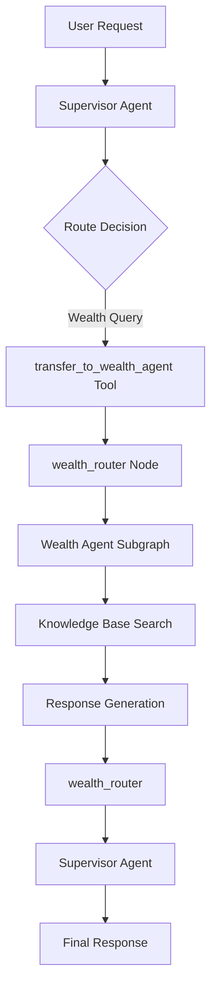

# Wealth Agent Architecture Guide

## Overview

The Wealth Agent is a specialized LangGraph-based agent designed to provide financial education, consumer protection guidance, and wealth management advice. It operates within a multi-agent supervisor system and demonstrates the current architectural patterns for agent integration.

## Table of Contents

1. [Architecture Overview](#architecture-overview)
2. [Component Structure](#component-structure)
3. [Supervisor Integration](#supervisor-integration)
4. [Agent Flow](#agent-flow)
5. [Key Patterns](#key-patterns)
6. [Migration Guidelines](#migration-guidelines)
7. [Troubleshooting](#troubleshooting)

## Architecture Overview

### High-Level Flow



### Component Hierarchy

```
supervisor/
├── agent.py                    # Main supervisor graph compilation
├── workers.py                  # Worker node implementations
├── handoff.py                  # Cross-agent communication tools
└── wealth_agent/
    ├── agent.py                # Wealth agent class and compilation
    ├── subgraph.py             # LangGraph subgraph definition
    ├── prompts.py              # System prompts and instructions
    ├── tools.py                # Agent-specific tools (search_kb)
    ├── handoff.py              # Wealth agent handoff logic
    └── helpers.py              # Utility functions
```

## Component Structure

### 1. Agent Class (`agent.py`)

**Purpose**: Main wealth agent class and graph compilation entry point.

**Key Components**:
- `WealthAgent` class: Encapsulates agent configuration and behavior
- `compile_wealth_agent_graph()`: Creates the complete agent subgraph
- `wealth_agent()`: Worker function for supervisor integration

**Critical Patterns**:
```python
class WealthAgent:
    def __init__(self):
        # Initialize with Bedrock models
        self.llm = ChatBedrockConverse(
            model_id=config.WEALTH_AGENT_MODEL_ID,
            region_name=config.WEALTH_AGENT_MODEL_REGION,
            temperature=config.WEALTH_AGENT_TEMPERATURE,
        )
    
    def _create_agent_with_tools(self):
        # Create subgraph with tools and prompts
        tools = [search_kb]
        prompt_builder = lambda: build_wealth_system_prompt()
        return create_wealth_subgraph(self.llm, tools, prompt_builder)
```

### 2. Subgraph Definition (`subgraph.py`)

**Purpose**: Defines the LangGraph workflow for the wealth agent.

**Architecture**:
```
START → agent_node → {tools|supervisor} → handoff_to_supervisor → END
          ↑              ↓
          └── tool_node ←─┘
```

**Key Nodes**:
- **`agent_node`**: Main reasoning and tool calling
- **`tool_node`**: Tool execution (search_kb)
- **`supervisor_node`**: Response formatting
- **`handoff_to_supervisor_node`**: Return control to supervisor

**Critical Features**:
- Tool call limiting (max 5 per conversation)
- Response cleaning for OpenAI model quirks
- Reasoning content filtering
- Fresh thread ID for each supervisor task

### 3. Response Cleaning Logic

**Purpose**: Handle problematic model behaviors while preserving functionality.

**Key Logic**:
```python
def _clean_response(response, tool_call_count: int, state: dict, logger):
    # 1. Handle tool calls with limits
    if hasattr(response, "tool_calls") and response.tool_calls:
        if total_calls > 5:
            # Truncate to 5 calls instead of blocking
            return limited_tool_calls
    
    # 2. Handle final responses
    if has_reasoning_content:
        # Check if tools were executed (ToolMessage exists)
        has_tool_results = any(msg.__class__.__name__ == "ToolMessage" 
                              for msg in state.get("messages", []))
        
        if not has_tool_results:
            # Force tool usage first
            return "I need to search my knowledge base..."
        else:
            # Clean reasoning content, allow response
            return cleaned_content
```

### 4. Supervisor Integration (`workers.py`)

**Purpose**: Bridge between supervisor and wealth agent subgraph.

**Key Pattern**:
```python
async def wealth_agent(state: MessagesState, config: RunnableConfig):
    # Get fresh wealth agent graph (no caching for supervisor tasks)
    wealth_graph = get_wealth_agent_graph()
    
    # Create unique thread ID to prevent state pollution
    unique_thread_id = f"wealth-task-{uuid.uuid4()}"
    
    # Execute with clean state
    result = await wealth_graph.ainvoke(state, config=wealth_config)
    
    # Format response for supervisor
    return formatted_supervisor_response
```

## Supervisor Integration

### 1. Handoff Tool Creation

**Location**: `supervisor/agent.py`

```python
assign_to_wealth_agent_with_description = create_task_description_handoff_tool(
    agent_name="wealth_agent",
    description="Assign task to a wealth agent for financial assistance and education...",
    destination_agent_name="wealth_router",  # Routes to workers.py
    tool_name="transfer_to_wealth_agent",
)
```

### 2. Graph Node Setup

**Supervisor Graph Nodes**:
```python
# In supervisor/agent.py
builder.add_node("wealth_router", wealth_router)  # From workers.py

# Graph edges
builder.add_edge("wealth_router", "supervisor")
```

### 3. Task Delegation Flow

**Step 1**: Supervisor analyzes user query
**Step 2**: Supervisor calls `transfer_to_wealth_agent` tool
**Step 3**: Tool creates delegation message with task description
**Step 4**: Routes to `wealth_router` node in workers.py
**Step 5**: `wealth_router` creates fresh wealth agent graph
**Step 6**: Wealth agent executes with unique thread ID
**Step 7**: Results formatted and returned to supervisor

## Agent Flow

### 1. Initial Request Processing

```python
# Input from supervisor
{
    "messages": [
        {
            "content": "Task: Provide overview of Chile financial laws...",
            "type": "human",
            "name": "supervisor_delegator"
        }
    ]
}
```

### 2. Agent Execution Phases

**Phase 1: Analysis** (`agent_node`)
- Receive delegated task
- Count existing tool calls (limit enforcement)
- Generate system prompt dynamically
- Call LLM with tools bound

**Phase 2: Knowledge Gathering** (`tool_node`)
- Execute search_kb tool calls (up to 5)
- Retrieve relevant financial information
- Process search results

**Phase 3: Response Generation** (`agent_node` again)
- Analyze gathered information
- Generate comprehensive response
- Clean reasoning content
- Validate response quality

**Phase 4: Handoff** (`supervisor_node` → `handoff_to_supervisor_node`)
- Format analysis results
- Create handoff message
- Return control to supervisor

### 3. Output Format

```python
# Final output to supervisor
{
    "messages": [
        {
            "role": "assistant",
            "content": "===== WEALTH AGENT TASK COMPLETED =====\n\nTask Analyzed: ...\n\nAnalysis Results:\n[Comprehensive financial information]\n\nSTATUS: WEALTH AGENT ANALYSIS COMPLETE",
            "name": "wealth_agent"
        }
    ]
}
```

## Key Patterns

### 1. State Isolation

**Problem**: Shared conversation state between different supervisor tasks
**Solution**: Unique thread IDs per task

```python
# In workers.py
unique_thread_id = f"wealth-task-{uuid.uuid4()}"
wealth_config = {
    "configurable": {
        "thread_id": unique_thread_id,
        "user_id": user_id
    }
}
```

### 2. Tool Call Management

**Problem**: OpenAI model making excessive tool calls (7+ calls)
**Solution**: Smart truncation instead of blocking

```python
if total_calls > 5:
    if tool_call_count > 0:
        # Allow completion with existing data
        return completion_response
    else:
        # Truncate to 5 calls
        limited_tool_calls = response.tool_calls[:5]
        return limited_response
```

### 3. Response Content Cleaning

**Problem**: OpenAI model exposing reasoning content to users
**Solution**: Content type filtering

```python
# Remove reasoning blocks while preserving functionality
cleaned_content = []
for block in response.content:
    if isinstance(block, dict) and block.get("type") == "reasoning_content":
        continue  # Skip reasoning content
    else:
        cleaned_content.append(block)
```

### 4. Tool Execution Detection

**Problem**: Determining if tools have been used in conversation
**Solution**: Check for ToolMessage instances

```python
has_tool_results = any(
    msg.__class__.__name__ == "ToolMessage"
    for msg in state.get("messages", [])
)
```

### 5. Fresh Graph Creation

**Problem**: Cached agents accumulating conversation history
**Solution**: Fresh compilation for supervisor tasks

```python
# No caching for supervisor delegations
def get_wealth_agent_graph():
    return compile_wealth_agent_graph()  # Fresh instance each time
```

## Migration Guidelines

### For Goal Agent Migration

#### 1. Directory Structure
Create similar structure:
```
goal_agent/
├── agent.py           # GoalAgent class + compilation
├── subgraph.py        # LangGraph definition  
├── prompts.py         # Goal-specific prompts
├── tools.py           # Goal-specific tools
├── handoff.py         # Handoff logic
└── helpers.py         # Utilities
```

#### 2. Agent Class Pattern
```python
class GoalAgent:
    def __init__(self):
        self.llm = ChatBedrockConverse(...)
    
    def _create_agent_with_tools(self):
        tools = [goal_specific_tools]
        prompt_builder = lambda: build_goal_system_prompt()
        return create_goal_subgraph(self.llm, tools, prompt_builder)

def compile_goal_agent_graph():
    goal_agent_instance = GoalAgent()
    return goal_agent_instance._create_agent_with_tools()
```

#### 3. Subgraph Structure
```python
def create_goal_subgraph(llm, tools, prompt_builder):
    workflow = StateGraph(MessagesState)
    
    # Same node pattern as wealth agent
    workflow.add_node("agent", agent_node)
    workflow.add_node("tools", tool_node)
    workflow.add_node("supervisor", supervisor_node)
    workflow.add_node("handoff_to_supervisor", handoff_to_supervisor_node)
    
    # Same edge pattern
    workflow.add_edge(START, "agent")
    workflow.add_conditional_edges("agent", should_continue)
    # ... rest of edges
    
    return workflow.compile(checkpointer=None)
```

#### 4. Workers Integration
```python
# In workers.py
async def goal_agent(state: MessagesState, config: RunnableConfig):
    goal_graph = get_goal_agent_graph()  # Fresh instance
    
    unique_thread_id = f"goal-task-{uuid.uuid4()}"
    goal_config = {
        "configurable": {
            "thread_id": unique_thread_id,
            "user_id": user_id
        }
    }
    
    result = await goal_graph.ainvoke(state, config=goal_config)
    return formatted_response
```

#### 5. Supervisor Registration
```python
# In supervisor/agent.py
assign_to_goal_agent_with_description = create_task_description_handoff_tool(
    agent_name="goal_agent",
    description="Assign task to goal agent for financial objectives...",
    destination_agent_name="goal_router",  # If using router pattern
    tool_name="transfer_to_goal_agent",
)
```

### Migration Checklist

- [ ] Create goal_agent directory structure
- [ ] Implement GoalAgent class with LLM configuration
- [ ] Define goal-specific tools and prompts
- [ ] Create subgraph with same node/edge pattern
- [ ] Implement response cleaning for model quirks
- [ ] Add workers.py integration with unique thread IDs
- [ ] Register handoff tool in supervisor
- [ ] Update supervisor graph nodes and edges
- [ ] Test delegation and response flow
- [ ] Verify state isolation between tasks

## Troubleshooting

### Common Issues

#### 1. "Tool call limit reached immediately"
**Cause**: Shared conversation state between tasks
**Solution**: Verify unique thread IDs in workers.py

#### 2. "Response with reasoning content blocked"
**Cause**: Tool execution detection logic
**Solution**: Check ToolMessage detection in `_clean_response`

#### 3. "Agent not making tool calls"
**Cause**: Tool call limits or prompt issues
**Solution**: Review tool call counting and system prompts

#### 4. "Generic responses instead of detailed content"
**Cause**: Response cleaning too aggressive
**Solution**: Adjust cleaning logic to preserve content after tool execution

### Debug Logging

Enable debug logging in agent_node:
```python
logger.info(f"Agent processing with {tool_call_count} previous tool calls")
logger.info(f"Tool execution results: {has_tool_results}")
logger.info(f"Response cleaning decision: {cleaning_action}")
```

### Testing Flow

1. **Unit Test**: Individual components (tools, prompts)
2. **Integration Test**: Subgraph execution
3. **Supervisor Test**: Full delegation flow
4. **State Test**: Multiple tasks in sequence
5. **Edge Cases**: Tool limits, error handling

## Best Practices

### 1. State Management
- Always use unique thread IDs for supervisor tasks
- Avoid caching agent instances for supervisor delegations
- Clean state between different user requests

### 2. Tool Design
- Limit tool calls per conversation (5 max recommended)
- Design tools to be atomic and focused
- Include proper error handling and fallbacks

### 3. Response Quality
- Clean model-specific artifacts (reasoning content)
- Preserve user-facing content quality
- Format responses consistently for supervisor

### 4. Error Handling
- Graceful degradation when tools fail
- Clear error messages for debugging
- Fallback responses for edge cases

### 5. Performance
- Fresh graphs for supervisor tasks (avoid state pollution)
- Efficient tool execution
- Proper resource cleanup

---

This architecture provides a robust, scalable pattern for specialized agents within the supervisor system. The wealth agent serves as a reference implementation for future agent migrations and development.