# Knowledge Base Module

The Knowledge Base module powers Verde AI's financial advisory platform by transforming web content into searchable vector embeddings. It leverages AWS Bedrock, S3 Vector Store, and advanced crawling strategies to ensure efficient and accurate knowledge synchronization.

## Core Features

- **Adaptive Crawling**: Supports recursive, sitemap, single-page, and PDF strategies
- **Semantic Search**: Uses AWS Bedrock embeddings for high-quality vector storage and retrieval  
- **Change Detection**: Employs SHA-256 hashing to process only updated content
- **Error Resilience**: Implements fallback mechanisms for JavaScript-heavy or corrupted content
- **Batch Processing**: Optimized for large-scale document handling

## Synchronization Flow

```mermaid
flowchart TD
    Start([🚀 Start Sync]) --> GetExternal[🌐 Fetch External Sources<br/>from FOS API]
    GetExternal --> GetLocal[📚 Load Local Sources<br/>from sources.json]
    GetLocal --> Compare[⚖️ Compare Sources]
    
    Compare --> Process[🔄 Process All Sources]
    
    Process --> Crawl[🕷️ Crawl Content]
    Crawl --> Chunk[✂️ Split into Chunks]
    Chunk --> HashCheck{Content Changed?}
    
    HashCheck -->|No Changes| Skip[⏭️ Skip KB Update]
    HashCheck -->|Changed| Embed[🧠 Generate Embeddings]
    Embed --> Store[☁️ Store in Vector DB]
    Store --> UpdateMeta[📝 Update Metadata]
    
    Skip --> End([✅ Sync Complete])
    UpdateMeta --> End
```



## Architecture

The knowledge base is built around **six core services**:

- **KnowledgeService**: Central orchestrator for document processing and vector operations
- **CrawlerService**: Multi-strategy web content extraction with fallback mechanisms  
- **DocumentService**: Text chunking, embedding generation, and content hashing
- **S3VectorStoreService**: AWS S3 Vector Store integration for storage and retrieval
- **SourceRepository**: JSON-based source configuration management
- **KnowledgeBaseSyncService**: External source synchronization and change detection

## API Endpoints

- **Search Knowledge Base**: `POST /knowledge/search`
- **Get Sources**: `GET /knowledge/sources`
- **Trigger Sync**: `POST /cron/knowledge-base`

## Configuration

- **Environment Variables**:
  - `EMBEDDINGS_MODEL_ID`: AWS Bedrock embedding model
  - `S3V_BUCKET`: S3 Vector Store bucket name
  - `MAX_CHUNKS_PER_SOURCE`: Limit chunks per source
  - `CRAWL_TIMEOUT`: Crawl timeout in seconds

- **Source Configuration**: Managed via `sources.json` with options for path filtering, crawl limits, and metadata enrichment

## Document Lifecycle

1. **Content Extraction**: Adaptive crawling with validation and metadata enrichment
2. **Text Chunking**: Configurable chunk sizes with context preservation
3. **Embedding Generation**: High-quality embeddings via AWS Bedrock
4. **Vector Storage**: Semantic indexing in S3 with metadata for attribution

## Module Structure

```
app/knowledge/
├── service.py              # Core KnowledgeService 
├── sync_service.py         # KnowledgeBaseSyncService
├── document_service.py     # Text processing & embeddings
├── crawler/                # Web crawling strategies
├── vector_store/           # S3 Vector Store integration  
├── sources/                # Source configuration management
└── management/             # CLI sync utilities
```