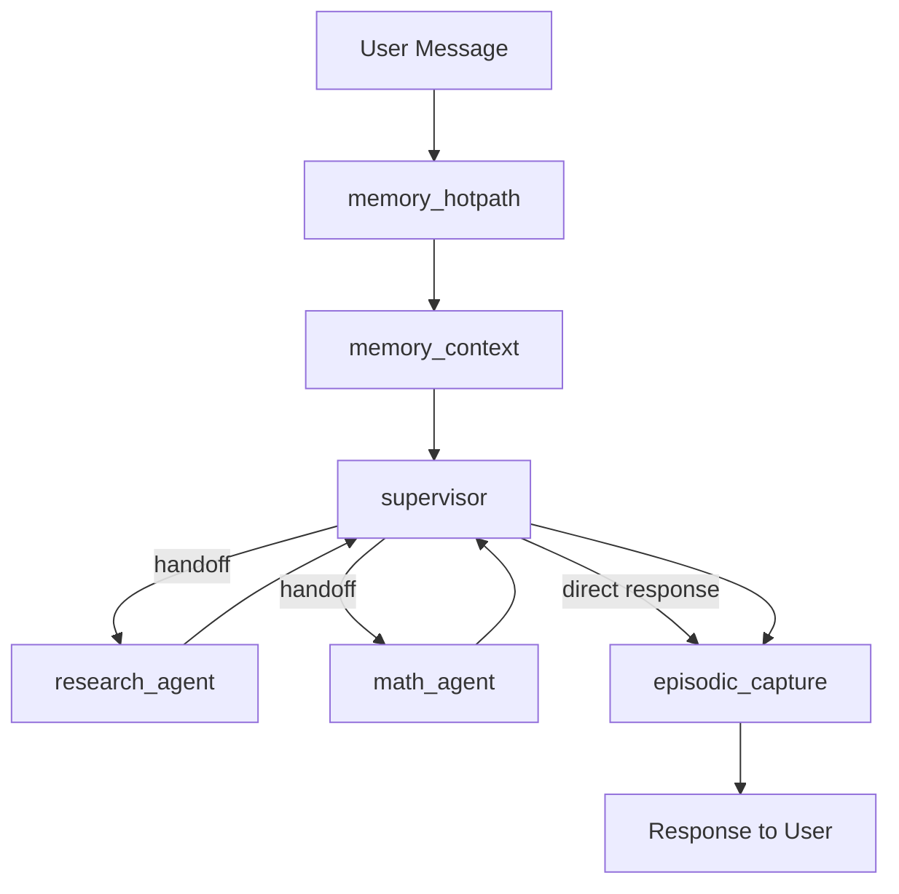

# 🤖 Guía de Integración de Nuevos Agentes al Supervisor

Esta guía explica paso a paso cómo integrar un nuevo agente especializado al grafo del supervisor de Vera, incluyendo herramientas, prompts y configuración completa.

## 📋 Tabla de Contenidos

1. [Arquitectura del Sistema](#arquitectura-del-sistema)
2. [Tipos de Agentes](#tipos-de-agentes)
3. [Creación de un Nuevo Agente](#creación-de-un-nuevo-agente)
4. [Integración al Supervisor](#integración-al-supervisor)
5. [Testing y Validación](#testing-y-validación)
6. [Mejores Prácticas](#mejores-prácticas)
7. [Troubleshooting](#troubleshooting)

---

## 🏗️ Arquitectura del Sistema

### Flujo Actual del Supervisor



### Componentes Clave

- **Supervisor**: Orquestador principal que decide routing
- **Workers**: Agentes especializados (research_agent, math_agent)
- **Tools**: Herramientas disponibles para el supervisor
- **Handoff**: Sistema de delegación entre agentes
- **Memory**: Sistema de contexto y captura episódica

---

## 🎯 Tipos de Agentes

### 1. **Worker Agents** (Recomendado)
- Funciones simples y especializadas
- Se ejecutan en el mismo grafo
- Retornan directamente al supervisor
- **Ejemplo**: `research_agent`, `math_agent`

### 2. **Sub-Graph Agents** (Avanzado)
- Grafos independientes con estado propio
- Mayor complejidad pero más flexibilidad
- **Ejemplo**: Onboarding agent

### 3. **Tool Agents** (Herramientas)
- Funciones síncronas/asíncronas simples
- Sin estado propio
- **Ejemplo**: `query_knowledge_base`

---

## 🚀 Creación de un Nuevo Agente

### Paso 1: Estructura de Archivos

Para un nuevo agente llamado `api_agent`:

```
app/agents/supervisor/
├── workers.py          # ← Agregar aquí función del agente
├── agent.py           # ← Modificar compile_supervisor_graph()
├── prompts.py         # ← Actualizar SUPERVISOR_PROMPT
├── handoff.py         # ← Ya existe, no modificar
└── tools.py           # ← Agregar herramientas si es necesario
```

### Paso 2: Implementar el Worker Agent

En `app/agents/supervisor/workers.py`:

```python
async def api_agent(state: MessagesState) -> dict[str, Any]:
    """
    Agent que maneja llamadas a APIs externas.
    
    Args:
        state: Estado del mensaje con contexto
        
    Returns:
        dict con mensaje de respuesta del agente
    """
    system: str = (
        "You are an API integration agent. You handle calls to external services "
        "and return structured responses. Be concise and factual."
    )
    
    # Extraer el último mensaje del usuario
    prompt: str = _get_last_user_message_text(state["messages"]) or "Handle API request."
    
    try:
        # Aquí implementar la lógica específica del agente
        # Por ejemplo: llamadas a ExternalUserRepository
        from app.services.external_context.client import ExternalUserRepository
        
        repo = ExternalUserRepository()
        # Implementar lógica específica según el prompt
        
        content: str = await call_llm(system, prompt)
        content = content or "API request could not be processed at this time."
        
    except Exception as e:
        logger.error(f"API agent error: {e}")
        content = "I encountered an issue processing that API request."
    
    return {"messages": [{"role": "assistant", "content": content, "name": "api_agent"}]}
```

### Paso 3: Crear Herramienta de Handoff

En `app/agents/supervisor/agent.py`, agregar:

```python
def compile_supervisor_graph() -> CompiledStateGraph:
    # Herramientas de handoff existentes
    assign_to_research_agent_with_description = create_task_description_handoff_tool(
        agent_name="research_agent", description="Assign task to a researcher agent."
    )
    assign_to_math_agent_with_description = create_task_description_handoff_tool(
        agent_name="math_agent", description="Assign task to a math agent."
    )
    
    # ✅ AGREGAR: Nueva herramienta de handoff
    assign_to_api_agent_with_description = create_task_description_handoff_tool(
        agent_name="api_agent", 
        description="Assign task to API integration agent for external service calls."
    )

    # Configuración del modelo (sin cambios)
    region = config.AWS_REGION
    model_id = config.BEDROCK_MODEL_ID
    guardrail_id = config.BEDROCK_GUARDRAIL_ID
    guardrail_version = str(config.BEDROCK_GUARDRAIL_VERSION)

    guardrails = {
        "guardrailIdentifier": guardrail_id,
        "guardrailVersion": guardrail_version,
        "trace": True,
    }
    chat_bedrock = ChatBedrock(model_id=model_id, region_name=region, guardrails=guardrails)

    # ✅ MODIFICAR: Agregar nueva herramienta al supervisor
    supervisor_agent_with_description = create_react_agent(
        model=chat_bedrock,
        tools=[
            assign_to_research_agent_with_description,
            assign_to_math_agent_with_description,
            assign_to_api_agent_with_description,  # ← NUEVO
            knowledge_search_tool,
        ],
        prompt=SUPERVISOR_PROMPT,
        name="supervisor",
    )

    # ✅ MODIFICAR: Configurar el grafo
    builder = StateGraph(MessagesState)

    builder.add_node("memory_hotpath", memory_hotpath)
    builder.add_node("memory_context", memory_context)
    builder.add_node(
        supervisor_agent_with_description, 
        destinations=("research_agent", "math_agent", "api_agent", "episodic_capture")  # ← AGREGAR api_agent
    )
    builder.add_node("episodic_capture", episodic_capture)
    builder.add_node("research_agent", research_agent)
    builder.add_node("math_agent", math_agent)
    builder.add_node("api_agent", api_agent)  # ← NUEVO NODO

    # Edges existentes (sin cambios)
    builder.add_edge(START, "memory_hotpath")
    builder.add_edge("memory_hotpath", "memory_context")
    builder.add_edge("memory_context", "supervisor")
    builder.add_edge("research_agent", "supervisor")
    builder.add_edge("math_agent", "supervisor")
    builder.add_edge("api_agent", "supervisor")  # ← NUEVO EDGE
    builder.add_edge("supervisor", "episodic_capture")
    builder.add_edge("episodic_capture", END)

    store = create_s3_vectors_store_from_env()
    return builder.compile(store=store)
```

### Paso 4: Actualizar el Prompt del Supervisor

En `app/agents/supervisor/prompts.py`:

```python
SUPERVISOR_PROMPT = """

    You are Vera, the supervising orchestrator for a multi-agent system at Verde Money.
    Your job is to decide whether to answer directly or route to a specialist agent.
    
    Agents available:
    - research_agent — use only to retrieve external information not present in the provided context.
    - math_agent — use only for non-trivial calculations that need precision.
    - api_agent — use for external API calls, user data updates, or integration tasks.  # ← AGREGAR
    
    # ... resto del prompt sin cambios ...
    
    Tool routing policy:
    - Prefer answering directly from user message + context; minimize tool calls.
    - Use exactly one agent at a time; never call agents in parallel.
    - research_agent: only if updated, external, or missing info is essential to answer.
    - math_agent: only if a careful calculation is required beyond simple mental math.
    - api_agent: for user profile updates, external service integration, or data synchronization.  # ← AGREGAR
    - For recall, personalization, or formatting tasks, do not use tools.
    
    # ... resto del prompt sin cambios ...
"""
```

### Paso 5: Importar el Nuevo Worker

En `app/agents/supervisor/agent.py`, agregar el import:

```python
from .workers import math_agent, research_agent, api_agent  # ← AGREGAR api_agent
```

---

## 🔧 Integración al Supervisor

### Checklist de Integración

- [ ] **Worker function** implementada en `workers.py`
- [ ] **Import** agregado en `agent.py`
- [ ] **Handoff tool** creada en `compile_supervisor_graph()`
- [ ] **Tool agregada** al supervisor agent
- [ ] **Nodo agregado** al StateGraph
- [ ] **Destination** agregado al supervisor
- [ ] **Edge** configurado (agente → supervisor)
- [ ] **Prompt actualizado** con instrucciones del nuevo agente

### Ejemplo Completo: API Agent

```python
# En workers.py
async def api_agent(state: MessagesState) -> dict[str, Any]:
    system = "You are an API integration specialist. Handle external service calls efficiently."
    prompt = _get_last_user_message_text(state["messages"])
    
    # Lógica específica del agente
    content = await call_llm(system, prompt)
    return {"messages": [{"role": "assistant", "content": content, "name": "api_agent"}]}

# En agent.py - dentro de compile_supervisor_graph()
assign_to_api_agent = create_task_description_handoff_tool(
    agent_name="api_agent", 
    description="Handle external API integrations and user data operations."
)

supervisor_agent = create_react_agent(
    model=chat_bedrock,
    tools=[
        assign_to_research_agent,
        assign_to_math_agent,
        assign_to_api_agent,  # ← Nuevo
        knowledge_search_tool,
    ],
    prompt=SUPERVISOR_PROMPT,
    name="supervisor",
)

# Configuración del grafo
builder.add_node("api_agent", api_agent)
builder.add_edge("api_agent", "supervisor")
# Actualizar destinations en supervisor
```

---

## 🧪 Testing y Validación

### 1. Unit Tests

```python
# tests/test_api_agent.py
import pytest
from app.agents.supervisor.workers import api_agent

@pytest.mark.asyncio
async def test_api_agent_basic():
    state = {
        "messages": [{"role": "user", "content": "Update my profile data"}]
    }
    
    result = await api_agent(state)
    
    assert "messages" in result
    assert result["messages"][0]["role"] == "assistant"
    assert result["messages"][0]["name"] == "api_agent"
```

### 2. Integration Tests

```python
# tests/test_supervisor_integration.py
@pytest.mark.asyncio
async def test_supervisor_routes_to_api_agent():
    # Test que el supervisor delega correctamente al API agent
    pass
```

### 3. Testing Manual

```bash
# Usar Streamlit o endpoints para probar manualmente
curl -X POST "http://localhost:8000/supervisor/message" \
  -H "Content-Type: application/json" \
  -d '{"thread_id": "test-123", "text": "Update my user profile"}'
```

---

## ✨ Mejores Prácticas

### 1. **Principio de Responsabilidad Única**
- Cada agente debe tener un propósito específico y bien definido
- Evitar solapamiento de funcionalidades entre agentes

### 2. **Manejo de Errores Robusto**
```python
async def my_agent(state: MessagesState) -> dict[str, Any]:
    try:
        # Lógica del agente
        result = await some_operation()
        content = process_result(result)
    except SpecificException as e:
        logger.warning(f"Expected error in my_agent: {e}")
        content = "I encountered a known issue. Please try again."
    except Exception as e:
        logger.error(f"Unexpected error in my_agent: {e}")
        content = "I'm having trouble processing that request right now."
    
    return {"messages": [{"role": "assistant", "content": content, "name": "my_agent"}]}
```

### 3. **Logging y Observabilidad**
```python
import logging
logger = logging.getLogger(__name__)

async def my_agent(state: MessagesState) -> dict[str, Any]:
    user_message = _get_last_user_message_text(state["messages"])
    logger.info(f"my_agent processing: {user_message[:100]}...")
    
    # Lógica del agente
    
    logger.info(f"my_agent completed successfully")
    return result
```

### 4. **Prompts Claros y Específicos**
- Definir claramente cuándo usar cada agente
- Incluir ejemplos en el prompt del supervisor
- Ser específico sobre el formato de respuesta esperado

### 5. **Estado Mínimo**
- Los worker agents deben ser stateless
- Toda la información necesaria debe venir en el estado
- Evitar dependencias externas complejas

---

## 🔍 Troubleshooting

### Problema: El supervisor no delega al nuevo agente

**Síntomas**: El supervisor responde directamente en lugar de usar el agente

**Soluciones**:
1. Verificar que el agente esté en la lista `destinations` del supervisor
2. Revisar las instrucciones en `SUPERVISOR_PROMPT`
3. Asegurar que la herramienta de handoff esté en la lista `tools`

### Problema: Error "Agent not found" 

**Síntomas**: `KeyError` o `ValueError` al intentar usar el agente

**Soluciones**:
1. Verificar que el nodo esté agregado al StateGraph: `builder.add_node("agent_name", agent_function)`
2. Confirmar que el edge esté configurado: `builder.add_edge("agent_name", "supervisor")`
3. Verificar el import en `agent.py`

### Problema: El agente no retorna al supervisor

**Síntomas**: El flujo se queda colgado después de llamar al agente

**Soluciones**:
1. Asegurar que el edge del agente apunte al supervisor: `builder.add_edge("my_agent", "supervisor")`
2. Verificar que la función del agente retorne el formato correcto
3. Revisar logs por errores en la ejecución del agente

### Problema: Sources no se extraen correctamente

**Síntomas**: Las fuentes no aparecen en `token.delta`

**Soluciones**:
1. Si el agente usa herramientas que retornan sources, verificar `_add_source_from_tool_end`
2. Asegurar que el agente esté configurado en `get_all_source_key_names()`
3. Revisar el formato de output del agente

---

## 📚 Recursos Adicionales

### Archivos Clave
- [`app/agents/supervisor/agent.py`](../app/agents/supervisor/agent.py) - Configuración principal del grafo
- [`app/agents/supervisor/workers.py`](../app/agents/supervisor/workers.py) - Implementación de workers
- [`app/agents/supervisor/prompts.py`](../app/agents/supervisor/prompts.py) - Prompts del supervisor
- [`app/agents/supervisor/handoff.py`](../app/agents/supervisor/handoff.py) - Sistema de delegación

### Documentación Relacionada
- [LangGraph Documentation](https://python.langchain.com/docs/langgraph)
- [Multi-Agent Systems](https://python.langchain.com/docs/tutorials/multi_agent)
- [Message State](https://python.langchain.com/docs/langgraph/how-tos/state-model)

---

## 📝 Template Rápido

Para crear un nuevo agente rápidamente, copia y modifica este template:

```python
# En workers.py
async def {{AGENT_NAME}}_agent(state: MessagesState) -> dict[str, Any]:
    """
    {{DESCRIPTION}}
    """
    system: str = (
        "{{SYSTEM_PROMPT}}"
    )
    
    prompt: str = _get_last_user_message_text(state["messages"]) or "{{DEFAULT_PROMPT}}"
    
    try:
        # TODO: Implementar lógica específica
        content: str = await call_llm(system, prompt)
        content = content or "{{ERROR_MESSAGE}}"
        
    except Exception as e:
        logger.error(f"{{AGENT_NAME}}_agent error: {e}")
        content = "{{ERROR_RESPONSE}}"
    
    return {"messages": [{"role": "assistant", "content": content, "name": "{{AGENT_NAME}}_agent"}]}
```

¡Ahora tienes todo lo necesario para integrar nuevos agentes al sistema supervisor de Vera! 🚀
