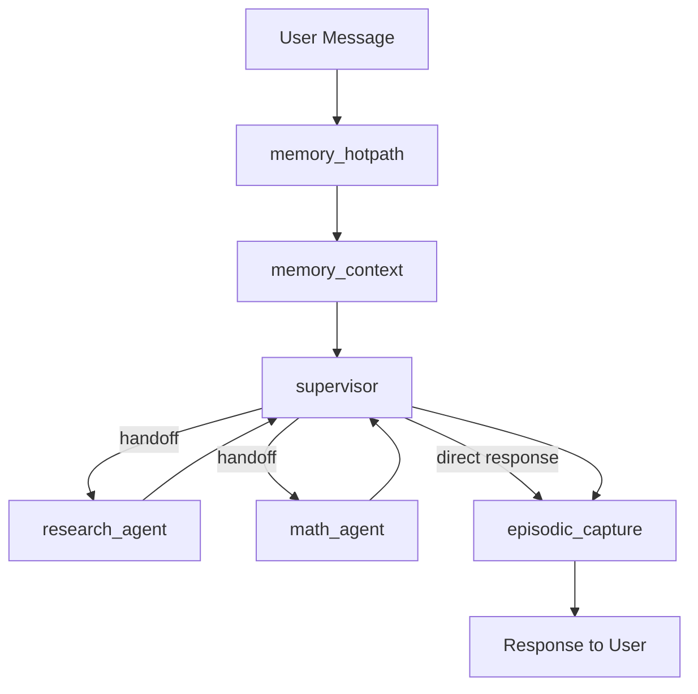

# 🤖 Agent Integration Guide for the Supervisor

## 🚦 Agent Integration Steps

1. **Implement the agent function in `workers.py`**
   - Create an async function for your agent (e.g., `async def api_agent(state: MessagesState) -> dict[str, Any]: ...`).
2. **Update the supervisor prompt in `prompts.py`**
   - Add a description of your new agent and instructions for when the supervisor should delegate to it.
3. **Add the agent to the supervisor graph in `agent.py`**
   - Import your agent function.
   - Add a handoff tool for your agent.
   - Add the agent node to the graph and update the destinations and edges.

**Optional:**
- If your agent needs tools, add them in `tools.py`.
- Update tests and documentation as needed.

This guide explains step by step how to integrate a new specialized agent into Vera's supervisor graph, including tools, prompts, and full configuration.

## 📋 Table of Contents

1. [System Architecture](#system-architecture)
2. [Agent Types](#agent-types)
3. [Creating a New Agent](#creating-a-new-agent)
4. [Supervisor Integration](#supervisor-integration)
5. [Testing and Validation](#testing-and-validation)
6. [Best Practices](#best-practices)
7. [Troubleshooting](#troubleshooting)

---

## 🏗️ System Architecture

### Current Supervisor Flow



### Key Components

- **Supervisor**: Main orchestrator that decides routing
- **Workers**: Specialized agents (research_agent, math_agent)
- **Tools**: Tools available to the supervisor
- **Handoff**: Delegation system between agents
- **Memory**: Context and episodic capture system

---

## 🎯 Agent Types

### 1. **Worker Agents** (Recommended)
- Simple, specialized functions
- Run in the same graph
- Return directly to the supervisor
- **Example**: `research_agent`, `math_agent`

### 2. **Sub-Graph Agents** (Advanced)
- Independent graphs with their own state
- More complex but more flexible
- **Example**: Onboarding agent

### 3. **Tool Agents** (Tools)
- Simple synchronous/asynchronous functions
- Stateless
- **Example**: `query_knowledge_base`

---

## 🚀 Creating a New Agent

### Step 1: File Structure

For a new agent called `api_agent`:

```
app/agents/supervisor/
├── workers.py          # ← Add agent function here
├── agent.py           # ← Modify compile_supervisor_graph()
├── prompts.py         # ← Update SUPERVISOR_PROMPT
├── handoff.py         # ← Already exists, no change needed
└── tools.py           # ← Add tools if needed
```

### Step 2: Implement the Worker Agent

In `app/agents/supervisor/workers.py`:

```python
async def api_agent(state: MessagesState) -> dict[str, Any]:
    """
    Agent that handles calls to external APIs.
    
    Args:
        state: Message state with context
        
    Returns:
        dict with agent response message
    """
    system: str = (
        "You are an API integration agent. You handle calls to external services "
        "and return structured responses. Be concise and factual."
    )
    
    # Extract the last user message
    prompt: str = _get_last_user_message_text(state["messages"]) or "Handle API request."
    
    try:
        # Implement agent-specific logic here
        # For example: calls to ExternalUserRepository
        from app.services.external_context.client import ExternalUserRepository
        
        repo = ExternalUserRepository()
        # Implement logic based on the prompt
        
        content: str = await call_llm(system, prompt)
        content = content or "API request could not be processed at this time."
        
    except Exception as e:
        logger.error(f"API agent error: {e}")
        content = "I encountered an issue processing that API request."
    
    return {"messages": [{"role": "assistant", "content": content, "name": "api_agent"}]}
```

### Step 3: Create Handoff Tool

In `app/agents/supervisor/agent.py`, add:

```python
def compile_supervisor_graph() -> CompiledStateGraph:
    # Existing handoff tools
    assign_to_research_agent_with_description = create_task_description_handoff_tool(
        agent_name="research_agent", description="Assign task to a researcher agent."
    )
    assign_to_math_agent_with_description = create_task_description_handoff_tool(
        agent_name="math_agent", description="Assign task to a math agent."
    )
    
    # ✅ ADD: New handoff tool
    assign_to_api_agent_with_description = create_task_description_handoff_tool(
        agent_name="api_agent", 
        description="Assign task to API integration agent for external service calls."
    )

    # Model configuration (unchanged)
    region = config.AWS_REGION
    model_id = config.BEDROCK_MODEL_ID
    guardrail_id = config.BEDROCK_GUARDRAIL_ID
    guardrail_version = str(config.BEDROCK_GUARDRAIL_VERSION)

    guardrails = {
        "guardrailIdentifier": guardrail_id,
        "guardrailVersion": guardrail_version,
        "trace": True,
    }
    chat_bedrock = ChatBedrock(model_id=model_id, region_name=region, guardrails=guardrails)

    # ✅ MODIFY: Add new tool to supervisor
    supervisor_agent_with_description = create_react_agent(
        model=chat_bedrock,
        tools=[
            assign_to_research_agent_with_description,
            assign_to_math_agent_with_description,
            assign_to_api_agent_with_description,  # ← NEW
            knowledge_search_tool,
        ],
        prompt=SUPERVISOR_PROMPT,
        name="supervisor",
    )

    # ✅ MODIFY: Configure the graph
    builder = StateGraph(MessagesState)

    builder.add_node("memory_hotpath", memory_hotpath)
    builder.add_node("memory_context", memory_context)
    builder.add_node(
        supervisor_agent_with_description, 
        destinations=("research_agent", "math_agent", "api_agent", "episodic_capture")  # ← ADD api_agent
    )
    builder.add_node("episodic_capture", episodic_capture)
    builder.add_node("research_agent", research_agent)
    builder.add_node("math_agent", math_agent)
    builder.add_node("api_agent", api_agent)  # ← NEW NODE

    # Existing edges (unchanged)
    builder.add_edge(START, "memory_hotpath")
    builder.add_edge("memory_hotpath", "memory_context")
    builder.add_edge("memory_context", "supervisor")
    builder.add_edge("research_agent", "supervisor")
    builder.add_edge("math_agent", "supervisor")
    builder.add_edge("api_agent", "supervisor")  # ← NEW EDGE
    builder.add_edge("supervisor", "episodic_capture")
    builder.add_edge("episodic_capture", END)

    store = create_s3_vectors_store_from_env()
    return builder.compile(store=store)
```

### Step 4: Update Supervisor Prompt

In `app/agents/supervisor/prompts.py`:

```python
SUPERVISOR_PROMPT = """

    You are Vera, the supervising orchestrator for a multi-agent system at Verde Money.
    Your job is to decide whether to answer directly or route to a specialist agent.
    
    Agents available:
    - research_agent — use only to retrieve external information not present in the provided context.
    - math_agent — use only for non-trivial calculations that need precision.
    - api_agent — use for external API calls, user data updates, or integration tasks.  # ← ADD
    
    # ... rest of the prompt unchanged ...
    
    Tool routing policy:
    - Prefer answering directly from user message + context; minimize tool calls.
    - Use exactly one agent at a time; never call agents in parallel.
    - research_agent: only if updated, external, or missing info is essential to answer.
    - math_agent: only if a careful calculation is required beyond simple mental math.
    - api_agent: for user profile updates, external service integration, or data synchronization.  # ← ADD
    - For recall, personalization, or formatting tasks, do not use tools.
    
    # ... rest of the prompt unchanged ...
"""
```

### Step 5: Import the New Worker

In `app/agents/supervisor/agent.py`, add the import:

```python
from .workers import math_agent, research_agent, api_agent  # ← ADD api_agent
```

---

## 🔧 Supervisor Integration

### Integration Checklist

- [ ] **Worker function** implemented in `workers.py`
- [ ] **Import** added in `agent.py`
- [ ] **Handoff tool** created in `compile_supervisor_graph()`
- [ ] **Tool added** to supervisor agent
- [ ] **Node added** to StateGraph
- [ ] **Destination** added to supervisor
- [ ] **Edge** configured (agent → supervisor)
- [ ] **Prompt updated** with instructions for the new agent

### Complete Example: API Agent

```python
# In workers.py
async def api_agent(state: MessagesState) -> dict[str, Any]:
    system = "You are an API integration specialist. Handle external service calls efficiently."
    prompt = _get_last_user_message_text(state["messages"])
    
    # Agent-specific logic
    content = await call_llm(system, prompt)
    return {"messages": [{"role": "assistant", "content": content, "name": "api_agent"}]}

# In agent.py - inside compile_supervisor_graph()
assign_to_api_agent = create_task_description_handoff_tool(
    agent_name="api_agent", 
    description="Handle external API integrations and user data operations."
)

supervisor_agent = create_react_agent(
    model=chat_bedrock,
    tools=[
        assign_to_research_agent,
        assign_to_math_agent,
        assign_to_api_agent,  # ← New
        knowledge_search_tool,
    ],
    prompt=SUPERVISOR_PROMPT,
    name="supervisor",
)

# Graph configuration
builder.add_node("api_agent", api_agent)
builder.add_edge("api_agent", "supervisor")
# Update destinations in supervisor
```

---

## 🧪 Testing and Validation

### 1. Unit Tests

```python
# tests/test_api_agent.py
import pytest
from app.agents.supervisor.workers import api_agent

@pytest.mark.asyncio
async def test_api_agent_basic():
    state = {
        "messages": [{"role": "user", "content": "Update my profile data"}]
    }
    
    result = await api_agent(state)
    
    assert "messages" in result
    assert result["messages"][0]["role"] == "assistant"
    assert result["messages"][0]["name"] == "api_agent"
```

### 2. Integration Tests

```python
# tests/test_supervisor_integration.py
@pytest.mark.asyncio
async def test_supervisor_routes_to_api_agent():
    # Test that the supervisor correctly delegates to the API agent
    pass
```

### 3. Manual Testing

```bash
# Use Streamlit or endpoints for manual testing
curl -X POST "http://localhost:8000/supervisor/message" \
  -H "Content-Type: application/json" \
  -d '{"thread_id": "test-123", "text": "Update my user profile"}'
```

---

## ✨ Best Practices

### 1. **Single Responsibility Principle**
- Each agent should have a specific, well-defined purpose
- Avoid overlapping functionalities between agents

### 2. **Robust Error Handling**
```python
async def my_agent(state: MessagesState) -> dict[str, Any]:
    try:
        # Agent logic
        result = await some_operation()
        content = process_result(result)
    except SpecificException as e:
        logger.warning(f"Expected error in my_agent: {e}")
        content = "I encountered a known issue. Please try again."
    except Exception as e:
        logger.error(f"Unexpected error in my_agent: {e}")
        content = "I'm having trouble processing that request right now."
    
    return {"messages": [{"role": "assistant", "content": content, "name": "my_agent"}]}
```

### 3. **Logging and Observability**
```python
import logging
logger = logging.getLogger(__name__)

async def my_agent(state: MessagesState) -> dict[str, Any]:
    user_message = _get_last_user_message_text(state["messages"])
    logger.info(f"my_agent processing: {user_message[:100]}...")
    
    # Agent logic
    
    logger.info(f"my_agent completed successfully")
    return result
```

### 4. **Clear and Specific Prompts**
- Clearly define when to use each agent
- Include examples in the supervisor prompt
- Be specific about the expected response format

### 5. **Minimal State**
- Worker agents should be stateless
- All necessary information should come in the state
- Avoid complex external dependencies

---

## 🔍 Troubleshooting

### Problem: Supervisor does not delegate to the new agent

**Symptoms**: Supervisor responds directly instead of using the agent

**Solutions**:
1. Check that the agent is in the supervisor's `destinations` list
2. Review instructions in `SUPERVISOR_PROMPT`
3. Ensure the handoff tool is in the `tools` list

### Problem: "Agent not found" Error

**Symptoms**: `KeyError` or `ValueError` when trying to use the agent

**Solutions**:
1. Check that the node is added to the StateGraph: `builder.add_node("agent_name", agent_function)`
2. Confirm the edge is configured: `builder.add_edge("agent_name", "supervisor")`
3. Check the import in `agent.py`

### Problem: Agent does not return to supervisor

**Symptoms**: Flow hangs after calling the agent

**Solutions**:
1. Ensure the agent's edge points to supervisor: `builder.add_edge("my_agent", "supervisor")`
2. Check that the agent function returns the correct format
3. Review logs for errors in agent execution

### Problem: Sources are not extracted correctly

**Symptoms**: Sources do not appear in `token.delta`

**Solutions**:
1. If the agent uses tools that return sources, check `_add_source_from_tool_end`
2. Ensure the agent is configured in `get_all_source_key_names()`
3. Review the agent's output format

---

## 📚 Additional Resources

### Key Files
- [`app/agents/supervisor/agent.py`](../app/agents/supervisor/agent.py) - Main graph configuration
- [`app/agents/supervisor/workers.py`](../app/agents/supervisor/workers.py) - Worker implementation
- [`app/agents/supervisor/prompts.py`](../app/agents/supervisor/prompts.py) - Supervisor prompts
- [`app/agents/supervisor/handoff.py`](../app/agents/supervisor/handoff.py) - Delegation system

### Related Documentation
- [LangGraph Documentation](https://python.langchain.com/docs/langgraph)
- [Multi-Agent Systems](https://python.langchain.com/docs/tutorials/multi_agent)
- [Message State](https://python.langchain.com/docs/langgraph/how-tos/state-model)

---

## 📝 Quick Template

To quickly create a new agent, copy and modify this template:

```python
# In workers.py
async def {{AGENT_NAME}}_agent(state: MessagesState) -> dict[str, Any]:
    """
    {{DESCRIPTION}}
    """
    system: str = (
        "{{SYSTEM_PROMPT}}"
    )
    
    prompt: str = _get_last_user_message_text(state["messages"]) or "{{DEFAULT_PROMPT}}"
    
    try:
        # TODO: Implement specific logic
        content: str = await call_llm(system, prompt)
        content = content or "{{ERROR_MESSAGE}}"
        
    except Exception as e:
        logger.error(f"{{AGENT_NAME}}_agent error: {e}")
        content = "{{ERROR_RESPONSE}}"
    
    return {"messages": [{"role": "assistant", "content": content, "name": "{{AGENT_NAME}}_agent"}]}
```

You now have everything you need to integrate new agents into Vera's supervisor system! 🚀
