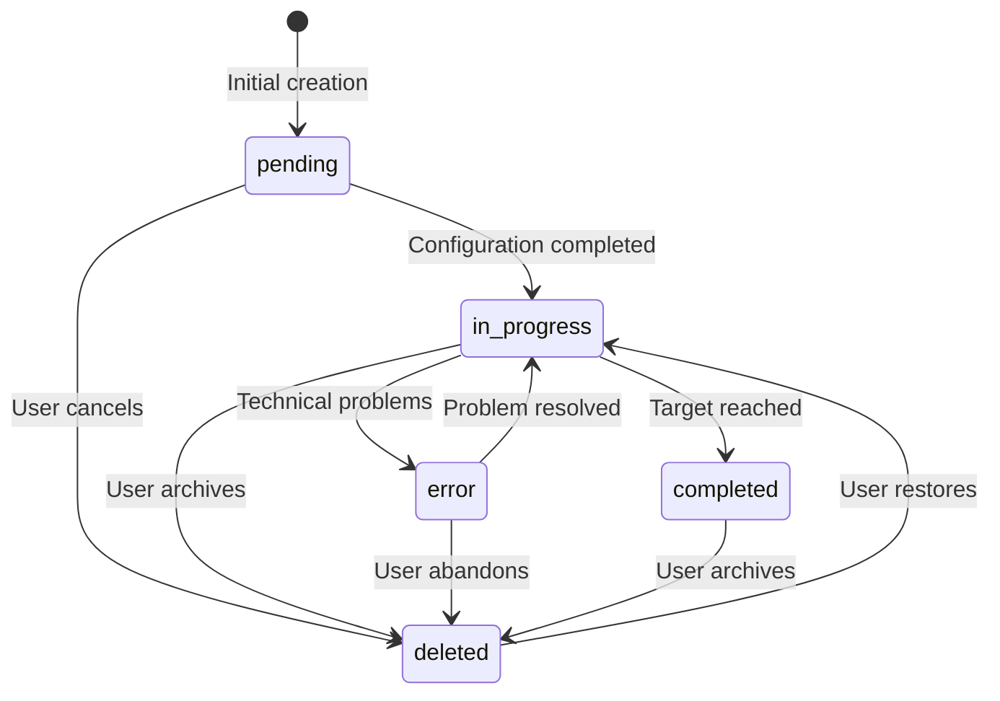

# Feature Specification: Goals System — V1

This document defines the complete specification of the `goals` object for Vera's system. This component allows users to define, track, and achieve financial objectives through intelligent coaching from specialized agents.

## Overview

The Goals system is designed to be flexible and integrated with the memory and agents architecture. It enables defining complex financial objectives with: 
- specific categories, 
- goal nature (increase/reduce), 
- affected entities and intelligent filtering by categories,
- varied frequencies, absolute or percentage amounts, 
- and a tracking and alerts system.

### Design Principles

- **Temporal Flexibility:** Support for both specific objectives (single date) and recurring ones (daily, weekly, monthly, etc.)
- **Monetary Expressiveness:** Absolute amounts in any currency or percentages relative to different financial bases
- **Intelligent Proactivity:** Threshold and reminder system for automatic engagement
- **Complete Traceability:** Detailed auditing and progress for user transparency and control
- **Systemic Integration:** Designed to work seamlessly with user_context, memory system, and specialist agents

### Affected Entities and Categorization

The Goals system considers multiple financial data sources to evaluate progress toward specific objectives:

#### Plaid Transaction Categories
The following categories are available for goals related to banking movements:

- **Bank fees** - Banking commissions
- **Home improvement** - Home improvements  
- **Rent & utilities** - Rent and utilities
- **Entertainment** - Entertainment
- **Income** - Income
- **Transfer in** - Incoming transfers
- **Food & drink** - Food and beverages
- **Loan payments** - Loan payments
- **Transfer out** - Outgoing transfers
- **General merchandise** - General merchandise
- **Medical** - Medical expenses
- **Transportation** - Transportation
- **General services** - General services
- **Personal care** - Personal care
- **Travel** - Travel
- **Government & non-profit** - Government and non-profit organizations

#### Manual Expenses (Manual Input)
In addition to automatic Plaid transactions, the system contemplates:

- **Manual expenses/incomes** - Expenses manually entered by the user (cash, income or expense), requiring amount, concept and category, at general level -> cost tracking.

#### Category Filtering Logic

**Fundamental Principle:** A goal to decrease certain types of expenses only takes into account transactions that belong to the specific category of the objective. Categories can be multiple. At least one, or all.

**Filtering Examples:**
- Goal: "Reduce entertainment expenses" → Only considers transactions categorized as "Entertainment"
- Goal: "Decrease medical expenses" → Only includes "Medical" transactions + manual expenses labeled as medical
- Goal: "Control transportation expenses" → Filters only "Transportation" + manual transportation expenses

**Implementation Considerations:**
- Manual expenses must be categorized by the user at the time of entry
- The system must allow retrospective re-categorization of transactions
- Multi-category goals can specify multiple filters (e.g., "Food & drink" + "Entertainment" for "discretionary expenses")

---

## Goals Object Schema

### Base Structure

#### goal
```json
{
  "title": "string",           // Descriptive title of the objective
  "description": "string"      // Optional detailed description
}
```

**Purpose:** Human identification and context of the objective. The title should be concise but descriptive; the description allows greater context for specialized agents.

---

### Categorization

#### category
```json
{
  "value": "enum",
  "options": ["saving", "spending", "debt", "income", "investment", "net_worth", "other"]
}
```

**Purpose:** Classification of the objective for intelligent routing to specialized agents and filtering in memory retrieval.

**Agent Mapping:**
- `debt` → `BudgetAgent`
- `saving`, `spending`, `investment` → `BudgetAgent`
- `income`, `net_worth` → `BudgetAgent`
- All categories → `Education & Wealth Coach` for contextual guidance

---

### Goal Nature

#### nature
```json
{
  "value": "enum",
  "options": ["increase", "reduce"]
}
```

**Purpose:** Defines the desired direction of change. Critical for progress algorithms and proactive messaging.

**Examples:**
- `increase` + `saving` = "Increase my savings"
- `reduce` + `debt` = "Reduce my debt"
- `increase` + `income` = "Increase my income"

---

### Frequency

#### frequency (one_of: specific | recurrent)

##### Specific Type
```json
{
  "type": "specific",
  "specific": {
    "date": "YYYY-MM-DD"       // Single target date
  }
}
```

##### Recurrent Type
```json
{
  "type": "recurrent",
  "recurrent": {
    "unit": "enum",           // day | week | month | quarter | year
    "every": "integer",       // ≥ 1 (every X units)
    "anchors": {              // Optional: specific temporal anchors
      "day_of_month": "integer|string",  // 1-31 or "last"
      "weekday": "enum"       // mon | tue | wed | thu | fri | sat | sun
    },
    "start_date": "YYYY-MM-DD",
    "end_date": "YYYY-MM-DD"  // Optional
  }
}
```

**Purpose:** Defines the evaluation calendar for the objective. Recurring objectives enable habit building and continuous tracking.

**Recurring Frequency Examples:**
- Save $500 each month [(all categories)]
- Reduce dining expenses by $100 each week
- Increase 401k contributions each quarter
- Annual net worth goal each December 31st

**Anchors Logic:**
- `day_of_month: 15` + `unit: month` = 15th day of each month
- `day_of_month: "last"` + `unit: month` = last day of each month
- `weekday: "fri"` + `unit: week` = every Friday
- `every: 2` + `unit: week` = every 2 weeks

---

### Target Amount

#### amount (one_of: absolute | percentage)

##### Absolute Amount
```json
{
  "type": "absolute",
  "absolute": {
    "currency": "string",     // ISO 4217 (USD, UYU, EUR, etc.)
    "target": "numeric"       // Target value
  }
}
```

##### Percentage Amount
```json
{
  "type": "percentage",
  "percentage": {
    "target_pct": "numeric",  // 0-100
    "of": {
      "basis": "enum",        // income | spending | category | account | net_worth | custom_query
      "ref_id": "string"      // Optional: specific reference ID
    }
  }
}
```

**Purpose:** Defines the quantitative target. Percentages allow relative objectives that automatically adapt to changes in income or spending.

**Examples:**
- Absolute: Save $1,000 USD
- Percentage: Save 20% of monthly income
- Specific percentage: Reduce dining expenses 15% (ref_id points to specific category)

**Basis Options:**
- `income`: Percentage of total income
- `spending`: Percentage of total spending
- `category`: Percentage of a specific category (use ref_id)
- `account`: Percentage of an account balance (use ref_id)
- `net_worth`: Percentage of net worth
- `custom_query`: Custom query for advanced cases

---

### Evaluation Configuration

#### aggregation
```json
{
  "value": "enum",
  "options": ["sum", "average", "max", "min"]
}
```

#### direction
```json
{
  "value": "enum",
  "options": ["≥", "≤", "="]
}
```

#### rounding (optional)
```json
{
  "value": "enum",
  "options": ["none", "floor", "ceil", "round"]
}
```

#### source
```json
{
  "value": "enum", 
  "options": ["linked_accounts", "manual_input", "mixed"]
}
```

**Purpose:** Defines the data sources considered for evaluating the objective's progress.

**Source Options:**
- `linked_accounts`: Only transactions from linked accounts (Plaid)
- `manual_input`: Only expenses manually entered by the user -> part of tracking
- `mixed`: Combination of both sources (recommended for greater accuracy)

**Filtering Considerations:**
- When `source = "linked_accounts"`: only Plaid categories are applied
- When `source = "manual_input"`: only manual categories and custom_categories are considered
- When `source = "mixed"`: both sources are evaluated, respecting the specific category of the goal

#### affected_categories (optional)
```json
{
  "value": "array",
  "items": "string",
  "options": [
    "bank_fees", "home_improvement", "rent_utilities", "entertainment", 
    "income", "transfer_in", "food_drink", "loan_payments", "transfer_out", 
    "general_merchandise", "medical", "transportation", "general_services", 
    "personal_care", "travel", "government_non_profit", "manual_expenses", 
    "cash_transactions", "custom_category"
  ]
}
```

**Purpose:** Specifies which specific expense/income categories should be considered for this goal. Critical for objectives of reducing or increasing specific categories.

**Behavior:**
- If not specified: all categories relevant to the goal's `category` are considered
- If specified: filters only the listed categories
- Allows multi-category goals (e.g., ["food_drink", "entertainment"] for "discretionary expenses")
- Combined with `source` to determine where to extract data from

---

### Alerts System

#### thresholds (optional)
```json
{
  "warn_progress_pct": "numeric",      // 0-100, warning threshold
  "alert_progress_pct": "numeric",     // 0-100, critical alert threshold
  "warn_days_remaining": "integer"     // ≥ 0, days remaining for warning
}
```

**Purpose:** Defines proactive engagement points. Integrates with the Heuristics Engine to generate intelligent nudges.

**Alerts Flow:**
1. `warn_progress_pct`: Gentle nudge when progress < threshold
2. `alert_progress_pct`: More urgent alert when progress critically low
3. `warn_days_remaining`: Time-based alerts independent of progress

---

### Reminders System

#### reminders (optional)
```json
{
  "items": [
    {
      "type": "enum",         // push | email | sms
      "when": "string"        // Temporal expression, e.g.: "monthly:day=27"
    }
  ]
}
```

**Purpose:** User-configurable proactive reminders. Integrates with the omnichannel system.

**When Examples:**
- `"monthly:day=15"` = 15th day of each month
- `"weekly:weekday=fri"` = every Friday
- `"days_before:7"` = 7 days before target date

---

### Status and Progress

#### status
```json
{
  "value": "enum",
  "options": ["pending", "in_progress", "completed", "error", "deleted"]
}
```

**Purpose:** Current goal status optimized for displaying visual badges in the frontend and granular progress tracking.

### Detailed States

#### `pending`
- **Description:** Goal with missing data or incomplete configuration
- **Criteria:** Missing required fields, cannot evaluate progress, user has not finished setup
- **Visual Badge:** ⏳ Yellow/orange badge with "Configuration Pending"
- **Available Actions:** Edit, Complete configuration, Delete

#### `in_progress` 
- **Description:** Active goal, validated and in continuous tracking (on-track)
- **Criteria:** All data is complete, progress is being evaluated, within expected thresholds
- **Visual Badge:** 🎯 Green badge with "In Progress" + completion percentage
- **Available Actions:** View progress, Pause, Edit, Delete

#### `completed`
- **Description:** Goal successfully achieved within established deadlines
- **Criteria:** Target achievement confirmed, within defined timeline
- **Visual Badge:** ✅ Bright green badge with "Completed" + achievement date
- **Available Actions:** View history, Archive, Create similar goal

#### `error`
- **Description:** Goal with technical problems preventing tracking
- **Criteria:** Loss of Plaid connection, synchronization errors, data source problems
- **Visual Badge:** ⚠️ Red badge with "Connection Error" + last successful sync
- **Available Actions:** Reconnect, Troubleshoot, Pause, Contact support

#### `deleted`
- **Description:** Goal archived by user action (soft delete)
- **Criteria:** User decided to delete/archive the goal
- **Visual Badge:** 🗃️ Not visible in main view, available in "Archived Goals"
- **Available Actions:** Restore, Delete permanently

### State Transitions

State transitions follow specific logic to ensure consistency:



**Transition Rules:**
- `pending` → `in_progress`: Only when all required fields are complete and data sources connected
- `in_progress` → `completed`: Automatic when target is reached within timeline
- `in_progress` → `error`: Automatic when there are synchronization failures > 48 hours
- `error` → `in_progress`: Automatic when connectivity and data are restored
- Any state → `deleted`: Manual, by user action
- `deleted` → `in_progress`: Manual, requires data re-validation

#### progress (optional)
```json
{
  "current_value": "numeric",         // Current value toward the objective
  "percent_complete": "numeric",      // 0-100
  "updated_at": "datetime"            // YYYY-MM-DDTHH:MM:SSZ
}
```

**Purpose:** Current status and progress tracking. Each state has specific visual badges and contextual actions available.

---

### Audit

#### audit (optional)
```json
{
  "created_at": "datetime",    // YYYY-MM-DDTHH:MM:SSZ
  "updated_at": "datetime"     // YYYY-MM-DDTHH:MM:SSZ
}
```

**Purpose:** Temporal traceability for compliance and user transparency.

---

## Integration with Vera Architecture

### Memory System Separation

Goals operate as an independent system, separate from Vera's memory architecture:

- **Independent Storage:** Goals maintain their own dedicated storage layer and data models
- **Separate Logic:** Goal tracking, progress calculation, and state management operate independently from memory systems
- **Non-overlapping Architecture:** Goals and memory systems are built as distinct components without direct integration or data overlap
- **Interface Communication:** When needed, goals communicate with other systems (including memory) through well-defined APIs rather than shared data structures

### Agent Specialization

Each type of goal is routed to the BudgetAgent specialist agent:

```
category: debt → BudgetAgent
category: saving|spending → BudgetAgent  
category: income|investment|net_worth → BudgetAgent
all categories → Education & Wealth Coach (guidance)
```

### Proactive Engagement

Thresholds and reminders feed the Heuristics Engine for:

- Automatic progress nudges
- Achievement celebrations
- Course correction suggestions
- Educational content delivery

### Data Persistence

Goals are stored in Aurora PostgreSQL following the versioning pattern:

```sql
CREATE TABLE goals (
  goal_id UUID PRIMARY KEY,
  user_id UUID REFERENCES users(user_id),
  version INTEGER NOT NULL DEFAULT 1,
  goal_data JSONB NOT NULL,           -- Complete goal structure
  is_active BOOLEAN DEFAULT true,
  created_at TIMESTAMP DEFAULT NOW(),
  updated_at TIMESTAMP DEFAULT NOW()
);
```

---

## Typical Use Cases

### 1. Monthly Savings Goal
```json
{
  "goal": {
    "title": "Emergency Fund Building",
    "description": "Build 6-month emergency fund"
  },
  "category": { "value": "saving" },
  "nature": { "value": "increase" },
  "frequency": {
    "type": "recurrent",
    "recurrent": {
      "unit": "month",
      "every": 1,
      "start_date": "2024-01-01"
    }
  },
  "amount": {
    "type": "absolute",
    "absolute": {
      "currency": "USD",
      "target": 500
    }
  },
  "thresholds": {
    "warn_progress_pct": 75,
    "warn_days_remaining": 7
  },
  "status": { "value": "in_progress" }
}
```

### 2. Percentage Debt Reduction Goal
```json
{
  "goal": {
    "title": "Credit Card Debt Reduction",
    "description": "Pay down high-interest credit cards"
  },
  "category": { "value": "debt" },
  "nature": { "value": "reduce" },
  "frequency": {
    "type": "recurrent",
    "recurrent": {
      "unit": "month",
      "every": 1,
      "start_date": "2024-02-01",
      "end_date": "2024-12-31"
    }
  },
  "amount": {
    "type": "percentage",
    "percentage": {
      "target_pct": 15,
      "of": {
        "basis": "income",
        "ref_id": null
      }
    }
  },
  "thresholds": {
    "alert_progress_pct": 50
  },
  "status": { "value": "in_progress" }
}
```

### 3. Category Expense Reduction Goal
```json
{
  "goal": {
    "title": "Reduce Entertainment Expenses",
    "description": "Control discretionary entertainment spending to save more"
  },
  "category": { "value": "spending" },
  "nature": { "value": "reduce" },
  "frequency": {
    "type": "recurrent",
    "recurrent": {
      "unit": "month",
      "every": 1,
      "start_date": "2024-03-01"
    }
  },
  "amount": {
    "type": "absolute",
    "absolute": {
      "currency": "USD",
      "target": 200
    }
  },
  "aggregation": { "value": "sum" },
  "direction": { "value": "≤" },
  "source": { "value": "mixed" },
  "affected_categories": ["entertainment"],
  "thresholds": {
    "warn_progress_pct": 80
  },
  "status": { "value": "in_progress" }
}
```

### 4. Specific Net Worth Goal
```json
{
  "goal": {
    "title": "Millionaire by 35",
    "description": "Reach $1M net worth before 35th birthday"
  },
  "category": { "value": "net_worth" },
  "nature": { "value": "increase" },
  "frequency": {
    "type": "specific",
    "specific": {
      "date": "2030-06-15"
    }
  },
  "amount": {
    "type": "absolute",
    "absolute": {
      "currency": "USD",
      "target": 1000000
    }
  },
  "thresholds": {
    "warn_progress_pct": 80,
    "warn_days_remaining": 365
  },
  "reminders": {
    "items": [
      {
        "type": "push",
        "when": "quarterly:day=1"
      }
    ]
  },
  "status": { "value": "in_progress" }
}
```

### 5. Example of Goal in Error State
```json
{
  "goal": {
    "title": "Save for Summer Vacation",
    "description": "Specific savings goal for family trip"
  },
  "category": { "value": "saving" },
  "nature": { "value": "increase" },
  "frequency": {
    "type": "specific",
    "specific": {
      "date": "2024-07-01"
    }
  },
  "amount": {
    "type": "absolute",
    "absolute": {
      "currency": "USD",
      "target": 3000
    }
  },
  "source": { "value": "mixed" },
  "status": { "value": "error" },
  "progress": {
    "current_value": 1250,
    "percent_complete": 41.67,
    "updated_at": "2024-02-15T08:30:00Z"
  },
  "error_details": {
    "type": "connection_lost",
    "message": "Plaid connection lost since 2024-02-13",
    "last_successful_sync": "2024-02-13T14:22:00Z"
  }
}
```

---

## Implementation Considerations

### Performance
- `in_progress` goals are cached in memory for low-latency access
- Progress calculations are executed async to avoid blocking user interactions
- State transitions are evaluated in real-time for immediate frontend updates
- Thresholds are evaluated daily via scheduled jobs
- Goals in `error` state have automatic retry logic every 6 hours

### Frontend UI States

For consistent user experience, each state has defined visual specifications:

#### Design System Integration
```css
/* Goal Status Badges */
.goal-badge-pending { 
  background: #FFF3CD; 
  color: #856404; 
  border: 1px solid #FFEAA7; 
}

.goal-badge-in-progress { 
  background: #D4EDDA; 
  color: #155724; 
  border: 1px solid #C3E6CB; 
}

.goal-badge-completed { 
  background: #D1ECF1; 
  color: #0C5460; 
  border: 1px solid #BEE5EB; 
}

.goal-badge-error { 
  background: #F8D7DA; 
  color: #721C24; 
  border: 1px solid #F5C6CB; 
}
```

#### Interactive Elements by State
- **Pending:** Prominent CTA "Complete Configuration"
- **In Progress:** Progress bar + visible percentage + quick actions
- **Completed:** Celebration badge + "View details" + "Similar goal"
- **Error:** Alert icon + "Reconnect" button + error details
- **Deleted:** Only visible in archived view with restore option

### Security
- Goals contain potential financial PII - encryption at rest is mandatory
- Access control via user_id verification in all operations
- Complete audit trail for compliance

### Scalability
- Partitioning by user_id for horizontal scaling
- Progress calculations distributed via event-driven architecture
- Bulk operations optimized for users with multiple goals

### Extensibility
- JSON schema allows easy addition of new fields
- Plugin architecture for custom goal types in V2+
- Webhook support for third-party integrations

---

## Roadmap V2+

### Advanced Features Considered
- **Goal Hierarchies:** Parent/child goal relationships
- **Collaborative Goals:** Shared goals between household members
- **AI-Suggested Goals:** Machine learning recommendations
- **Goal Templates:** Pre-built templates for common scenarios
- **Advanced Scheduling:** Complex recurrence patterns
- **Integration Plugins:** Third-party service connections
- **Gamification:** Achievement systems and social features

This Goals system establishes a solid foundation for Vera's personalized financial coaching, balancing flexibility with simplicity of use, and preparing the ground for sophisticated features in future versions.

