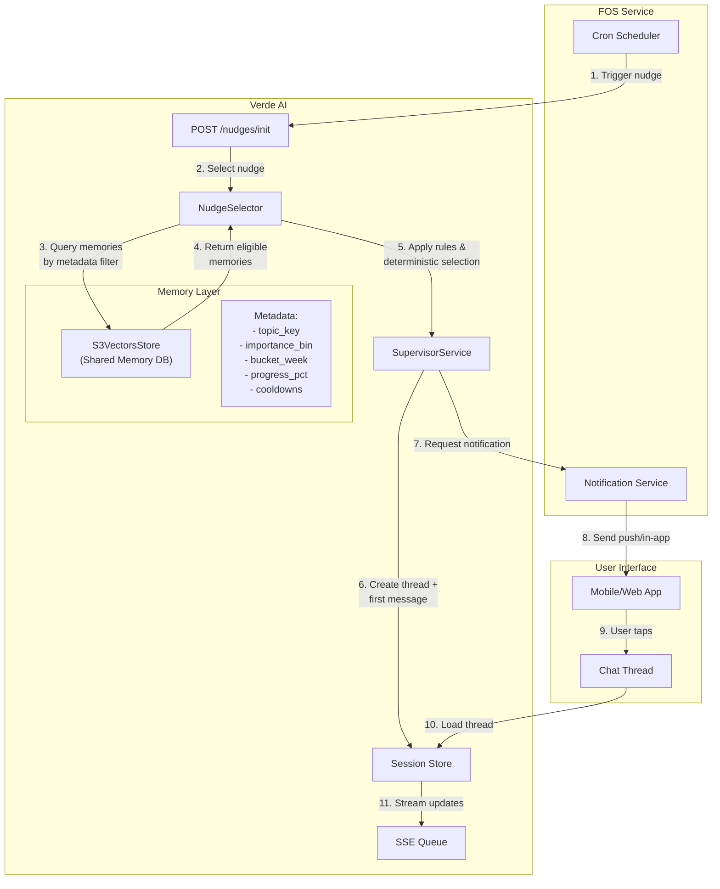
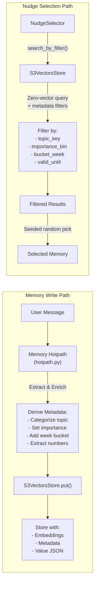
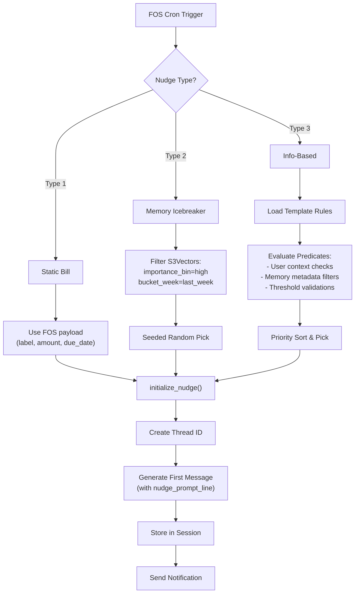

# Nudge System Implementation

## Overview
This system enables proactive, contextual user engagement through three types of nudges.

## Implemented Components

### 1. Nudges Module (`app/services/nudges/`)
- **templates.py**: Declarative nudge templates and rules
  - Defines `NudgeType`, `NudgeChannel`, and `NudgeTemplate` classes
  - Registry of predefined templates (goal milestones, spending patterns, subscriptions, etc.)
  - Pure predicates without runtime logic
  
- **selector.py**: Deterministic nudge selection logic
  - `NudgeSelector` class for metadata-based filtering
  - Seeded random selection for consistency
  - Support for all three nudge types
  - Cooldown management

### 2. Memory System Enhancements

#### Memory Hotpath (`app/agents/supervisor/memory/hotpath.py`)
- Added `_derive_nudge_metadata()` function
- Automatically enriches memories with:
  - `topic_key`: Categorized topics (subscription, spending_pattern, goal_active, etc.)
  - `importance_bin`: High/Med/Low classification
  - `bucket_week`: Time-based bucketing for selection
  - Numeric extraction for spending/progress tracking

#### S3 Vectors Store (`app/repositories/s3_vectors_store.py`)
- Extended `put()` method to store nudge metadata
- Added `search_by_filter()` for metadata-only queries
- Added `update_metadata()` for cooldown updates
- Created `get_s3_vectors_store()` singleton getter

### 3. Supervisor Service Extensions (`app/services/supervisor.py`)
- Added `initialize_nudge()` method
- Creates thread with pre-generated assistant message
- Integrates with existing context loading
- Maintains conversation history structure

### 4. External Notifications Client (`app/services/external_context/notifications.py`)
- `NotificationsClient` class for FOS integration
- Methods for creating, updating, and retrieving notifications
- Idempotent notification creation

### 5. API Endpoint (`app/api/routes_nudges.py`)
- `POST /nudges/init` endpoint for nudge initialization
- Request/response models with Pydantic
- Support for all three nudge types:
  - Type 1: Static Bills (FOS-driven)
  - Type 2: Memory Icebreaker (random high-importance)
  - Type 3: Info-Based (template/rule driven)

### 6. Configuration (`app/core/config.py`)
Added comprehensive nudge settings:
- Feature flags: `NUDGES_ENABLED`, `NUDGES_TYPE2_ENABLED`, `NUDGES_TYPE3_ENABLED`
- Operational parameters:
  - Cooldown days
  - Quiet hours (22:00-08:00 default)
  - Daily/weekly caps
  - Spending thresholds
  - Goal progress ranges

## Key Features

### Deterministic Selection
- No extra LLM calls beyond existing memory hotpath
- Metadata-only filtering for efficiency
- Seeded random selection for repeatability
- Date-based seeds ensure daily variation

### Guards and Constraints
- Quiet hours enforcement
- Cooldown periods to prevent repetition
- Daily/weekly caps per user
- Template-specific priority sorting

### Extensibility
- Easy template addition through registry
- Configurable predicates for new rules
- Environment-based feature toggles
- Modular architecture for future enhancements

## Usage Example

### FOS Cron Request
```json
POST /nudges/init
{
  "type": "memory_icebreaker",
  "user_id": "550e8400-e29b-41d4-a716-446655440000",
  "channel": "push"
}
```

### Response
```json
{
  "thread_id": "abc123...",
  "status": "enqueued",
  "preview_text": "Let's talk about your savings goal",
  "message": "Hi! I noticed you're making great progress..."
}
```

## Integration Points

1. **FOS Service**: Triggers nudges via cron, receives notification requests
2. **Memory System**: Provides semantic memories with metadata for selection
3. **User Context**: Loads profile data for personalization
4. **Session Store**: Manages conversation threads and history
5. **SSE Queue**: Real-time event streaming for UI updates

## System Flow Diagram

### Overall Nudge System Flow



### Memory Creation & Metadata Flow



### Nudge Type Decision Flow



## Production Considerations

- All nudge types can be independently enabled/disabled
- Metadata extraction happens during memory write (no extra cost)
- S3 Vectors queries use zero-vector for filter-only searches
- Singleton pattern for store instances reduces connection overhead
- Comprehensive logging with structured fields for monitoring

## Future Enhancements

- Additional template rules based on user feedback
- A/B testing framework for nudge effectiveness
- Analytics dashboard for engagement metrics
- Machine learning for optimal timing prediction
- Multi-channel delivery (email, SMS integration) 