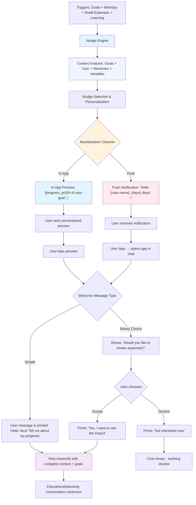

# Nudge System for Vera

## What are Nudges?

**Nudges** are subtle, non-intrusive interventions that guide users toward better decisions and desired behaviors. In Vera's context, nudges are strategically positioned messages that help users to:

- Connect bank accounts or complete information
- Celebrate achievements or alert about deviations
- Maintain momentum in using Vera
- Inform users contextually according to their level and needs

## Nudge Design Principles

### 1. **Contextually Relevant and Personalized**
- Trigger based on the user's current state
- Consider user_context, episodic and semantic memories
- Adapt to conversation context and user profile
- Respect preferences and interaction history

### 2. **Actionable**
- Provide direct contact with the user
- Reduce friction for achieving goals with Vera
- Offer immediate value to the user

## Types of Nudges in the System

### 1. **Goal Progress Nudges**
- Reminders to complete pending steps
- Celebration of achieved milestones
- Visual progress indicators
- Encouraging messages during the process (follow-up)

### 2. **Connection Nudges**
- Suggestions to connect bank accounts (if they don't have them)

### 3. **Education Nudges**
- Brief explanations of financial concepts related to interests or goals
- Security and privacy tips
- Financial best practices

## Nudge Manifestation Types

### **1. Delivery Channel Type**

#### **In-App Message**
- **Location**: Within the application interface
- **Presentation**: Presented as a particular type of welcome message to the user
- **Timing**: Immediate or context-based
- **Advantage**: Complete context available, direct interaction

#### **Push Notification**
- **Location**: Device notification system
- **Content**: Personalized preview text with variables like {user-name}, {goal-name}, etc.
- **Timing**: Scheduled or event-based
- **Behavior**: When tapped → opens specific chat with related welcome message
- **Advantage**: Reach outside the app, re-engagement

### **2. Welcome Message Type (After Preview-Nudge)**

#### **Simple Welcome Message**
- **Behavior**: When preview is tapped, direct message is executed
- **Purpose**: Start natural conversation about a specific topic
- **Example**: "Hello Vera! Tell me about my savings progress"
- **Flow**: Preview → Welcome Message → USER responds naturally → LLM continues conversation
- **Result**: Always initiates active conversation

#### **Binary Choice Welcome Message**
- **Behavior**: When preview is tapped, predefined options are shown
- **Purpose**: Get immediate user decision before continuing
- **Example**: "Would you like to review your entertainment expenses this month?"
- **Options**: 
  - "Yes, help me" → User message is sent to chat → LLM responds about the topic
  - "Not now" → Decline message is sent → CLOSE chat immediately
- **Flow**: Preview → Binary Choice → User Selection → **if ACCEPT** = LLM responds → **if DECLINE** = CLOSE chat
- **Logic**: Accept = active conversation, Decline = immediate closure

## The Nudge Engine: Detailed Architecture

### Engine Components

### **Main Engine Components**

#### **1. Nudge Orchestrator**
- Coordinates the entire nudge execution flow
- Analyzes context, selects appropriate nudge, and executes delivery

#### **2. Context Analyzer**
- Collects user context: episodic/semantic memories, profile, goals, preferences
- Integrates with your existing memory system

#### **3. Nudge Selector**
- Selects the most relevant nudge based on context and user preferences
- Uses scoring to determine which is most appropriate

#### **4. LLM Router**
- Doesn't need to prepare complex prompts - the LLM already has context
- Only sends the selected user message to the chat
- The LLM responds naturally using its existing personality and context

### Engine Execution Flow

```
1. Trigger Event → 2. Context Analysis → 3. Nudge Selection → 4. User Message → 5. Execution
     ↓                      ↓                    ↓                    ↓                ↓
User Action/Time        User Context         Best Nudge         User Selection      Deliver & Handle
```

### Nudge Engine States

```python
class NudgeEngineState:
    IDLE = "idle"                    # Waiting for triggers
    ANALYZING = "analyzing"          # Analyzing context
    SELECTING = "selecting"          # Selecting nudge
    PREPARING = "preparing"          # Preparing user message
    EXECUTING = "executing"          # Executing nudge
    COMPLETED = "completed"          # Nudge completed
    FAILED = "failed"                # Execution error
```

## Integration with the Agent System

### Nudge Routing by Type

### **Nudge Routing by Type**

#### **Welcome Message Nudges → Supervisor Agent**
- Sent to supervisor agent to continue conversation naturally
- Use predefined nudge context to personalize the response

#### **Binary Choice Nudges → Direct LLM**
- Processed directly by the LLM according to user choice
- If accepted: user message is sent to chat
- If declined: decline message is sent to chat and conversation is closed

#### **Intelligent Routing System**
- Automatically determines where to send each type of nudge
- Fallback to supervisor agent if no specific handler exists

### **Memory System for Nudges**

- **Storage**: Saves each nudge interaction in episodic memory
- **Tracking**: Tracks user responses, outcomes, and context
- **Optimization**: Calculates effectiveness of each nudge type to improve future selections
- **Integration**: Connects with your existing memory system (episodic and semantic)

## Nudge Response Structure

### **Push Notification with Simple Welcome Message**
```json
{
  "id": "nudge_push_simple",
  "type": "nudge_push",
  "preview_text": "Hello {user-name}! How's your {goal-name} going?",
  "target_key": "nudge.goal_progress_followup",
  "welcome_message": {
    "type": "simple",
    "user_message": "Hello Vera! How's my savings plan going?",
    "action": "continue_conversation"
  },
  "manifestation": {
    "channel": "push_notification",
    "timing": "scheduled_48h"
  }
}
```

### **Push Notification with Binary Choice Welcome Message**
```json
{
  "id": "nudge_push_binary",
  "type": "nudge_push",
  "preview_text": "Hello {user-name}, I noticed something about your entertainment expenses 🤔",
  "target_key": "nudge.spending_entertainment_alert",
  "welcome_message": {
    "type": "binary_choice",
    "message": "Would you like to review your entertainment expenses this month?",
    "choices": [
      {
        "id": "accept",
        "label": "Yes, help me",
        "user_message": "Yes, I'd like to review my entertainment expenses",
        "action": "continue_conversation"
      },
      {
        "id": "decline",
        "label": "Not now",
        "user_message": "Not now, maybe later",
        "action": "close_chat"
      }
    ]
  },
  "manifestation": {
    "channel": "push_notification",
    "timing": "immediate"
  }
}
```

### **In-App Preview Welcome Message Simple**
```json
{
  "id": "nudge_inapp_simple",
  "type": "nudge_inapp",
  "preview_text": "Congratulations! You're at 80% of your emergency savings goal 🎉",
  "target_key": "nudge.goal_progress_celebration",
  "welcome_message": {
    "type": "simple",
    "user_message": "Hello Vera! Tell me about my savings progress",
    "action": "continue_conversation"
  },
  "manifestation": {
    "channel": "in_app_message",
    "timing": "immediate"
  }
}
```

### **In-App Preview Welcome Message Binary Choice**
```json
{
  "id": "nudge_inapp_binary",
  "type": "nudge_inapp",
  "preview_text": "Your goal to reduce food expenses is going great. Should we keep optimizing?",
  "target_key": "nudge.goal_{goal_id}_optimization",
  "welcome_message": {
    "type": "binary_choice",
    "message": "Would you like to keep optimizing your food expenses?",
    "choices": [
      {
        "id": "accept",
        "label": "Yes, let's continue!",
        "user_message": "Yes, I'd like to keep optimizing my food expenses",
        "action": "continue_conversation"
      },
      {
        "id": "decline",
        "label": "I'm good as is",
        "user_message": "I'm good as is for now",
        "action": "close_chat"
      }
    ]
  },
  "manifestation": {
    "channel": "in_app_message",
    "timing": "immediate"
  }
}
```

## Nudge Configuration by Type

> **Design Note**: Nudge names are abstracted by functional categories for scalability. 
> Instead of creating specific nudges for each case (e.g., birthday, debt, small expenses), 
> we use generic categories that are personalized with dynamic variables.

### **In-App Nudges (Preview Welcome Message)**
```python
INAPP_NUDGES = {
    'goal_progress': {
        'preview_text': "Congratulations! You're at {progress_pct}% of your {goal_category} goal 🎉",
        'trigger_conditions': ['goal_status_in_progress', 'progress_pct_gte_75'],
        'type': 'nudge_inapp',
        'welcome_message': {
            'type': 'simple',
            'user_message': "Hello Vera! Tell me about my progress",
            'action': "continue_conversation"
        },
        'manifestation': {
            'channel': 'in_app_message',
            'timing': 'immediate'
        }
    },
    'goal_category_alert': {
        'preview_text': "Your plan for {goal_category} is going very well. Should we keep the momentum?",
        'trigger_conditions': ['goal_category_active', 'progress_positive'],
        'type': 'nudge_inapp',
        'welcome_message': {
            'type': 'simple',
            'user_message': "Vera, how's my progress with {goal_category}?",
            'action': "continue_conversation"
        },
        'manifestation': {
            'channel': 'in_app_message',
            'timing': 'immediate'
        }
    },
    'spending_pattern_alert': {
        'preview_text': "I noticed a pattern in your {category} expenses that adds up to ${total_amount} per month 🐜",
        'trigger_conditions': ['spending_pattern_detected', 'impact_threshold_met'],
        'type': 'nudge_inapp',
        'welcome_message': {
            'type': 'binary_choice',
            'message': "Would you like to review this spending pattern?",
            'choices': {
                'accept': {
                    'label': "Yes, I want to review it",
                    'user_message': "Yes, I want to review this spending pattern",
                    'action': "continue_conversation"
                },
                'decline': {
                    'label': "Not interested now",
                    'user_message': "I'm not interested in reviewing it now",
                    'action': "close_chat"
                }
            }
        },
        'manifestation': {
            'channel': 'in_app_message',
            'timing': 'immediate'
        }
    }
}
```

### **Push Notification Nudges (With Welcome Message)**
```python
PUSH_NUDGES = {
    'goal_engagement': {
        'preview_text': "Hello {user-name}! How's your {goal-name} going?",
        'trigger_conditions': ['goal_active', 'no_interaction_7_days'],
        'type': 'nudge_push',
        'welcome_message': {
            'type': 'simple',
            'user_message': "Hello Vera! How's my progress in {goal-name}?",
            'action': "continue_conversation"
        },
        'manifestation': {
            'channel': 'push_notification',
            'timing': 'scheduled_7_days'
        }
    },
    'spending_insight': {
        'preview_text': "Hello {user-name}, I noticed something about your {category} expenses 🤔",
        'trigger_conditions': ['goal_category_spending', 'threshold_warn_progress_pct'],
        'type': 'nudge_push',
        'welcome_message': {
            'type': 'binary_choice',
            'message': "Would you like to review your {category} expenses this month?",
            'choices': {
                'accept': {
                    'label': "Yes, help me",
                    'user_message': "Yes, I'd like to review my {category} expenses",
                    'action': "continue_conversation"
                },
                'decline': {
                    'label': "Not now",
                    'user_message': "Not now, maybe later",
                    'action': "close_chat"
                }
            }
        },
        'manifestation': {
            'channel': 'push_notification',
            'timing': 'immediate'
        }
    },
    'goal_milestone': {
        'preview_text': "¡{user-name}, you're super close to achieving your goal! 🚀",
        'trigger_conditions': ['goal_status_in_progress', 'progress_pct_gte_90'],
        'type': 'nudge_push',
        'welcome_message': {
            'type': 'simple',
            'user_message': "Vera! How close am I to my goal?",
            'action': "continue_conversation"
        },
        'manifestation': {
            'channel': 'push_notification',
            'timing': 'immediate'
        }
    },
    'temporal_event_reminder': {
        'preview_text': "¡{event_name} is coming in {days_until_event} days! Should we plan the budget?",
        'trigger_conditions': ['temporal_event_approaching', 'no_budget_planned'],
        'type': 'nudge_push',
        'welcome_message': {
            'type': 'binary_choice',
            'message': "Would you like to plan the budget for {event_name}?",
            'choices': {
                'accept': {
                    'label': "Yes, help me plan",
                    'user_message': "Yes, help me plan the budget for {event_name}",
                    'action': "continue_conversation"
                },
                'decline': {
                    'label': "I don't need a budget",
                    'user_message': "I don't need a budget for {event_name}",
                    'action': "close_chat"
                }
            }
        },
        'manifestation': {
            'channel': 'push_notification',
            'timing': 'scheduled_7_days',
            'delivery_rules': {
                'max_per_day': 1,
                'avoid_weekends': True,
                'time_window': '9:00-18:00',
                'priority_score': 8
            }
        }
    }
}
```

## Technical Implementation

### Nudge Architecture

```
User State → Nudge Engine → Context Analysis → Nudge Selection → Delivery
```

### System Components

#### 1. **Nudge Engine**
- Analyzes user state
- Determines when to show nudges
- Selects the most appropriate nudge

#### 2. **Context Analyzer**
- Evaluates user progress in their goals
- Identifies improvement opportunities
- Considers interaction history

#### 3. **Nudge Repository**
- Stores different types of nudges
- Manages variations and personalization
- Controls appearance frequency

#### 4. **Delivery System**
- Integrates nudges into conversation flow
- Manages timing and positioning
- Tracks engagement and effectiveness

### Nudge States

```python
class NudgeState:
    PENDING = "pending"      # Nudge ready to show
    ACTIVE = "active"        # Nudge being shown
    DISMISSED = "dismissed"  # User dismissed it
    COMPLETED = "completed"  # User took the action
    EXPIRED = "expired"      # Nudge no longer relevant
```

## Timing Strategies

### 1. **Immediate Nudges**
- Shown within the conversation, part of Vera's proactivity
- Take advantage of user momentum
- Example: "Would you like to connect your bank account now?"

### 2. **Deferred Nudges**
- Triggered at specific moments (related to memory, user context, or goals)
- Consider user behavior

### 3. **Conditional Nudges**
- Activated based on specific triggers (e.g., free trial days left)

## Personalization and Adaptation

### Personalization Factors

#### **User Profile**
- Financial experience level (financial_literacy)
- Communication preferences (active push notifications)

#### **Behavior**
- Application usage patterns
- Response time to nudges
- Timing preferences

#### **Context**
- Time of day
- Device used

### Adaptation Algorithm

```python
def calculate_nudge_relevance(user_state, nudge_type, context):
    base_score = get_base_relevance(nudge_type)
    user_factor = get_user_preference_factor(user_state)
    context_factor = get_context_factor(context)
    timing_factor = get_timing_factor(user_state)
    
    return base_score * user_factor * context_factor * timing_factor
```

## Timing and Frequency

### **Daily Limits and Delivery Rules**
- **Maximum 2 push notifications per day** per user
- **In-app nudges without daily limit** (shown when user opens the app)
- **Minimum spacing**: 4 hours between push notifications of the same type
- **Rotation**: Avoid repeating the same push nudge within 7 days

### **Smart Scheduling (Push Notifications Only)**
- **Active window**: 9:00 AM - 8:00 PM (business hours and evening)
- **Avoid**: Early morning hours (12:00 AM - 6:00 AM) and very late (after 9:00 PM)
- **Weekends**: Don't send automatic push notifications
- **In-app nudges**: No time restrictions (shown when user opens the app)

### **Prioritization Criteria**
**Note**: Only applies to push notifications. In-app nudges are shown automatically when the user opens the app.

When there are multiple push notification candidates for the same day:

1. **Urgency**: Security alerts or anomalies (maximum priority)
2. **Temporal relevance**: Birthday planning, upcoming goal milestones
3. **Historical engagement**: Users who respond more to certain types of nudges
4. **Diversity**: Rotate between different categories (goals, learning, small expenses)
5. **Personal context**: Prioritize nudges related to user's active goals

### **Daily Selection Logic**
```
1. Analyze all active triggers for the user
2. Separate nudges by manifestation type:
   - In-app: No timing restrictions (shown when user opens app, replacing the original Welcome Message)
   - Push: Apply strict filters (no night, no weekends)
3. For push notifications:
   - Calculate priority score
   - Select maximum 1 per day with highest score
   - Schedule optimal time within active window
4. For in-app nudges:
   - Shown immediately when user opens the app
   - No daily frequency limits
   - Automatic rotation to avoid repetition
```

## UX Considerations

### 1. **Don't Overwhelm**
- Limit the number of push notifications
- Respect the user's personal space
- Allow total control over the experience

### 2. **Accessibility**
- Clear and readable text
- Adequate contrast
- Keyboard navigation
- Screen reader compatibility

### 3. **Transparency**
- Explain why the nudge is shown
- Allow feedback on relevance
- Option to disable specific types

## Implementation Examples

### Bank Connection Nudge

```python
class BankConnectionNudge:
    def __init__(self):
        self.message = "Would you like to connect your bank account to get more precise insights?"
        self.actions = [
            {"text": "Connect now", "action": "connect_bank"},
            {"text": "Later", "action": "dismiss"},
            {"text": "Don't show again", "action": "disable"}
        ]
    
    def should_show(self, user_state):
        return (
            user_state.has_active_goals and
            not user_state.has_connected_bank and
            not user_state.nudges_disabled.get('bank_connection', False)
        )
```

### Data Verification Nudge

```python
class DataVerificationNudge:
    def __init__(self):
        self.message = "We've noticed some inconsistencies in your data. Would you like to review them?"
        self.actions = [
            {"text": "Review now", "action": "verify_data"},
            {"text": "Ignore", "action": "dismiss"}
        ]
    
    def should_show(self, user_state):
        return (
            user_state.has_data_inconsistencies and
            not user_state.nudges_shown.get('data_verification', False)
        )
```

## Ethical Considerations

### 1. **Transparency**
- Users must understand why they see each nudge
- Clear information about the purpose
- Option to opt-out at any time

### 2. **Respect for Autonomy**
- Nudges should not be manipulative
- Don't pressure vulnerable users

### 3. **Privacy**
- Nudges should not expose sensitive information
- Respect user privacy preferences
- Comply with data protection regulations

### 4. **User Well-being**
- Nudges should promote healthy behaviors
- Avoid creating dependency or anxiety
- Consider emotional impact

## Conclusion

By implementing it ethically and user-centered, we can:

- Increase engagement and continuous use of Vera
- Improve the quality of collected data
- Create a more engaging and personalized experience
- Establish a solid foundation for long-term relationship

The key is finding the perfect balance between being helpful and not intrusive, always keeping the user at the center of design decisions.

The Nudge Engine acts as the brain of the system, analyzing context, selecting appropriate nudges, and coordinating perfect integration with the LLM to create personalized and effective experiences.

## Complete Nudge Execution Flow

### **1. Nudge Activation**
```
Trigger Event → Context Analysis → Nudge Selection → Manifestation Decision
```

### **2. User Manifestation**
- **In-App**: Shown within the interface
- **Push**: Sent as system notification
- **Preview Text**: Shows the nudge hook text

### **3. User Interaction**
- **Welcome Message**: When tapped, opens chat with specific context
- **Binary Choice**: When tapped, shows predefined options

### **4. Response Processing**
- **Welcome Message**: Sent to Supervisor Agent to continue conversation
- **Binary Choice**: Choice is processed and specific prompt sent to LLM

### **5. LLM Integration**
- **Predefined Context**: Each nudge has its own LLM context
- **Intelligent Routing**: Sent to appropriate agent or LLM
- **Personalization**: User context is used to enrich the response

### **Complete Flow Example**

```
1. User breaks a decrease nature threshold → 2. Alert nudge + info → 3. Push notification
4. User taps → 5. App opens → 6. Binary choice is shown
7. User chooses "Yes" → 8. User message is sent to chat
9. LLM responds about savings tips or expense planning → 10. Conversation continues naturally
```

This system ensures that each nudge has a clear purpose, appropriate manifestation, and perfect integration with the existing conversation flow.

## Few Shots Table - Implementation Examples

| Type | Preview Text (With Variables) | Trigger Conditions | Manifestation | Welcome Message Type | User Message Result |
|------|------------------------------|-------------------|----------------|---------------------|---------------------|
| **Goal Progress Celebration** | "Congratulations! You're at {progress_pct}% of your {goal_category} goal 🎉" | `goal_status_in_progress`, `progress_pct_gte_75` | In-app, immediate | Simple | "Hello Vera! Tell me about my progress" |
| **Goal Check-in** | "Hello {user-name}! How's your {goal-name} going?" | `goal_active`, `no_interaction_7_days` | Push, scheduled_7_days | Simple | "Hello Vera! How's my progress?" |
| **Spending Category Alert** | "Hello {user-name}, I noticed something about your {category} expenses 🤔" | `goal_category_spending`, `threshold_warn_progress_pct` | Push, immediate | Binary Choice | "Yes, I'd like to review my {category} expenses" / "Not now, maybe later" |
| **Goal Near Completion** | "¡{user-name}, you're super close to achieving your goal! 🚀" | `goal_status_in_progress`, `progress_pct_gte_90` | Push, immediate | Simple | "Vera! How close am I to my goal?" |
| **Debt Reduction Progress** | "Your plan to reduce debt is going very well. Should we keep the momentum?" | `goal_category_debt`, `progress_positive` | In-app, immediate | Simple | "Vera, how's my progress with debt?" |
| **Food Spending Optimization** | "Your goal to reduce food expenses is going great. Should we keep optimizing?" | `goal_category_food_drink`, `progress_positive` | In-app, immediate | Binary Choice | "Yes, I'd like to keep optimizing my food expenses" / "I think I'm good as is for now" |
| **Birthday Planning** | "¡Your birthday is coming in {days_until_birthday} days! Should we plan the budget?" | `birthday_approaching`, `no_celebration_budget` | Push, scheduled_7_days | Binary Choice | "Yes, help me plan" / "I don't need a budget" |
| **Small Expenses Alert** | "I noticed several small expenses that add up to ${total_amount} per month 🐜" | `small_recurring_expenses_detected`, `impact_threshold_met` | In-app, immediate | Binary Choice | "Yes, I want to see the impact" / "Not interested now" |
| **Financial Learning** | "Would you like to learn about {suggested_topic} today?" | `learning_opportunity`, `topic_relevant_to_goals` | Push, scheduled_weekly | Simple | "Yes, teach me about {suggested_topic}" |
| **Emergency Fund Reminder** | "{user-name}, you've gone {streak_days} days without financial emergencies 💪" | `emergency_fund_goal_active`, `no_emergency_expenses` | In-app, immediate | Simple | "Vera! Tell me about my emergency savings streak" |

## Unified Nudge System Diagram


