# Nudge System for Vera

## What are Nudges?

**Nudges** are subtle, non-intrusive interventions that guide users toward better decisions and desired behaviors. In Vera's context, nudges are strategically positioned messages that help users to:

- Connect bank accounts or complete information
- Celebrate achievements or alert about deviations
- Maintain momentum in using Vera
- Inform users contextually according to their level and needs

## Nudge Design Principles

### 1. **Contextually Relevant and Personalized**
- Trigger based on the user's current state
- Consider user_context, episodic and semantic memories
- Adapt to conversation context and user profile
- Respect preferences and interaction history

### 2. **Actionable**
- Provide direct contact with the user
- Reduce friction for achieving goals with Vera
- Offer immediate value to the user

## Types of Nudges in the System

### 1. **Goal Progress Nudges**
- Reminders to complete pending goals
- Celebration of achieved goals

### 2. **App Nudges**
- Notifications triggered based on the structured data we have for a user
- Suggestions to connect bank accounts (if not already connected)
- Reminder of free trial ending soon (e.g., 3 days left)

### 3. **Memory-based Nudges**
- Recurring notifications (daily or every two days, to be defined)
- Use episodic or semantic memory as the icebreaker
- Craft a personalized message from that memory to spark a new conversation

### 4. **Bill payment Nudge**
- Reminder for upcoming bill due dates
- Bill items are defined in the user's profile
- Each item includes name and monthly due date

## Nudge Manifestation Types

### **1. Delivery Channel Type**

#### **In-App Message**
- **Location**: Within the application interface
- **Presentation**: Presented as a particular type of welcome message to the user
- **Timing**: Immediate or context-based
- **Advantage**: Complete context available, direct interaction

#### **Push Notification**
- **Location**: Device notification system
- **Content**: Personalized preview text with variables like {user-name}, {goal-name}, etc.
- **Timing**: Scheduled or event-based
- **Behavior**: When tapped → opens specific chat with related welcome message
- **Advantage**: Reach outside the app, re-engagement

### **2. Welcome Message Type (After Preview-Nudge)**

#### **Simple Welcome Message**
- **Behavior**: When preview is tapped, direct message is executed
- **Purpose**: Start natural conversation about a specific topic
- **Example**: "Hello Vera! Tell me about my savings progress"
- **Flow**: Preview → Welcome Message → USER responds naturally → Supervisor Agent continues conversation
- **Result**: Always initiates active conversation

#### **Binary Choice Welcome Message**
- **Behavior**: When preview is tapped, predefined options are shown
- **Purpose**: Get immediate user decision before continuing
- **Example**: "Would you like to review your entertainment expenses this month?"
- **Options**: 
  - "Yes, help me" → User message is sent to chat → Supervisor Agent responds about the topic
  - "Not now" → Decline message is sent → CLOSE chat immediately
- **Flow**: Preview → Binary Choice → User Selection → **if ACCEPT** = Supervisor Agent responds → **if DECLINE** = CLOSE chat
- **Logic**: Accept = active conversation, Decline = immediate closure

#### **Text Message Welcome Message**
- **Behavior**: When preview is tapped, direct text message is executed
- **Purpose**: Start conversation with memory-based or contextual content
- **Example**: "Remember when you mentioned wanting to save for vacation? Let's check your progress!"
- **Flow**: Preview → Text Message → USER responds naturally → Supervisor Agent continues conversation
- **Result**: Always initiates active conversation with personalized context

## Nudge Engine Architecture

### **Core Components**
- **Nudge Orchestrator**: Coordinates execution flow and selects appropriate nudges
- **Context Analyzer**: Collects user context (memories, profile, goals, preferences)
- **Nudge Selector**: Uses scoring to determine the most relevant nudge
- **Supervisor Agent Router**: Routes selected messages to Supervisor Agent

### **Execution Flow**
```
Trigger Event → Context Analysis → Nudge Selection → User Message → Delivery
```

### **Engine States**
```python
class NudgeEngineState:
    IDLE = "idle"                    # Waiting for triggers
    ANALYZING = "analyzing"          # Analyzing context
    SELECTING = "selecting"          # Selecting nudge
    EXECUTING = "executing"          # Executing nudge
    COMPLETED = "completed"          # Nudge completed
    FAILED = "failed"                # Execution error
```

## Integration & Memory System

### **Routing**
All nudges are routed to the **Supervisor Agent** for processing:
- **Simple/Text Messages**: Continue conversation naturally
- **Binary Choices**: Process user choice (accept → continue, decline → close chat)

### **Memory Integration**
- **Storage**: Saves nudge interactions in episodic memory
- **Tracking**: Monitors user responses and outcomes
- **Optimization**: Calculates effectiveness to improve future selections

## Nudge Response Structure

### **Push Notification with Simple Welcome Message**
```json
{
  "id": "nudge_push_simple",
  "type": "nudge_push",
  "preview_text": "Hello {user-name}! How's your {goal-name} going?",
  "target_key": "nudge.goal_progress_followup",
  "welcome_message": {
    "type": "simple",
    "user_message": "Hello Vera! How's my savings plan going?",
    "action": "continue_conversation"
  },
  "manifestation": {
    "channel": "push_notification",
    "timing": "scheduled_48h"
  }
}
```

### **Push Notification with Binary Choice Welcome Message**
```json
{
  "id": "nudge_push_binary",
  "type": "nudge_push",
  "preview_text": "Hello {user-name}, I noticed something about your entertainment expenses 🤔",
  "target_key": "nudge.spending_entertainment_alert",
  "welcome_message": {
    "type": "binary_choice",
    "message": "Would you like to review your entertainment expenses this month?",
    "choices": [
      {
        "id": "accept",
        "label": "Yes, help me",
        "user_message": "Yes, I'd like to review my entertainment expenses",
        "action": "continue_conversation"
      },
      {
        "id": "decline",
        "label": "Not now",
        "user_message": "Not now, maybe later",
        "action": "close_chat"
      }
    ]
  },
  "manifestation": {
    "channel": "push_notification",
    "timing": "immediate"
  }
}
```

### **In-App Preview Welcome Message Simple**
```json
{
  "id": "nudge_inapp_simple",
  "type": "nudge_inapp",
  "preview_text": "Congratulations! You're at 80% of your emergency savings goal 🎉",
  "target_key": "nudge.goal_progress_celebration",
  "welcome_message": {
    "type": "simple",
    "user_message": "Hello Vera! Tell me about my savings progress",
    "action": "continue_conversation"
  },
  "manifestation": {
    "channel": "in_app_message",
    "timing": "immediate"
  }
}
```

### **In-App Preview Welcome Message Binary Choice**
```json
{
  "id": "nudge_inapp_binary",
  "type": "nudge_inapp",
  "preview_text": "Your goal to reduce food expenses is going great. Should we keep optimizing?",
  "target_key": "nudge.goal_{goal_id}_optimization",
  "welcome_message": {
    "type": "binary_choice",
    "message": "Would you like to keep optimizing your food expenses?",
    "choices": [
      {
        "id": "accept",
        "label": "Yes, let's continue!",
        "user_message": "Yes, I'd like to keep optimizing my food expenses",
        "action": "continue_conversation"
      },
      {
        "id": "decline",
        "label": "I'm good as is",
        "user_message": "I'm good as is for now",
        "action": "close_chat"
      }
    ]
  },
  "manifestation": {
    "channel": "in_app_message",
    "timing": "immediate"
  }
}
```

## Nudge Configuration by Type

> **Design Note**: Nudge names are abstracted by functional categories for scalability. 
> Instead of creating specific nudges for each case (e.g., birthday, debt, small expenses), 
> we use generic categories that are personalized with dynamic variables.

### **In-App Nudges (Preview Welcome Message)**
```python
INAPP_NUDGES = {
    'goal_progress': {
        'preview_text': "Congratulations! You're at {progress_pct}% of your {goal_category} goal 🎉",
        'trigger_conditions': ['goal_status_in_progress', 'progress_pct_gte_75'],
        'type': 'nudge_inapp',
        'welcome_message': {
            'type': 'simple',
            'user_message': "Hello Vera! Tell me about my progress",
            'action': "continue_conversation"
        },
        'manifestation': {
            'channel': 'in_app_message',
            'timing': 'immediate'
        }
    },
    'pending_goal': {
        'preview_text': "Hey {user-name}, we've got a goal waiting on details… want to wrap it up?",
        'trigger_conditions': ['goal_status_pending'],
        'type': 'nudge_inapp',
        'welcome_message': {
            'type': 'binary_choice',
            'message': "Would you like to complete your pending goal?",
            'choices': {
                'accept': {
                    'label': "Edit goal",
                    'user_message': "Yes, I want to complete my goal",
                    'action': "continue_conversation"
                },
                'decline': {
                    'label': "Not now",
                    'user_message': "Not now, maybe later",
                    'action': "close_chat"
                }
            }
        },
        'manifestation': {
            'channel': 'in_app_message',
            'timing': 'immediate'
        }
    },
    'memory_icebreaker': {
        'preview_text': "{memory_based_text}",
        'trigger_conditions': ['memory_available', 'daily_schedule'],
        'type': 'nudge_inapp',
        'welcome_message': {
            'type': 'text_message',
            'user_message': "{memory_based_text}",
            'action': "continue_conversation"
        },
        'manifestation': {
            'channel': 'in_app_message',
            'timing': 'immediate'
        }
    }
}
```

### **Push Notification Nudges (With Welcome Message)**
```python
PUSH_NUDGES = {
    'free_trial_ending': {
        'preview_text': "Hey {user-name} just letting you know: we've got 3 days left on the free trial.",
        'trigger_conditions': ['user_is_free', 'days_left_equals_3'],
        'type': 'nudge_push',
        'welcome_message': {
            'type': 'binary_choice',
            'message': "Would you like to subscribe to continue using Vera?",
            'choices': {
                'accept': {
                    'label': "Subscribe now",
                    'user_message': "Yes, I want to subscribe",
                    'action': "continue_conversation"
                },
                'decline': {
                    'label': "Not now",
                    'user_message': "Not now, maybe later",
                    'action': "close_chat"
                }
            }
        },
        'manifestation': {
            'channel': 'push_notification',
            'timing': 'immediate'
        }
    },
    'connect_accounts': {
        'preview_text': "Hey {user-name} linking your accounts helps us give you better advice… and unlocks some extras too.",
        'trigger_conditions': ['accounts_connected_false'],
        'type': 'nudge_push',
        'welcome_message': {
            'type': 'binary_choice',
            'message': "Would you like to connect your bank accounts?",
            'choices': {
                'accept': {
                    'label': "Connect accounts",
                    'user_message': "Yes, I want to connect my accounts",
                    'action': "continue_conversation"
                },
                'decline': {
                    'label': "Not now",
                    'user_message': "Not now, maybe later",
                    'action': "close_chat"
                }
            }
        },
        'manifestation': {
            'channel': 'push_notification',
            'timing': 'immediate'
        }
    },
    'goal_achieved': {
        'preview_text': "Hey {user-name}, you did it! {goal-name} achieved!",
        'trigger_conditions': ['goal_end_date_true', 'goal_status_complete'],
        'type': 'nudge_push',
        'welcome_message': {
            'type': 'text_message',
            'user_message': "Congratulations! Tell me about my achievement",
            'action': "continue_conversation"
        },
        'manifestation': {
            'channel': 'push_notification',
            'timing': 'immediate'
        }
    },
    'goal_7_days_left': {
        'preview_text': "Hey {user-name}, just 7 days left to hit {goal-name}… and you're doing amazing!",
        'trigger_conditions': ['goal_end_date_current_minus_7'],
        'type': 'nudge_push',
        'welcome_message': {
            'type': 'text_message',
            'user_message': "Tell me about my goal progress",
            'action': "continue_conversation"
        },
        'manifestation': {
            'channel': 'push_notification',
            'timing': 'immediate'
        }
    },
    'bill_payment_due': {
        'preview_text': "Hey {user-name}, just a reminder: {bill-item} payment's due today.",
        'trigger_conditions': ['bill_payment_item_due_date_current'],
        'type': 'nudge_push',
        'welcome_message': {
            'type': 'text_message',
            'user_message': "Tell me about my bill payment",
            'action': "continue_conversation"
        },
        'manifestation': {
            'channel': 'push_notification',
            'timing': 'immediate'
        }
    },
    'memory_icebreaker_push': {
        'preview_text': "{memory_based_text}",
        'trigger_conditions': ['memory_available', 'daily_schedule'],
        'type': 'nudge_push',
        'welcome_message': {
            'type': 'text_message',
            'user_message': "{memory_based_text}",
            'action': "continue_conversation"
        },
        'manifestation': {
            'channel': 'push_notification',
            'timing': 'scheduled_daily',
            'delivery_rules': {
                'max_per_day': 1,
                'avoid_weekends': True,
                'time_window': '9:00-18:00',
                'priority_score': 5
            }
        }
    }
}
```

### **Nudge States**
```python
class NudgeState:
    PENDING = "pending"      # Nudge ready to show
    ACTIVE = "active"        # Nudge being shown
    DISMISSED = "dismissed"  # User dismissed it
    COMPLETED = "completed"  # User took the action
    EXPIRED = "expired"      # Nudge no longer relevant
```

## Timing & Frequency

### **Delivery Rules**
- **Maximum 3 push notifications per day** per user
- **In-app nudges**: No daily limit (shown when user opens app)
- **Minimum spacing**: 4 hours between push notifications of same type
- **Rotation**: Avoid repeating same push nudge within 7 days

### **Smart Scheduling (Push Only)**
- **Active window**: 9:00 AM - 8:00 PM
- **Avoid**: Early morning (12:00 AM - 6:00 AM) and late night (after 9:00 PM)
- **Weekends**: No automatic push notifications

## Personalization and Adaptation

### Personalization Factors

#### **User Profile**
- Account setting
- Bill payment items (if added)

#### **Memories**
- Semantic and Episodic

#### **Context**
- Time of day

### Adaptation Algorithm

```python
def calculate_nudge_relevance(user_state, nudge_type, context):
    base_score = get_base_relevance(nudge_type)
    user_factor = get_user_preference_factor(user_state)
    context_factor = get_context_factor(context)
    timing_factor = get_timing_factor(user_state)
    
    return base_score * user_factor * context_factor * timing_factor
```

### **Prioritization (Push Only)**
1. **Urgency**: Security alerts (max priority)
2. **Temporal relevance**: Bill due dates, goal milestones
3. **Historical engagement**: User response patterns
4. **Diversity**: Rotate between categories
5. **Personal context**: Active goals priority

## UX Considerations

### 1. **Don't Overwhelm**
- Limit the number of push notifications
- Respect the user's personal space
- Allow total control over the experience

### 2. **Accessibility**
- Clear and readable text
- Adequate contrast
- Keyboard navigation
- Screen reader compatibility

### 3. **Transparency**
- Explain why the nudge is shown
- Allow feedback on relevance
- Option to disable specific types

## Implementation Example

```python
class NudgeHandler:
    def __init__(self, nudge_type, message, actions):
        self.nudge_type = nudge_type
        self.message = message
        self.actions = actions
    
    def should_show(self, user_state):
        # Generic logic for all nudge types
        return (
            self.check_trigger_conditions(user_state) and
            not user_state.nudges_disabled.get(self.nudge_type, False)
        )
    
    def check_trigger_conditions(self, user_state):
        # Specific conditions per nudge type
        conditions = {
            'free_trial_ending': user_state.is_free_trial and user_state.days_left == 3,
            'bill_payment_due': user_state.has_bill_items and user_state.bill_due_today,
            'memory_icebreaker': user_state.has_recent_memories and user_state.daily_schedule_active,
            'goal_achieved': user_state.goal_status == 'complete',
            'connect_accounts': not user_state.accounts_connected
        }
        return conditions.get(self.nudge_type, False)
```

## Ethical Considerations

### 1. **Transparency**
- Users must understand why they see each nudge
- Clear information about the purpose
- Option to opt-out at any time

### 2. **Respect for Autonomy**
- Nudges should not be manipulative
- Don't pressure vulnerable users

### 3. **Privacy**
- Nudges should not expose sensitive information
- Respect user privacy preferences
- Comply with data protection regulations

### 4. **User Well-being**
- Nudges should promote healthy behaviors
- Avoid creating dependency or anxiety
- Consider emotional impact

## Conclusion

By implementing it ethically and user-centered, we can:

- Increase engagement and continuous use of Vera
- Improve the quality of collected data
- Create a more engaging and personalized experience
- Establish a solid foundation for long-term relationship

The key is finding the perfect balance between being helpful and not intrusive, always keeping the user at the center of design decisions.

The Nudge Engine acts as the brain of the system, analyzing context, selecting appropriate nudges, and coordinating perfect integration with the Supervisor Agent to create personalized and effective experiences.

## Complete Flow

```
1. Trigger Event → 2. Context Analysis → 3. Nudge Selection → 4. User Manifestation
5. User Interaction → 6. Supervisor Agent Processing → 7. Conversation Continues
```

**Example**: User breaks spending threshold → Push notification → User taps → Binary choice → User accepts → Supervisor Agent responds → Conversation continues

## Nudges Table - Implementation Examples

| Description | Type | Preview Text (With Variables) | Trigger Conditions | Manifestation | Welcome Message Type | User Message Result |
|-------------|------|------------------------------|-------------------|----------------|---------------------|---------------------|
| **3 days left (free trial)** | app settings | "Hey {user-name} just letting you know: we've got 3 days left on the free trial." | if user is free and days left is equal to 3 | Push | binary_choice | Subscribe now \| Not now |
| **Connect your accounts** | app settings | "Hey {user-name} linking your accounts helps us give you better advice… and unlocks some extras too." | if accountsConnected = false | Push | binary_choice | Connect accounts \| Not now |
| **Memory as Ice Breaker** | memory_based | [free text based on episodic or semantic memories recently visited or created] | each day at {hh:mm am/pm} | Push / App | text_message | [free text based on episodic or semantic memories recently visited or created] |
| **Goal achieved!** | goals | "Hey {user-name}, you did it! {goal-name} achieved!" | if goalEndDate=true and goalStatus=complete | Push | text_message | |
| **Pending goal** | goals | "Hey {user-name}, we've got a goal waiting on details… want to wrap it up?" | if goalStatus=pending | Push / in App | binary_choice | Edit goal \| Not now |
| **7 days left to goal Goal** | goals | "Hey {user-name}, just 7 days left to hit {goal-name}… and you're doing amazing!" | ifGoalEndDate=currentDate - 7 | Push | text_message | |
| **Bill payment** | bill payment | "Hey {user-name}, just a reminder: {bill-item} payment's due today." | if billPaymentItemDueDate=currentDate | Push | text_message | |

## Unified Nudge System Diagram

```mermaid
flowchart TD
    A[Triggers: Goals + App Settings + Memory-based + Bill Payment] --> B[Nudge Engine]
    B --> C[Context Analysis: Goals + User + Memories + Variables]
    C --> D[Nudge Selection & Personalization]
    D --> E{Manifestation Channel}
    
    E -->|In-App| F["In-App Preview: '{progress_pct}% of your goal 🎉'"]
    E -->|Push| G["Push Notification: 'Hey {user-name}, 3 days left! 🎉'"]
    
    F --> H[User sees personalized preview]
    G --> I[User receives notification]
    
    H --> J[User taps preview]
    I --> K[User taps → opens app in chat]
    
    J --> L{Welcome Message Type}
    K --> L
    
    L -->|Binary Choice| M["Shows: 'Would you like to review expenses?'"]
    L -->|Text Message| N["Memory-based message: 'Remember when you...'"]
    
    M --> O{User chooses}
    O -->|Accept| P["Prints: 'Yes, I want to see the impact'"]
    O -->|Decline| Q["Prints: 'Not interested now'"]
    
    N --> R[Supervisor Agent responds with complete context]
    P --> R
    Q --> S[Chat closes - tracking decline]
    
    R --> T[Educational/planning conversation continues]
    
    style B fill:#e3f2fd
    style C fill:#f0f4ff
    style E fill:#fff3e0
    style F fill:#e1f5fe
    style G fill:#ffebee
    style S fill:#f3e5f5
```


