## Nudge System Implementation Plan

This document outlines the asynchronous, queue-based nudge system using SQS for priority-ordered processing. The system separates evaluation from execution, enabling batch processing and intelligent priority management.

### Architecture Overview
- **Asynchronous evaluation**: Cron jobs periodically evaluate nudge conditions
- **Queue-based execution**: SQS manages nudge delivery with priority ordering
- **Separation of concerns**: Evaluation logic separate from notification delivery
- **Batch optimization**: Process multiple users efficiently in evaluation cycles
- **Priority management**: High-value nudges processed first
- **Plaid integration**: Fetch bill data from financial database

### Goals and Constraints
- No new persistent tables; reuse existing stores (user_context, S3 Vectors memories, session store)
- No extra LLM calls beyond the memory hotpath already run each turn
- Cron orchestrates evaluation timing; queue manages execution ordering
- Deterministic selection for types 2 and 3 via metadata-only filters and seeded choice
- SQS provides reliable, ordered message delivery with built-in retry logic
- Bill detection from Plaid transaction history in external database

---

## System Architecture

```mermaid
flowchart TD
    CRON1["Bill Cron<br/>(Every 4 hours)"] -->|"Evaluate bills"| EVAL["Eval Nudge<br/>FOS-AI"]
    CRON2["Memory Cron<br/>(Daily at a certain hour)"] -->|"Evaluate memories"| EVAL
    CRON3["Info Cron / FOS Ping<br/>(On demand / Every 2 hours)"] -->|"Evaluate info-based"| EVAL
    
    EVAL -->|"Fetch active users (paginated)"| FOSAPI["FOS Users API<br/>/users/active?limit=&cursor="]
    EVAL -->|"Check conditions"| NUDGE["Nudge Logic<br/>• Condition Check<br/>• Priority (1-5)<br/>• Type Selection"]
    
    NUDGE -->|"Nudge candidates"| SQS["AWS SQS<br/>(Priority Queue)"]
    NUDGE -->|"Metrics"| OBS["Observability<br/>• Application Logs<br/>• Custom Metrics"]
    
    SQS -->|"Consume messages<br/>by priority"| WORKER["Queue Worker<br/>(Async Consumer)"]
    
    WORKER -->|"Execute nudge"| EXEC["Execute Nudge"]
    EXEC -->|"Create thread"| INIT["Initialize<br/>Conversation"]
    EXEC -->|"Send notification"| NOTIF["Send<br/>Notifications"]
    
    INIT -->|"Thread ID"| USER["User<br/>Interaction"]
    NOTIF -->|"Push/In-app"| USER
    
    subgraph "Data Stores"
        S3V["S3 Vectors<br/>(Memories)"]
        CTX["User Context<br/>(Profile)"]
        SESS["Session Store<br/>(Threads)"]
        PLAID["Plaid DB<br/>(Financial Data)"]
    end
    
    NUDGE -.->|"Query"| S3V
    NUDGE -.->|"Query"| CTX
    NUDGE -.->|"Query Bills"| PLAID
    INIT -.->|"Write"| SESS
    
    subgraph "User Activity"
        ACT["User Activity<br/>Counter (In-memory)"]
    end
    
    WORKER -.->|"Update"| ACT
    NUDGE -.->|"Check"| ACT
```



---

## Active User Fetching & Pagination

To avoid sending massive user arrays, the evaluator fetches active users directly from the FOS API in pages and evaluates per page.

```python
from typing import AsyncIterator, Optional

DEFAULT_PAGE_SIZE: int = 500  # Use config, not a magic number

async def iter_active_users(
    *,
    page_size: int = config.FOS_USERS_PAGE_SIZE,
    max_pages: int = config.FOS_USERS_MAX_PAGES,
    timeout_ms: int = config.FOS_USERS_API_TIMEOUT_MS,
) -> AsyncIterator[list[str]]:
    """Stream active users from FOS API in pages."""
    cursor: Optional[str] = None
    pages_fetched: int = 0
    
    while True:
        if max_pages and pages_fetched >= max_pages:
            break
        endpoint = f"/users/active?limit={page_size}" + (f"&cursor={cursor}" if cursor else "")
        resp = await fos_client.get(endpoint, timeout_ms=timeout_ms)
        users = (resp or {}).get("users", [])
        cursor = (resp or {}).get("next_cursor")
        if not users:
            break
        yield [u.get("user_id") for u in users if u.get("user_id")]
        pages_fetched += 1
        if not cursor:
            break
```

- Fetch is paginated and resilient to large user counts.
- Concurrency should be bounded when evaluating pages (e.g., `EVAL_CONCURRENCY_LIMIT`).
- No user_ids are passed in FOS requests; Verde AI pulls them on-demand.

Configuration (add to config per configuration-architecture rules):
```bash
FOS_USERS_PAGE_SIZE=500
FOS_USERS_MAX_PAGES=100
FOS_USERS_API_TIMEOUT_MS=5000
EVAL_CONCURRENCY_LIMIT=4
```

---

## 1) Core Components

### A. Nudge Evaluator Service
**Location**: `app/services/nudges/evaluator.py`

**Responsibilities**:
- Batch evaluate users for nudge eligibility
- Check conditions (cooldowns, quiet hours, daily limits)
- Calculate priority scores
- Determine nudge type and content
- Query Plaid database for recurring bills
- Send qualified nudges to SQS

**Key Functions**:
```python
async def evaluate_nudges_batch(user_ids: list[UUID]) -> list[NudgeCandidate]:
    """Evaluate multiple users for nudge eligibility."""
    
async def check_nudge_conditions(user_id: UUID) -> NudgeEligibility:
    """Check if user meets nudge conditions."""
    
async def detect_upcoming_bills(user_id: UUID) -> list[BillInfo]:
    """Detect recurring bills from Plaid transaction history."""
    
def assign_priority(nudge_type: str, context: dict) -> int:
    """Assign simple priority score (1-5, higher = more urgent)."""
```

### B. Bill Detection Service
**Location**: `app/services/nudges/bill_detector.py`

**Responsibilities**:
- Query Plaid financial database for transaction patterns
- Identify recurring transactions (subscriptions, utilities, loans)
- Predict next payment dates based on patterns
- Extract bill metadata (amount, merchant, category)


### C. SQS Queue Manager
**Location**: `app/services/queue/sqs_manager.py`

**Configuration**:
- **Queue Type**: Standard queue with priority ordering
- **Deduplication Strategy**: Latest nudge replaces older ones for same user
- **Message Deduplication**: By user_id and nudge_type combination
- **Visibility Timeout**: 5 minutes
- **Message Retention**: 4 days
- **Dead Letter Queue**: After 3 failed attempts

**Deduplication Logic**:
```python
async def enqueue_nudge(nudge: NudgeMessage) -> str:
    """
    Enqueue nudge with deduplication.
    Latest nudge for user+type combination replaces any existing ones.
    """
    # Create deduplication key
    dedup_key = f"{nudge.user_id}:{nudge.nudge_type}"
    
    # Delete any existing messages for this user+type
    await delete_existing_nudges(dedup_key)
    
    # Send new message with priority as message attribute
    message_attributes = {
        "Priority": {"DataType": "Number", "StringValue": str(nudge.priority)},
        "DeduplicationKey": {"DataType": "String", "StringValue": dedup_key},
        "Timestamp": {"DataType": "String", "StringValue": nudge.timestamp}
    }
    
    # Enqueue the latest nudge
    return await sqs_client.send_message(
        QueueUrl=queue_url,
        MessageBody=json.dumps(nudge.dict()),
        MessageAttributes=message_attributes
    )
```

**Message Schema**:
```json
{
  "messageId": "uuid",
  "priority": 4,  // Simple 1-5 scale
  "userId": "uuid",
  "nudgeType": "static_bill|memory_icebreaker|info_based",
  "nudgePayload": {
    "type": "...",
    "content": "...",
    "metadata": {
      "bill": {
        "merchant": "Comcast",
        "amount": 89.99,
        "due_date": "2025-01-15",
        "category": "rent_and_utilities"
      }
    }
  },
  "channel": "push|in_app",
  "timestamp": "2025-01-09T10:00:00Z",
  "expiresAt": "2025-01-09T22:00:00Z",
  "deduplicationKey": "user123:static_bill"
}
```

### D. Queue Worker (Consumer)
**Location**: `app/workers/nudge_worker.py`

**Responsibilities**:
- Poll SQS for messages (ordered by priority)
- Check if nudge is still the latest for user
- Process only the most recent nudge per user
- Skip stale nudges
- Handle failures and retries
- Update user activity counters

**Processing Logic**:
```python
async def process_nudge_message(message: SQSMessage) -> ProcessResult:
    """
    Process a nudge from the queue.
    Only processes if it's the most recent for this user+type.
    """
    nudge = json.loads(message.body)
    
    # 1. Check if this is still the latest nudge for user+type
    if not await is_latest_nudge(nudge['userId'], nudge['nudgeType'], nudge['timestamp']):
        logger.info(f"Skipping stale nudge for {nudge['userId']}")
        await delete_message(message.receipt_handle)
        return ProcessResult.SKIPPED
    
    # 2. Validate message hasn't expired
    if datetime.parse(nudge['expiresAt']) < datetime.now():
        await delete_message(message.receipt_handle)
        return ProcessResult.EXPIRED
    
    # 3. Check user still eligible (rate limits, quiet hours)
    if not await check_user_eligible(nudge['userId']):
        await delete_message(message.receipt_handle)
        return ProcessResult.RATE_LIMITED
    
    # 4. Execute nudge initialization
    thread_id = await initialize_nudge(nudge)
    
    # 5. Send notification
    await send_notification(nudge, thread_id)
    
    # 6. Update counters and cooldowns
    await update_activity_counter(nudge['userId'], nudge['nudgeType'])
    
    # 7. Delete processed message
    await delete_message(message.receipt_handle)
    
    return ProcessResult.SUCCESS
```

**Priority-Based Polling**:
```python
async def poll_queue_by_priority():
    """
    Poll queue and process messages ordered by priority.
    Higher priority (5) processed first, then by timestamp (FIFO) within same priority.
    """
    # Receive batch of messages
    messages = await sqs_client.receive_messages(
        QueueUrl=queue_url,
        MaxNumberOfMessages=10,
        MessageAttributeNames=['Priority', 'DeduplicationKey', 'Timestamp'],
        WaitTimeSeconds=20  # Long polling
    )
    
    # Sort by priority (higher first), then by timestamp (older first)
    sorted_messages = sorted(
        messages,
        key=lambda m: (
            -int(m.message_attributes.get('Priority', {}).get('StringValue', '1')),  # Negative for desc
            m.message_attributes.get('Timestamp', {}).get('StringValue', '')  # FIFO within priority
        )
    )
    
    # Process in order
    for message in sorted_messages:
        await process_nudge_message(message)
```

### E. User Activity Counter
**Location**: `app/services/nudges/activity_counter.py`

**Tracks**:
- Nudges sent today/this week per user
- Last nudge timestamp
- Response rates (for future optimization)
- Cooldown periods

**Storage**: In-memory cache (Redis recommended for production)
```python
# Simple in-memory implementation
from datetime import datetime, timedelta
from typing import Dict, Optional
from collections import defaultdict

class ActivityCounter:
    """
    In-memory activity counter for nudge rate limiting.
    Note: For production, consider Redis for persistence and scale.
    """
    
    def __init__(self):
        # In-memory storage
        self._nudge_counts: Dict[str, Dict[str, int]] = defaultdict(lambda: defaultdict(int))
        self._last_nudge: Dict[str, datetime] = {}
        self._cooldowns: Dict[str, datetime] = {}
    
    async def increment_nudge_count(self, user_id: UUID, nudge_type: str) -> None:
        """Increment nudge count for user."""
        key = f"{user_id}:{nudge_type}"
        today = datetime.now().date().isoformat()
        
        # Increment daily count
        self._nudge_counts[f"{key}:{today}"]["count"] += 1
        self._last_nudge[key] = datetime.now()
    
    async def get_nudge_stats(self, user_id: UUID) -> NudgeStats:
        """Get nudge statistics for user."""
        today = datetime.now().date()
        week_start = today - timedelta(days=today.weekday())
        
        # Count nudges for today and this week
        nudges_today = 0
        nudges_week = 0
        
        for nudge_type in ["static_bill", "memory_icebreaker", "info_based"]:
            key = f"{user_id}:{nudge_type}"
            
            # Today's count
            today_key = f"{key}:{today.isoformat()}"
            nudges_today += self._nudge_counts.get(today_key, {}).get("count", 0)
            
            # Week count (sum last 7 days)
            for i in range(7):
                day = (week_start + timedelta(days=i)).isoformat()
                day_key = f"{key}:{day}"
                nudges_week += self._nudge_counts.get(day_key, {}).get("count", 0)
        
        return NudgeStats(
            nudges_today=nudges_today,
            nudges_this_week=nudges_week,
            last_nudge=self._last_nudge.get(f"{user_id}:*")
        )
    
    async def check_rate_limits(self, user_id: UUID) -> bool:
        """Check if user is within rate limits."""
        stats = await self.get_nudge_stats(user_id)
        
        # Check limits from config
        if stats.nudges_today >= config.NUDGE_MAX_PER_DAY:
            return False
        if stats.nudges_this_week >= config.NUDGE_MAX_PER_WEEK:
            return False
            
        return True
    
    def cleanup_old_entries(self):
        """
        Periodic cleanup of old entries to prevent memory bloat.
        Should be called periodically (e.g., daily).
        """
        cutoff = datetime.now() - timedelta(days=7)
        
        # Remove entries older than 7 days
        keys_to_delete = []
        for key in self._nudge_counts.keys():
            if ":" in key:
                date_str = key.split(":")[-1]
                try:
                    entry_date = datetime.fromisoformat(date_str).date()
                    if entry_date < cutoff.date():
                        keys_to_delete.append(key)
                except:
                    pass
        
        for key in keys_to_delete:
            del self._nudge_counts[key]

# Singleton instance
_activity_counter = None

def get_activity_counter() -> ActivityCounter:
    """Get singleton activity counter instance."""
    global _activity_counter
    if _activity_counter is None:
        _activity_counter = ActivityCounter()
    return _activity_counter

# Future optimization note:
"""
For production deployment with multiple workers, consider using Redis:

from redis import Redis

class RedisActivityCounter:
    def __init__(self):
        self.redis = Redis(host='localhost', port=6379, decode_responses=True)
    
    async def increment_nudge_count(self, user_id: UUID, nudge_type: str) -> None:
        key = f"nudge:{user_id}:{nudge_type}:{datetime.now().date()}"
        self.redis.incr(key)
        self.redis.expire(key, 86400 * 7)  # 7 day TTL
        
This provides:
- Persistence across restarts
- Shared state across multiple workers
- Automatic TTL for cleanup
- Better performance at scale
"""
```

---

## 2) Evaluation Logic by Nudge Type

### Type 1 — Static Bills (From Plaid Data)
**Bill Detection from Financial Database**:
```python
async def evaluate_bill_nudges(user_id: UUID) -> list[BillCandidate]:
    """
    Detect and prioritize bills from Plaid transaction data.
    """
    # 1. Query financial database for recurring transactions
    db_service = get_database_service()
    async with db_service.get_session() as session:
        repo = db_service.get_finance_repository(session)
        
        # Detect recurring bills (utilities, subscriptions, loans)
        bills_query = """
        WITH monthly_recurring AS (
            SELECT 
                COALESCE(merchant_name, name) as merchant,
                category_detailed,
                AVG(amount) as typical_amount,
                EXTRACT(DAY FROM MAX(transaction_date)) as usual_day,
                MAX(transaction_date) as last_payment,
                COUNT(*) as payment_count
            FROM public.unified_transactions
            WHERE user_id = :user_id
                AND transaction_date >= CURRENT_DATE - INTERVAL '120 days'
                AND amount > 0
                AND pending = false
                AND category IN (
                    'RENT_AND_UTILITIES',
                    'LOAN_PAYMENTS', 
                    'GENERAL_SERVICES',
                    'ENTERTAINMENT'
                )
            GROUP BY merchant_name, name, category_detailed
            HAVING COUNT(*) >= 3  -- At least 3 monthly occurrences
        )
        SELECT 
            merchant,
            category_detailed,
            typical_amount,
            usual_day,
            last_payment,
            -- Predict next payment date
            CASE 
                WHEN usual_day <= EXTRACT(DAY FROM CURRENT_DATE) 
                THEN DATE_TRUNC('month', CURRENT_DATE) + INTERVAL '1 month' + (usual_day - 1) * INTERVAL '1 day'
                ELSE DATE_TRUNC('month', CURRENT_DATE) + (usual_day - 1) * INTERVAL '1 day'
            END as predicted_due_date
        FROM monthly_recurring
        WHERE last_payment < CURRENT_DATE - INTERVAL '20 days'  -- Not recently paid
        """
        
        bills = await repo.execute_query(bills_query, user_id)
    
    # 2. Assign simple priority for each bill
    return [assign_bill_priority(bill) for bill in bills]
```

**Priority Assignment (Simplified 1-5 Scale)**:
```python
def assign_bill_priority(bill: dict) -> int:
    """
    Simple priority assignment for bills (1-5 scale).
    5 = Most urgent, 1 = Least urgent
    """
    days_until_due = (bill['predicted_due_date'] - datetime.now()).days
    
    # Priority based on urgency
    if days_until_due <= 1:
        return 5  # Due today/tomorrow - Critical
    elif days_until_due <= 3:
        return 4  # Due within 3 days - High
    elif days_until_due <= 7:
        return 3  # Due within a week - Medium
    elif days_until_due <= 14:
        return 2  # Due within 2 weeks - Low
    else:
        return 1  # Due later - Background
```

### Type 2 — Memory Icebreaker
**Priority Assignment**:
```python
def assign_memory_priority(memory: Memory, user_context: dict) -> int:
    """
    Simple priority for memory icebreakers (1-5 scale).
    Memory nudges are generally lower priority.
    """
    # Memory icebreakers are re-engagement, not urgent
    if memory.importance_bin == "high":
        return 2  # Higher importance memories
    else:
        return 1  # Standard memories
```

### Type 3 — Info-Based (FOS-Controlled Text)
**Purpose**: Evaluate conditions for nudges where FOS controls the notification text.

**How it works**:
1. FOS sends nudge ID + notification text in cron request
2. Verde AI evaluates if conditions are met (based on nudge ID)
3. If conditions pass, use FOS-provided text (not generated)
4. This allows FOS to A/B test and modify texts without code changes

**Evaluation Logic**:
```python
async def evaluate_info_based_nudge(
    user_id: UUID, 
    nudge_id: str,
    notification_text: str,
    preview_text: str
) -> NudgeCandidate:
    """
    Evaluate if conditions are met for a FOS-defined nudge.
    FOS provides the text, we just check if it should be sent.
    """
    # Map nudge IDs to evaluation functions
    evaluators = {
        "spending_alert": check_spending_increase,
        "goal_milestone": check_goal_progress,
        "budget_warning": check_budget_usage,
        "subscription_reminder": check_upcoming_subscription,
        "savings_opportunity": check_savings_potential,
    }
    
    evaluator = evaluators.get(nudge_id)
    if not evaluator:
        logger.warning(f"Unknown nudge_id: {nudge_id}")
        return None
    
    # Evaluate conditions
    should_send = await evaluator(user_id)
    
    if should_send:
        return NudgeCandidate(
            user_id=user_id,
            nudge_type="info_based",
            nudge_id=nudge_id,
            notification_text=notification_text,  # Use FOS-provided text
            preview_text=preview_text,           # Use FOS-provided preview
            priority=assign_info_priority(nudge_id),
            metadata={"evaluated_at": datetime.now()}
        )
    
    return None

# Condition evaluators (return True/False only)
async def check_spending_increase(user_id: UUID) -> bool:
    """Check if user has unusual spending pattern."""
    # Query recent transactions
    # Compare to baseline
    # Return True if 30%+ increase detected
    pass

async def check_goal_progress(user_id: UUID) -> bool:
    """Check if user is near a goal milestone."""
    # Check user's active goals
    # Return True if 80-95% progress
    pass

async def check_budget_usage(user_id: UUID) -> bool:
    """Check if budget usage is high."""
    # Check current month budget
    # Return True if >60% used with >10 days left
    pass
```

**Priority Assignment**:
```python
def assign_info_priority(nudge_id: str) -> int:
    """
    Simple priority for info-based nudges (1-5 scale).
    Based on nudge type urgency.
    """
    # Nudge ID to priority mapping
    priority_map = {
        "payment_failed": 5,           # Critical
        "spending_alert": 4,           # High
        "goal_milestone": 3,           # Medium
        "budget_warning": 3,           # Medium
        "subscription_reminder": 2,    # Low
        "savings_opportunity": 1,      # Background
    }
    
    return priority_map.get(nudge_id, 2)  # Default to 2
```

---

## 3) API Endpoints

### A. Evaluation Endpoint (Triggered by Cron or FOS Ping)
**Endpoint**: `POST /nudges/evaluate`

**Purpose**: Evaluate a nudge across active users fetched from FOS API (paginated). FOS does NOT send user_ids.

**Request Examples**:

**Type 1 - Bills (Verde generates text):**
```json
{
  "nudge_type": "static_bill"
}
```

**Type 2 - Memory (Verde generates text from memory):**
```json
{
  "nudge_type": "memory_icebreaker"
}
```

**Type 3 - Info-Based (FOS provides text):**
```json
{
  "nudge_type": "info_based",
  "nudge_id": "spending_alert",
  "notification_text": "Hey! Your dining expenses increased 40% this month. Want to review?",
  "preview_text": "Spending alert 💳"
}
```

**Processing Outline**:
```python
async def evaluate_handler(body: EvaluateRequest) -> dict:
    # 1) Iterate active users from FOS (paginated)
    async for user_page in iter_active_users():
        # 2) Evaluate in bounded concurrency per page
        await evaluate_page(user_page, body)
    return {"status": "ok"}
```

---

## 4) Cron Configuration

### Evaluation Schedule
```yaml
# Separate cron jobs / pings with appropriate intervals

static_bills_cron: 
  schedule: "0 */4 * * *"
  description: "Evaluate recurring bills from Plaid data for all active users (paginated)"

memory_icebreakers_cron:
  schedule: "0 10 * * *"
  description: "Select high-importance memories once per day for all active users (paginated)"

info_based_ping:
  schedule: "On demand from FOS"
  description: "FOS pings with nudge_id + texts; Verde evaluates across active users"
```

### Batch Processing Strategy
```python
async def cron_evaluate_info_based(nudge_id: str, notification_text: str, preview_text: str):
    async for user_ids in iter_active_users(
        page_size=config.FOS_USERS_PAGE_SIZE,
        max_pages=config.FOS_USERS_MAX_PAGES,
        timeout_ms=config.FOS_USERS_API_TIMEOUT_MS,
    ):
        await evaluate_nudges_batch(
            user_ids=user_ids,
            nudge_type="info_based",
            nudge_id=nudge_id,
            notification_text=notification_text,
            preview_text=preview_text,
        )
```

### Cron Job Rationale
```yaml
rationale:
  bills:
    frequency: "Every 4 hours"
    reason: "Bills change slowly but need timely reminders"
    peak_times: "Morning (8am) and evening (8pm) for highest engagement"
    
  memories:
    frequency: "Once daily"
    reason: "Re-engagement doesn't benefit from frequent attempts"
    optimal_time: "10am when users are most receptive"
    
  info_based:
    frequency: "Every 2 hours during active hours"
    reason: "Spending patterns emerge throughout the day"
    active_hours: "8am-8pm to avoid disturbing users"
```

---

## 5) Priority Rules and Queue Management

### Priority Scale (1-5)
- **5**: Critical - Immediate attention needed (bills due today, failed payments)
- **4**: High - Important but not immediate (bills due in 2-3 days, goal achieved)
- **3**: Medium - Regular reminders (weekly check-ins, spending alerts)
- **2**: Low - Engagement nudges (subscription renewals, budget reviews)
- **1**: Background - Nice to have (memory icebreakers, tips)

### Queue Processing Rules
1. **Latest Wins**: Most recent nudge for user+type replaces older ones
2. **User Deduplication**: Only one nudge per user+type in queue at a time
3. **Priority Ordering**: Higher priority (5) processed before lower (1)
4. **FIFO within Priority**: Same priority level = first in, first out
5. **Staleness Check**: Skip nudges that have been superseded
6. **Expiration**: Messages expire after configured time

### Simple Ordering Strategy
```python
def sort_nudges_for_processing(nudges: list[Nudge]) -> list[Nudge]:
    """
    Sort nudges by priority (desc), then timestamp (asc).
    Simple and predictable ordering.
    """
    return sorted(
        nudges,
        key=lambda n: (-n.priority, n.timestamp)  # Higher priority first, older first within same priority
    )
```

### Deduplication Strategy
```python
def get_deduplication_key(user_id: UUID, nudge_type: str) -> str:
    """
    Create deduplication key.
    Same user+type combination = same key (latest replaces older).
    """
    return f"{user_id}:{nudge_type}"

async def should_replace_existing(new_nudge: Nudge, existing_nudge: Nudge) -> bool:
    """
    Determine if new nudge should replace existing one.
    """
    # Always replace with more recent evaluation
    if new_nudge.timestamp > existing_nudge.timestamp:
        return True
    
    # Replace if priority increased significantly (20+ points)
    if new_nudge.priority - existing_nudge.priority >= 20:
        return True
    
    return False
```

### Message Group Strategy
```python
def get_message_group_id(user_id: UUID, nudge_type: str) -> str:
    """
    Create message group for FIFO ordering.
    Groups ensure nudges for same user are processed in order.
    """
    return f"{user_id}:{nudge_type}"
```

---

## 6) Configuration & Environment Variables

### Queue Configuration
```bash
# SQS Configuration
SQS_QUEUE_NAME=nudges-production
SQS_QUEUE_REGION=us-east-1
SQS_MAX_MESSAGES=10              # Messages per poll
SQS_VISIBILITY_TIMEOUT=300       # 5 minutes
SQS_WAIT_TIME_SECONDS=20         # Long polling

# Worker Configuration
NUDGE_WORKER_THREADS=4            # Concurrent workers
NUDGE_WORKER_BATCH_SIZE=10       # Messages per batch
NUDGE_WORKER_POLL_INTERVAL=5     # Seconds between polls
```

### Evaluation Configuration
```bash
# Evaluation Settings
NUDGE_EVAL_BATCH_SIZE=100        # Users per evaluation batch
NUDGE_EVAL_TIMEOUT=30             # Seconds per batch
NUDGE_MIN_PRIORITY=30             # Minimum priority to queue
```

### Rate Limiting
```bash
# Per-User Limits
NUDGE_MAX_PER_HOUR=1             # Max nudges per user per hour
NUDGE_MAX_PER_DAY=3              # Max nudges per user per day
NUDGE_MAX_PER_WEEK=10            # Max nudges per user per week

# Global Limits
NUDGE_GLOBAL_MAX_PER_MINUTE=100  # System-wide rate limit
```

### Bill Detection Configuration
```bash
# Bill Detection Settings
BILL_DETECTION_LOOKBACK_DAYS=120     # Days to analyze for patterns
BILL_MIN_OCCURRENCES=3               # Minimum payments to consider recurring
BILL_PREDICTION_WINDOW_DAYS=35       # Days ahead to predict bills
BILL_CATEGORIES="RENT_AND_UTILITIES,LOAN_PAYMENTS,GENERAL_SERVICES"
```

---

## 7) Monitoring & Observability

### Application Metrics
```python
# Custom application metrics (logged to application logs)
nudge.evaluation.total          # Total evaluations
nudge.evaluation.eligible       # Eligible for nudge
nudge.evaluation.queued         # Successfully queued
nudge.evaluation.skipped        # Skipped (conditions not met)
nudge.bills.detected           # Bills detected from Plaid
nudge.queue.depth              # Current queue depth
nudge.queue.age               # Oldest message age
nudge.worker.processed        # Messages processed
nudge.worker.failed          # Processing failures
nudge.priority.distribution  # Priority score distribution
```

### Logging Strategy
```python
import structlog

logger = structlog.get_logger()

# Structured logging for observability
logger.info(
    "nudge.evaluation.complete",
    user_id=user_id,
    nudge_type=nudge_type,
    priority=priority,
    bills_detected=len(bills),
    queue_depth=queue_depth
)
```

### Health Checks
```python
async def health_check() -> dict:
    """Health check endpoint for monitoring."""
    return {
        "queue_depth": await get_queue_depth(),
        "worker_status": await check_worker_health(),
        "db_connection": await check_db_connection(),
        "last_evaluation": await get_last_evaluation_time()
    }
```

---

## 8) Implementation Phases

### Phase 1: Core Infrastructure (Week 1)
- [ ] Implement SQS queue manager
- [ ] Create evaluation service structure
- [ ] Add basic priority calculation
- [ ] Set up worker process
- [ ] Integrate with FinanceRepository for Plaid data

### Phase 2: Evaluation Logic (Week 2)
- [ ] Implement bill detection from Plaid transactions
- [ ] Implement Type 2 (Memory) evaluation
- [ ] Add rate limiting and cooldowns
- [ ] Create activity counter

### Phase 3: Queue Processing (Week 3)
- [ ] Build queue worker with error handling
- [ ] Implement notification delivery
- [ ] Add retry logic and DLQ
- [ ] Create monitoring dashboards

### Phase 4: Optimization (Week 4)
- [ ] Add priority tuning
- [ ] Implement A/B testing framework
- [ ] Add performance metrics
- [ ] Create admin tools

---

## 9) Benefits of Queue-Based Architecture

### Scalability
- **Horizontal scaling**: Add more workers as needed
- **Batch processing**: Evaluate thousands of users efficiently
- **Load distribution**: Queue smooths traffic spikes

### Reliability
- **Message persistence**: SQS ensures delivery
- **Retry logic**: Built-in failure handling
- **Dead letter queue**: Capture failed messages
- **Circuit breakers**: Prevent cascade failures

### Flexibility
- **Priority management**: Process important nudges first
- **Rate limiting**: Control user experience
- **A/B testing**: Easy to implement variations
- **Schedule control**: Adjust timing without code changes

### Observability
- **Queue metrics**: Monitor backlog and throughput
- **Processing metrics**: Track success/failure rates
- **User metrics**: Understand engagement patterns
- **Cost optimization**: Efficient resource usage

---

## 10) Migration Strategy

### From Synchronous to Asynchronous
1. **Dual Mode**: Support both sync and async initially
2. **Shadow Mode**: Queue messages without processing
3. **Gradual Rollout**: Start with 10% of users
4. **Full Migration**: Switch all users to queue-based

### Rollback Plan
- Keep synchronous endpoint active
- Feature flag for queue processing
- Manual override for critical nudges
- Application logging for issue detection 

---

## 9) Summary of Nudge Text Generation

### Text Generation by Type

| Nudge Type | Who Generates Text | When | Why |
|------------|-------------------|------|-----|
| **Type 1: Bills** | Verde AI | At evaluation time | Based on bill details (amount, merchant, due date) from Plaid |
| **Type 2: Memory** | Verde AI | At evaluation time | Based on selected memory content and context |
| **Type 3: Info-Based** | FOS | In cron request | Allows A/B testing and admin panel control without code changes |

### Example Flow for Each Type

**Type 1 - Bill Nudge:**
1. Cron triggers bill evaluation
2. Verde detects "Netflix $15.99 due Jan 15"
3. Verde generates: "Your Netflix subscription ($15.99) is due on Jan 15"
4. Sends to queue with priority 3

**Type 2 - Memory Nudge:**
1. Cron triggers memory evaluation
2. Verde selects high-importance memory about savings goal
3. Verde generates: "Remember your vacation fund goal? You're 85% there!"
4. Sends to queue with priority 2

**Type 3 - Info Nudge:**
1. FOS admin sets text: "⚠️ You've spent 40% more on dining this month"
2. FOS cron sends nudge_id="spending_alert" + that text
3. Verde evaluates: Has user actually increased dining spending?
4. If yes: Sends FOS text to queue with priority 4
5. If no: Skips this user

This design gives FOS full control over messaging for Type 3 nudges while Verde handles the business logic evaluation. 