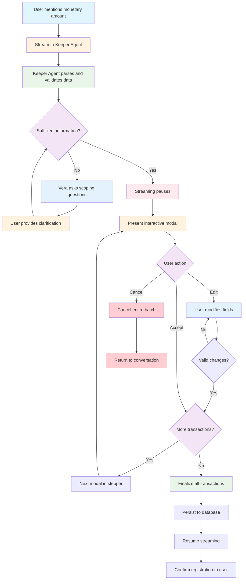

# Conversational Financial Tracking (VIA "Keeper Agent")

## Overview

Conversational Financial Tracking allows users to register monetary amounts naturally through Vera, using a human-in-the-loop validation system. The **Keeper Agent** processes financial information through streaming events, pausing the conversation chain to present interactive modals for user validation and editing before finalizing transactions.

## Data Structure

### Required Fields

```json
{
  "category": "string",            // Main monetary category (Income, Expense, Asset, Liability)
  "amount": "number",              // Monetary amount entered by the user
  "descriptive_name": "string",    // Descriptive name given by the user
  "vera_pov_category": "string"    // Main category (Income, Expense, Asset, Liability)
}
```

### Automatically Inferred Fields (Not Visible to User)

```json
{
  "plaid_subcategory": "string",   // Specific Plaid subcategory (automatically inferred)
  "timestamp": "datetime",         // Registration date and time (automatically generated)
  "user_id": "uuid",               // User ID (obtained from session context)
  "source": "manual_input"         // Transaction source (always "manual_input" for conversational tracking)
}
```

**Important note**: These fields are automatically generated in the backend but are **NOT visible to the user** in the confirmation interface. Only the required fields are shown (amount, type, category, name).

## System Flow Diagram

The following diagram illustrates the complete flow between user, Vera, Keeper Agent, and human-in-the-loop validation:



## Interaction Flow

### 1. Conversation Start

```
User: "I spent $50 at the supermarket yesterday"
```

### 2. Automatic Inference

Vera analyzes the context and:
- Identifies the amount: `$50`
- Infers the main category: `Expense`
- Infers the subcategory: `Groceries` (for internal Plaid mapping)
- Suggests descriptive name: `"Groceries"`

**Note**: If the user mentions a specific subcategory, Vera takes it as context to make the inference more accurate.

### 3. Streaming to Keeper Agent

The conversation streams to the **Keeper Agent** which:
- Parses the financial information
- Pauses the streaming chain
- Triggers the human-in-the-loop validation

### 4. Interactive Modal Presentation

A modal appears with pre-populated fields that can be edited:

```json
{
  "modal_type": "transaction_validation",
  "transaction_id": "txn_001",
  "step": "1/1",
  "fields": {
    "amount": {
      "value": 50.00,
      "editable": true,
      "validation": "positive_number"
    },
    "type": {
      "value": "Expense",
      "editable": true,
      "options": ["Income", "Expense", "Asset", "Liability"]
    },
    "category": {
      "value": "Food & Drinks",
      "editable": true,
      "options": ["Food & Drinks", "Transportation", "Shopping", "Utilities", "Entertainment"]
    },
    "name": {
      "value": "Groceries",
      "editable": true,
      "validation": "non_empty_string"
    }
  },
  "actions": ["Accept", "Cancel"]
}
```

### 5. User Actions

#### If the user accepts:
- Transaction data is validated and stored
- If there are more transactions in the batch, the next modal appears
- If it's the last transaction, all are persisted to the database

#### If the user edits fields:
- Changes are validated in real-time
- User can modify any field (amount, type, category, name)
- Must accept the changes to proceed

#### If the user closes the modal (X):
- **Entire batch is cancelled**
- Streaming resumes with a cancellation message
- No transactions are persisted

## Interaction Examples

### Example 1: Single Transaction

```
User: "I paid $25 for Uber this morning"
[Streaming pauses - Keeper Agent processes]
[Modal appears with pre-populated data]

{
  "modal_type": "transaction_validation",
  "transaction_id": "txn_001",
  "step": "1/1",
  "fields": {
    "amount": {
      "value": 25.00,
      "editable": true,
      "validation": "positive_number"
    },
    "type": {
      "value": "Expense",
      "editable": true,
      "options": ["Income", "Expense", "Asset", "Liability"]
    },
    "category": {
      "value": "Transportation & Travel",
      "editable": true,
      "options": ["Food & Drinks", "Transportation & Travel", "Shopping", "Utilities", "Entertainment"]
    },
    "name": {
      "value": "Uber",
      "editable": true,
      "validation": "non_empty_string"
    }
  },
  "actions": ["Accept", "Cancel"]
}

User: [Accepts]
[Transaction persisted]
Vera: "Registered: $25 in Transportation & Travel - January 15, 2024"
```

### Example 2: Transaction with Editing

```
User: "I bought something for $120 on Amazon"
[Modal appears]

{
  "modal_type": "transaction_validation",
  "transaction_id": "txn_002",
  "step": "1/1",
  "fields": {
    "amount": {
      "value": 120.00,
      "editable": true,
      "validation": "positive_number"
    },
    "type": {
      "value": "Expense",
      "editable": true,
      "options": ["Income", "Expense", "Asset", "Liability"]
    },
    "category": {
      "value": "Shopping & Entertainment",
      "editable": true,
      "options": ["Food & Drinks", "Transportation", "Shopping & Entertainment", "Professional Services", "Utilities"]
    },
    "name": {
      "value": "Amazon",
      "editable": true,
      "validation": "non_empty_string"
    }
  },
  "actions": ["Accept", "Cancel"]
}

1.User: [Edits Name field to "Programming book"]
2.User: [Changes Category to "Professional Services"]
3.User: [Accepts]

[Transaction persisted with edited data]
Vera: "Registered: $120 in Professional Services - January 15, 2024"
```

### Example 3: Multiple Transactions (Stepper)

```
User: "I spent $50 on groceries and $25 on gas"
[Keeper Agent processes both transactions]
[First modal appears]

{
  "modal_type": "transaction_validation",
  "transaction_id": "txn_003",
  "step": "1/2",
  "fields": {
    "amount": {
      "value": 50.00,
      "editable": true,
      "validation": "positive_number"
    },
    "type": {
      "value": "Expense",
      "editable": true,
      "options": ["Income", "Expense", "Asset", "Liability"]
    },
    "category": {
      "value": "Food & Drinks",
      "editable": true,
      "options": ["Food & Drinks", "Transportation", "Shopping", "Utilities", "Entertainment"]
    },
    "name": {
      "value": "Groceries",
      "editable": true,
      "validation": "non_empty_string"
    }
  },
  "actions": ["Accept", "Cancel"]
}

User: [Accepts]
[Second modal appears]

{
  "modal_type": "transaction_validation",
  "transaction_id": "txn_004",
  "step": "2/2",
  "fields": {
    "amount": {
      "value": 25.00,
      "editable": true,
      "validation": "positive_number"
    },
    "type": {
      "value": "Expense",
      "editable": true,
      "options": ["Income", "Expense", "Asset", "Liability"]
    },
    "category": {
      "value": "Transportation & Travel",
      "editable": true,
      "options": ["Food & Drinks", "Transportation & Travel", "Shopping", "Utilities", "Entertainment"]
    },
    "name": {
      "value": "Gas",
      "editable": true,
      "validation": "non_empty_string"
    }
  },
  "actions": ["Accept", "Cancel"]
}

User: [Accepts]
[Both transactions persisted]
Vera: "Registered 2 transactions: $50 in Food & Drinks and $25 in Transportation & Travel - January 15, 2024"
```

### Example 4: Batch Cancellation

```
User: "I spent $100 on various things"
[Modal appears with inferred data]

{
  "modal_type": "transaction_validation",
  "transaction_id": "txn_005",
  "step": "1/1",
  "fields": {
    "amount": {
      "value": 100.00,
      "editable": true,
      "validation": "positive_number"
    },
    "type": {
      "value": "Expense",
      "editable": true,
      "options": ["Income", "Expense", "Asset", "Liability"]
    },
    "category": {
      "value": "General",
      "editable": true,
      "options": ["Food & Drinks", "Transportation", "Shopping", "Utilities", "General", "Entertainment"]
    },
    "name": {
      "value": "Various expenses",
      "editable": true,
      "validation": "non_empty_string"
    }
  },
  "actions": ["Accept", "Cancel"]
}

User: [Closes modal with X]
[Entire batch cancelled]
Vera: "Transaction registration cancelled. No data was saved."
```

### Example 5: Income Registration

```
User: "I received my salary of $3000"
[Modal appears]

{
  "modal_type": "transaction_validation",
  "transaction_id": "txn_006",
  "step": "1/1",
  "fields": {
    "amount": {
      "value": 3000.00,
      "editable": true,
      "validation": "positive_number"
    },
    "type": {
      "value": "Income",
      "editable": true,
      "options": ["Income", "Expense", "Asset", "Liability"]
    },
    "category": {
      "value": "Salary & Wages",
      "editable": true,
      "options": ["Salary & Wages", "Freelance", "Investment", "Business", "Other Income"]
    },
    "name": {
      "value": "Salary",
      "editable": true,
      "validation": "non_empty_string"
    }
  },
  "actions": ["Accept", "Cancel"]
}

User: [Accepts]
[Transaction persisted]
Vera: "Registered: $3000 in Salary & Wages - January 15, 2024"
```

## Scoping Process

When Vera encounters insufficient or ambiguous information, she uses **natural language questions** to gather the necessary details through conversation. Once she has all the required information, the **Keeper Agent** presents an interactive modal for final validation and acceptance.

### Scoping Examples

#### **Amount Scoping**
```
User: "I spent some money on groceries"
Vera: "How much did you spend on groceries?"
User: "About $75"
[Keeper Agent now has all information]
[Modal appears with all fields populated]

{
  "modal_type": "transaction_validation",
  "transaction_id": "txn_scoping_001",
  "step": "1/1",
  "fields": {
    "amount": {
      "value": 75.00,
      "editable": true,
      "validation": "positive_number"
    },
    "type": {
      "value": "Expense",
      "editable": true,
      "options": ["Income", "Expense", "Asset", "Liability"]
    },
    "category": {
      "value": "Food & Drinks",
      "editable": true,
      "options": ["Food & Drinks", "Transportation", "Shopping", "Utilities", "Entertainment"]
    },
    "name": {
      "value": "Groceries",
      "editable": true,
      "validation": "non_empty_string"
    }
  },
  "actions": ["Accept", "Cancel"]
}

User: [Accepts]
[Transaction persisted]
Vera: "Registered: $75 in Food & Drinks - January 15, 2024"
```

#### **Category Scoping**
```
User: "I spent $200"
Vera: "What category would you prefer for this $200 expense?"
User: "It was for utilities"
[Keeper Agent now has all information]
[Modal appears]

{
  "modal_type": "transaction_validation",
  "transaction_id": "txn_scoping_002",
  "step": "1/1",
  "fields": {
    "amount": {
      "value": 200.00,
      "editable": true,
      "validation": "positive_number"
    },
    "type": {
      "value": "Expense",
      "editable": true,
      "options": ["Income", "Expense", "Asset", "Liability"]
    },
    "category": {
      "value": "Utilities",
      "editable": true,
      "options": ["Food & Drinks", "Transportation", "Shopping", "Utilities", "General", "Entertainment"]
    },
    "name": {
      "value": "Utilities",
      "editable": true,
      "validation": "non_empty_string"
    }
  },
  "actions": ["Accept", "Cancel"]
}

User: [Accepts]
[Transaction persisted]
Vera: "Registered: $200 in Utilities - January 15, 2024"
```

#### **Context Scoping**
```
User: "I bought a laptop for $1,500"
Vera: "Is this laptop for personal use or for your business?"
User: "It's for my business"
[Keeper Agent now has all information]
[Modal appears with all fields pre-populated]

{
  "modal_type": "transaction_validation",
  "transaction_id": "txn_scoping_003",
  "step": "1/1",
  "fields": {
    "amount": {
      "value": 1500.00,
      "editable": true,
      "validation": "positive_number"
    },
    "type": {
      "value": "Asset",
      "editable": true,
      "options": ["Income", "Expense", "Asset", "Liability"]
    },
    "category": {
      "value": "Electronics",
      "editable": true,
      "options": ["Electronics", "Furniture", "Real Estate", "Vehicles", "Other Assets"]
    },
    "name": {
      "value": "Laptop",
      "editable": true,
      "validation": "non_empty_string"
    }
  },
  "actions": ["Accept", "Cancel"]
}

User: [Accepts]
[Transaction persisted as asset]
Vera: "Registered: $1,500 in Electronics (Asset) - January 15, 2024"
```

### Scoping Principles
- **Natural conversation first**: Vera asks questions in natural language to clarify ambiguities
- **Modal for validation**: Once all information is gathered, Keeper Agent presents modal for final validation
- **Pre-populated fields**: Modal shows inferred values based on conversation
- **Edit before confirm**: Users can still modify any field before accepting
- **Human-in-the-loop**: Final acceptance always goes through modal validation

## Edge Cases

### Ambiguous Amounts
```
User: "I spent like $100 on something"
Vera: "Could you specify the exact amount and what you spent it on?"
User: "It was $95 for groceries"
[Keeper Agent now has all information]
[Modal appears]

{
  "modal_type": "transaction_validation",
  "transaction_id": "txn_edge_001",
  "step": "1/1",
  "fields": {
    "amount": {
      "value": 95.00,
      "editable": true,
      "validation": "positive_number"
    },
    "type": {
      "value": "Expense",
      "editable": true,
      "options": ["Income", "Expense", "Asset", "Liability"]
    },
    "category": {
      "value": "Food & Drinks",
      "editable": true,
      "options": ["Food & Drinks", "Transportation", "Shopping", "Utilities", "Entertainment"]
    },
    "name": {
      "value": "Groceries",
      "editable": true,
      "validation": "non_empty_string"
    }
  },
  "actions": ["Accept", "Cancel"]
}

User: [Accepts]
[Transaction persisted]
Vera: "Registered: $95 in Food & Drinks - January 15, 2024"
```

### Multiple Categories
```
User: "I bought food and medicine for $80"
Vera: "I see you mention food and medicine. Which category would you like me to use for this transaction?"
User: "It was mostly groceries"
[Keeper Agent now has all information]
[Modal appears]

{
  "modal_type": "transaction_validation",
  "transaction_id": "txn_edge_002",
  "step": "1/1",
  "fields": {
    "amount": {
      "value": 80.00,
      "editable": true,
      "validation": "positive_number"
    },
    "type": {
      "value": "Expense",
      "editable": true,
      "options": ["Income", "Expense", "Asset", "Liability"]
    },
    "category": {
      "value": "Food & Drinks",
      "editable": true,
      "options": ["Food & Drinks", "Medical", "Shopping", "Utilities", "Entertainment"]
    },
    "name": {
      "value": "Groceries",
      "editable": true,
      "validation": "non_empty_string"
    }
  },
  "actions": ["Accept", "Cancel"]
}

User: [Accepts]
[Transaction persisted]
Vera: "Registered: $80 in Food & Drinks - January 15, 2024"
```

### Insufficient Context
```
User: "I spent $200"
Vera: "What category would you prefer for this $200 expense?"
User: "It was for utilities"
[Keeper Agent now has all information]
[Modal appears]

{
  "modal_type": "transaction_validation",
  "transaction_id": "txn_edge_003",
  "step": "1/1",
  "fields": {
    "amount": {
      "value": 200.00,
      "editable": true,
      "validation": "positive_number"
    },
    "type": {
      "value": "Expense",
      "editable": true,
      "options": ["Income", "Expense", "Asset", "Liability"]
    },
    "category": {
      "value": "Utilities",
      "editable": true,
      "options": ["Food & Drinks", "Transportation", "Shopping", "Utilities", "General"]
    },
    "name": {
      "value": "Utilities",
      "editable": true,
      "validation": "non_empty_string"
    }
  },
  "actions": ["Accept", "Cancel"]
}

User: [Accepts]
[Transaction persisted]
Vera: "Registered: $200 in Utilities - January 15, 2024"
```

### Ambiguity between Main Categories
```
User: "I bought a laptop for $1,500"
Vera: "Is this laptop for personal use or for your business?"
User: "It's for my business"
[Keeper Agent now has all information]
[Modal appears]

{
  "modal_type": "transaction_validation",
  "transaction_id": "txn_edge_004",
  "step": "1/1",
  "fields": {
    "amount": {
      "value": 1500.00,
      "editable": true,
      "validation": "positive_number"
    },
    "type": {
      "value": "Asset",
      "editable": true,
      "options": ["Income", "Expense", "Asset", "Liability"]
    },
    "category": {
      "value": "Electronics",
      "editable": true,
      "options": ["Electronics", "Furniture", "Real Estate", "Vehicles", "Equipment"]
    },
    "name": {
      "value": "Laptop",
      "editable": true,
      "validation": "non_empty_string"
    }
  },
  "actions": ["Accept", "Cancel"]
}

User: [Accepts]
[Transaction persisted as business asset]
Vera: "Registered: $1,500 in Electronics (Asset) - January 15, 2024"
```

## Technical Considerations

### Keeper Agent Processing
- **Streaming Integration**: Receives financial data through streaming events
- **Parsing Logic**: Analyzes conversational context to extract monetary information
- **Chain Pausing**: Automatically pauses streaming when financial data is detected
- **Modal Triggering**: Initiates human-in-the-loop validation process
- **Batch Management**: Handles multiple transactions in sequence through stepper

### Modal System
- **Pre-population**: All fields are filled with inferred data
- **Real-time Validation**: Changes are validated as user types
- **Field Editing**: All fields (amount, type, category, name) are editable
- **Stepper Navigation**: Progress indicator shows current transaction in batch
- **Batch Control**: Single cancellation cancels entire batch

### Data Validation
- **Amount**: Must be a positive number
- **Category**: Must be one of the four main categories (Income, Expense, Asset, Liability)
- **Timestamp**: Automatically assigned at final confirmation time
- **Batch Persistence**: All transactions are persisted together at the end

### Complete Data Structure

```json
{
  "category": "Expense",
  "amount": 50.00,
  "descriptive_name": "Groceries",
  "vera_pov_category": "Food & Drinks",
  "plaid_subcategory": "Groceries",
  "timestamp": "2024-01-15T10:30:00Z",
  "user_id": "user-uuid",
  "source": "manual_input"
}
```

**Automatically inferred fields (not visible to user):**
- **vera_pov_category**: Main category (Income, Expense, Asset, Liability)
- **plaid_subcategory**: Specific Plaid subcategory inferred from context
- **timestamp**: Registration date and time automatically generated
- **user_id**: User ID obtained from session context
- **source**: Transaction source (always "manual_input" for conversational tracking)

## System Integration

- **Keeper Agent** processes all financial conversations
- Registered transactions are stored in the user's financial profile
- Integrated with Finance Agent for pattern analysis
- Considered for progress towards financial goals
- **Streaming resumes** after modal validation is complete
- **Batch processing** ensures data consistency across multiple transactions