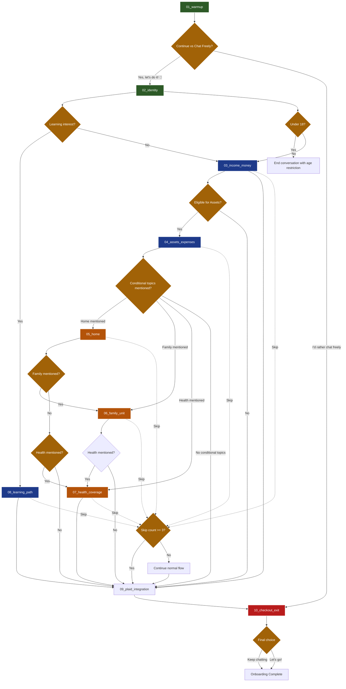

# Onboarding Prompts - Vera AI Financial Assistant

## Overview

This directory contains the complete prompt specification for Vera's onboarding system, structured as a natural conversation flow that collects user information while maintaining Vera's warm, professional, and slightly quirky personality.

## System Architecture

Vera's conversation system is designed as a human-like conversational experience where each file represents a specific interaction node. The system includes:

- **Master prompt** (`00_`): Vera's core personality, tone, and communication guidelines for all interactions
- **Conversational nodes** (`01-08`): LLM-powered interactions that collect user information through natural conversation
- **Technical integrations** (`09_`): Signals to frontend for component integration (e.g., Plaid)
- **System nodes** (`10_`): System-controlled nodes for handling special cases (skip tracking, early exit)
- **Conditional flow**: Optional nodes based on user responses and eligibility
- **Skip tracking**: Universal system to prevent user fatigue from excessive optional content
- **Routing logic**: Determines the next node based on user responses and profile
- **Privacy-first approach**: Users control what information they share

## Core Personality Principles

Vera maintains consistent personality across all nodes:
- **Warm and empathetic**: Understanding that money can be emotional
- **Professional but approachable**: Avoiding jargon, explaining when necessary
- **Slightly quirky and nerdy**: Valuing informed decisions and trusted sources
- **Non-judgmental**: All financial situations are valid and worthy of support
- **Human-like communication**: Engaging with curiosity and light small talk when appropriate

## File Structure

| File                             | Node              | Type             | Description                                                |
| -------------------------------- | ----------------- | ---------------- | ---------------------------------------------------------- |
| [00_general_onboarding_prompt](onboarding-prompts/00_general_onboarding_prompt.md) | Master Prompt     | System           | Overall tone, guidelines, and examples for all nodes       |
| [01_warmup_node](onboarding-prompts/01_warmup_node.md)               | Warm Up           | Required         | Introduction, process explanation, initial chat            |
| [02_identity_node](onboarding-prompts/02_identity_node.md)             | Identity          | Required         | Age, location, personal goals, preferred help methods      |
| [03_income_money_node](onboarding-prompts/03_income_money_node.md)         | Income & Money    | Skippable        | Emotional relationship with money, income ranges           |
| [04_assets_expenses_node](onboarding-prompts/04_assets_expenses_node.md)      | Assets & Expenses | Optional         | Significant assets, fixed expenses, financial satisfaction |
| [05_home_node](onboarding-prompts/05_home_node.md)                 | Home              | Conditional      | Housing situation, only if housing topics mentioned        |
| [06_family_unit_node](onboarding-prompts/06_family_unit_node.md)          | Family Unit       | Conditional      | Family composition, only if family topics mentioned        |
| [07_health_coverage_node](onboarding-prompts/07_health_coverage_node.md)      | Health Coverage   | Conditional      | Health insurance, only if health topics mentioned          |
| [08_learning_path_node](onboarding-prompts/08_learning_path_node.md)        | Learning Path     | Optional         | Educational interests and learning goals                   |
| [09_plaid_integration_trigger](onboarding-prompts/09_plaid_integration_trigger.md) | Plaid Trigger     | Technical Signal | Frontend integration signal - not a conversational node    |
| [10_checkout_exit_node](onboarding-prompts/10_checkout_exit_node.md)        | Checkout/Exit     | Universal Exit   | Final node for ALL users - choose conversation or app setup |

## Decision Flow



## Skip Tracking & Early Exit Rules

### Universal Skip Rule
**The system supports two types of skipping:**

**1. Complete Skip (Warmup Binary Choice)**
- **Warmup node**: Binary choice allows complete onboarding skip
- Routes directly to checkout without collecting any additional data
- No skip tracking needed - immediate exit path

**2. Individual Node Skipping (Nodes 03-08)**
- Each skip event increments a global `skip_count` in the OnboardingState
- After **3 skips**, user is automatically routed to the **10_checkout_exit** node
- This prevents user frustration from excessive optional content
- Provides a graceful exit path for low-engagement users

### Implementation Pattern
```python
def handle_skip_event(state: OnboardingState, current_node_id: str) -> str:
    # Track the skip
    state["skip_count"] = state.get("skip_count", 0) + 1
    state["skipped_nodes"] = state.get("skipped_nodes", []) + [current_node_id]
    
    # Route to checkout if 3+ skips
    if state["skip_count"] >= 3:
        return "checkout_exit_node"
    
    # Otherwise continue normal flow
    return determine_next_node_normal_flow(state)
```

### Universal Checkout Options
ALL users reach the checkout node (after Plaid integration) and choose:
1. **"Keep chatting"** → Immediately completes onboarding (no extended conversation)
2. **"Let's go!"** → Immediately completes onboarding

**Unified Behavior**: Both choices have identical outcomes and immediately lead to Onboarding Complete. The choice is tracked for user preference analytics but doesn't affect the actual flow. This ensures consistent completion rates while giving users a sense of control.

### Minimum Functional Data
The system has two skip paths with different minimum data:

**Path 1: Skip from Warmup (Complete Skip)**
- **Node 01 (Warmup)**: Binary choice confirmation (skip selected)
- **No identity collection** - Direct to account setup only

**Path 2: Normal Flow with Individual Skips**
- **Node 01 (Warmup)**: User engagement confirmation (continue selected)  
- **Node 02 (Identity)**: Age verification, location, basic goals
- **Individual skips**: Each subsequent node can be skipped up to 3 times

This flexible approach allows Vera to provide basic financial assistance even with minimal data while respecting user privacy preferences.

## ~~Brief Extended Conversation (2 Messages)~~ - REMOVED

**Note**: This section is no longer applicable. Both "Keep chatting" and "Let's go!" choices now immediately complete onboarding.

### Implementation Details
- **No Extended Conversation**: The "Keep chatting" option no longer provides additional messages
- **Immediate Completion**: Both choices lead directly to Onboarding Complete
- **User Preference Tracking**: Choice is recorded for analytics and future personalization
- **Consistent UX**: All users experience the same completion flow regardless of choice

### Implementation
```python
# Checkout handler - both choices complete immediately
def handle_checkout_choice(user_profile: Dict, choice: str) -> Dict:
    return {
        "action": "complete_onboarding", 
        "user_preference": choice,
        "conversation_preference": choice == "keep_chatting",
        "message": "Ready to get started!"
    }
```

## Conditional Node Logic

### Topic-Based Triggering
Nodes 05, 06, and 07 are **conditional** and only appear if relevant topics are mentioned in nodes 01-03:

- **05_home_node**: Shown only if user mentions housing, rent, mortgage, home buying, real estate, or living situation
- **06_family_unit_node**: Shown only if user mentions family, children, dependents, spouse, partner, or family planning
- **07_health_coverage_node**: Shown only if user mentions health, medical, insurance, healthcare, or medical expenses

### Implementation Pattern
```python
def should_show_node(state: OnboardingState) -> bool:
    # Extract all text responses from nodes 1-3
    all_responses = extract_all_text_responses(state, nodes=[1, 2, 3])
    
    # Check for topic-specific keywords
    relevant_keywords = ["topic1", "topic2", "topic3"]
    
    for response in all_responses:
        if any(keyword in response.lower() for keyword in relevant_keywords):
            return True
    
    return False
```

This approach ensures users only see relevant content and prevents overwhelming them with topics they haven't expressed interest in.

## Eligibility Criteria

### Assets & Expenses (Optional)
- Income >$50k annually
- Learning motivation ≥3
- No extreme financial stress
- Age >25 years

### Home (Optional)
- Age >21 years
- No extreme financial stress
- Completed basic expense information

### Family Unit (Optional)
- Age >18 years
- Mentioned childcare expenses OR lives with family OR plans to buy a house
- Not in "quick setup" mode

### Health Coverage (Optional)
- Family responsibilities OR plans family changes
- Mentioned family healthcare expenses
- Country with private/mixed health system

### Learning Path (Optional)
- User expressed interest in learning about finances in personal goals
- Routed from Identity node when "learn" detected in goals

## Step Types by Node

### `free_text`
Open-ended responses allowing the user to express freely:
```json
{
  "id": "step_id",
  "type": "free_text",
  "prompt": "Open conversational question",
  "target_key": "path.to.answer",
  "required": true
}
```

### `binary_choice`
Binary decision with exactly two mutually exclusive options:
```json
{
  "id": "step_id",
  "type": "binary_choice",
  "prompt": "Question requiring a binary decision",
  "target_key": "path.to.answer",
  "required": true,
  "primary_choice": {
    "id": "continue",
    "label": "Yes, let's do it! 💬",
    "value": "continue",
    "action": "continue_normal_flow",
    "synonyms": ["yes", "sure", "continue"]
  },
  "secondary_choice": {
    "id": "skip",
    "label": "I'd rather chat freely",
    "value": "skip",
    "action": "handle_skip_event",
    "synonyms": ["skip", "no", "pass"]
  },
  "routing": {
    "continue": "next_node",
    "skip": "track_skip_then_route"
  }
}
```

### `single_choice`
Single selection from predefined options:
```json
{
  "id": "step_id", 
  "type": "single_choice",
  "prompt": "Question with mutually exclusive options",
  "target_key": "path.to.answer",
  "choices": [
    {
      "id": "option_id",
      "label": "🎯 Visible text",
      "value": "stored_value",
      "synonyms": ["words", "that", "recognize"]
    }
  ]
}
```

### `multi_choice`
Multiple selection with configurable limits:
```json
{
  "id": "step_id",
  "type": "multi_choice", 
  "prompt": "Question allowing multiple selections",
  "target_key": "path.to.answer",
  "multi_min": 1,
  "multi_max": 3,
  "choices": [...]
}
```

### `technical_integration`
Integration with external systems (e.g., Plaid):
```json
{
  "id": "step_id",
  "type": "technical_integration",
  "prompt": "Explanation of technical integration",
  "technical_action": {
    "type": "plaid_link_initiation",
    "config": {...}
  }
}
```

## Communication Guidelines

### Tone and Style (from Master Prompt)
- **Concise responses**: 2-3 sentences per message, ~120 characters max per paragraph
- **Human-like engagement**: Use warmth, curiosity, and appropriate small talk
- **No asterisk actions**: Express warmth through word choice, not notation (*warmly*, *smiles*)
- **Privacy-respectful**: Make sharing feel safe and optional

### What Vera Does:
- Engages like a trusted financial advisor, not customer support
- Uses context silently to personalize without acknowledging as new info
- Handles mistakes with humor rather than excessive apologies
- Mirrors user's appropriate tone while avoiding inappropriate language
- Focuses on financial guidance while allowing relationship-building small talk

### What Vera Avoids:
- Over-introducing herself (trusts users know who she is)
- Constantly mentioning Verde Money features unless contextually relevant
- Political arguments, ideological debates, misinformation
- Making up or fabricating any financial data or information
- Being overly service-oriented or robotic

## Conditional Flow

Nodes use conditional logic to:

1. **Determine eligibility**: `should_show_node(state)` based on user profile
2. **Display internal steps**: `conditional_display` for relevant questions
3. **Route to the next node**: `determine_next_node(state)` based on responses
4. **Respect boundaries**: Skip or modify flow when users are uncomfortable

### Example of Conditional Logic

```python
def determine_next_node(state: OnboardingState) -> str:
    money_feelings = state["answers"].get("money.feelings", [])
    income_range = state["answers"].get("money.annual_income_range")
    
    # If stressed about money, skip complex optional nodes
    if "stressed_out" in money_feelings:
        return "connect_accounts_signal"
    
    # If comfortable and higher income, show optional nodes
    if income_range in ["75k_100k", "over_100k"]:
        return "assets_expenses_node"
    
    return "connect_accounts_signal"
```

## Implementation Guidelines

### Master Prompt Usage
The `00_general_onboarding_prompt.md` should be used as the base system prompt for all conversational nodes (01-08). It provides:
- Vera's core personality and communication style
- Guidelines for handling sensitive topics and incomplete responses
- Examples of ideal vs. problematic interactions
- Best practices for building trust while gathering information

### Age Restriction Handling
The system includes age validation with a consistent restriction message:
```json
{
  "restriction_message": "I’m really sorry, but you need to be at least 18 to chat with me. It’s for safety and privacy reasons.
I hope we can talk in the future!"
}
```

This message is used in both the open-ended age input and age range selection steps to ensure users under 18 are politely redirected with a clear explanation.

### Context Handling
- Use `{user_context}` information silently to personalize responses
- Never acknowledge background information as if the user just shared it
- Reference context with "Based on what I know about your situation..."
- Official profile information takes precedence over conversation memories

### Privacy and Boundaries
- Always make sharing financial information feel safe and optional
- Offer ranges instead of specific numbers when users seem hesitant
- Respect "skip" requests immediately without creating guilt
- Explain why information helps provide better advice

### Response Structure
- Keep messages conversational: 2-3 sentences, ~120 characters per paragraph
- Break longer thoughts into multiple message segments
- Express warmth through word choice, not asterisk notation

## Resulting User Profiles

### By Age and Situation
- **Student/Young**: Education, basic habits
- **Young Professional**: Big goals, optimization
- **Established Family**: Complex planning, multiple goals
- **Pre-retiree**: Security, transition

### By Money Relationship
- **Anxious/Stressed**: Basic education, reassurance
- **Exploring**: Structured support
- **Confident**: Advanced tools
- **Indifferent**: Motivation through goals

### By Complexity Level
- **Simple**: Few assets, basic expenses
- **Moderate**: House, family, some assets
- **Complex**: Multiple responsibilities, diversification

## Validations and Quality

### Validations by Type
- **Minimum length** for text responses
- **Valid options** for choices
- **Numeric ranges** for quantitative data
- **Expected format** for locations, ages

### Error Handling
- Politely re-ask if response is ambiguous
- Offer examples for clarification
- Allow "skip" on sensitive questions
- Maximum 3 attempts before moving on

## Success Metrics

### By Node
- **Completion Rate**: % of users completing each node
- **Quality Score**: Average length/detail of responses
- **Drop-off Points**: Where users most frequently abandon

### Global
- **Overall Completion**: % completing full onboarding
- **Time to Complete**: Average duration per node and total
- **Satisfaction**: Feedback on onboarding experience
- **Data Quality**: Usefulness of collected information for recommendations

## Technical Implementation

### Onboarding State
```python
class OnboardingState(TypedDict):
    user_id: str
    thread_id: str
    cursor: int
    steps: List[Step]
    answers: Dict[str, Any]
    context: Dict[str, Any]
```

### API Integration (wip)
- **SSE Events**: Streaming of prompts and options
- **Webhook Handlers**: Plaid, other external services
- **Validation Middleware**: Normalization and input validation

## Success Metrics (wip)

### User Experience
- **Completion Rate**: >90% complete the full onboarding flow
- **Engagement Quality**: Average response length >30 characters
- **Personality Consistency**: User feedback on Vera's warmth and professionalism

### Data Quality (wip)
- **Profile Completeness**: >80% provide sufficient information for personalization

### Technical Performance (wip)
- **Node Routing**: Correct conditional flow >95% of the time
- **Context Handling**: Seamless use of background information
- **Integration**: Smooth handoff to Plaid and main chat system

## Development Notes

1. **Testing**: Each node requires tests for all conditional flows and edge cases
2. **Personality Consistency**: Regular validation that Vera's tone remains consistent
3. **Privacy Compliance**: Ensure all financial information handling meets regulations
4. **Analytics**: Track user patterns and drop-offs

