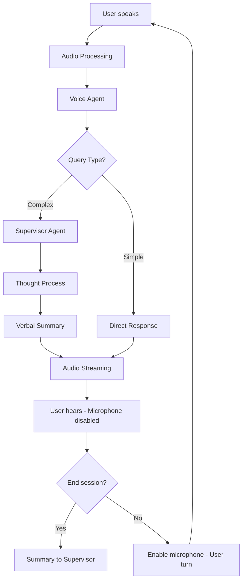
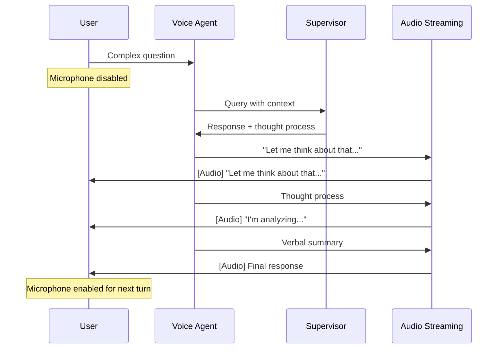

# Voice Mode - Product Documentation

## Overview

Voice Mode is a feature that enables bidirectional conversations between users and Vera through voice, creating a more natural and fluid experience. The interaction is based on conversational turns where Vera and the user alternate speaking, optimized to be brief, direct, and contextually relevant.

## Value Proposition

- **Natural Conversation**: Voice interaction that simulates real conversation
- **Turn-based Interaction**: Clear alternation between user and Vera speaking (interruptions planned for future versions)
- **Preserved Context**: Access to user memories and context for relevant responses
- **Smart Routing**: Simple queries handled by voice agent, complex ones by supervisor
- **Full Control**: On/off mode with session duration tracking

## Core Features

### 1. Turn-based Conversation
- **Conversational Turns**: Vera and user alternate in conversation
- **Voice Detection**: Automatic recognition of when the user finishes speaking
- **Microphone Control**: User microphone is disabled while Vera is speaking
- **Visual Feedback**: State indicators (listening, processing, speaking)

### 2. Specialized Voice Agent
- **Conversational Prompt**: More natural, brief, and spoken tone that respects Vera's essence and personality
- **Memory Access**: User context and episodic/semantic memories
- **Optimized Responses**: Content designed to be heard, not read
- **Personalization**: Adaptation to the user's communication style

### 3. Smart Query Routing
- **Simple Queries**: Handled directly by the voice agent for quick responses
- **Complex Queries**: When deep analysis is required, the voice agent consults the supervisor
- **Thought Process**: Shows the reasoning process for complex responses
- **Verbal Summary**: Converts complex responses into concise spoken messages
- **Preserved Context**: Maintains conversational flow during supervisor consultations

### 4. Session Control
- **On/Off Mode**: Voice mode activation/deactivation
- **Microphone Control**: Option to mute user input
- **Session Duration**: Real-time conversation time tracking displayed in the interface
- **Final Summary**: Upon closing, sends summary to supervisor for closing message

### Data Flow



## User Experience

### Interface States

#### 1. Inactive Mode
- Prominent "Start Voice Mode" button
- Status indicator: "Ready to chat"
- Available configuration options

#### 2. Active Mode - Listening
- Visual indicator: "Listening..."
- Active microphone button
- Option to mute microphone
- "Stop Voice Mode" button
- Session timer display

#### 3. Active Mode - Processing
- Visual indicator: "I'm thinking..."
- Spinner or processing animation
- Microphone disabled during processing

#### 4. Active Mode - Speaking
- Visual indicator (orb or movement)
- Microphone button disabled (turn-based interaction)
- Real-time close captions (ON/OFF)
- Session timer display

#### 5. Active Mode - Connection Issues
- Visual indicator: "Connecting..." / "Slow connection"
- Option to retry connection

#### 6. Active Mode - Background Noise
- Visual indicator: "Too much background noise, I can't understand you properly"

### Main Controls

#### State Indicators
- Listening to user
- Processing response
- Speaking (turn-based interaction)
- Error or microphone disabled
- Connection issues
- Background noise detected

#### Close Captions
- **Real-time transcription** of Vera's responses
- **Synchronization** with audio
- **Readable format** with pauses and punctuation
- **UI Control** - Toggle button to activate/deactivate
- **Accessibility** - improves experience for users with hearing difficulties

#### CC Control Behavior
- **Persistent state**: Preference maintained between sessions
- **Immediate toggle**: Real-time activation/deactivation
- **Visual indicator**: Button clearly shows ON/OFF status
- **Positioning**: Located in main control panel for easy access
- **Accessibility**: Compatible with screen readers and keyboard navigation

#### State Dictionary (Vera POV)
To maintain consistency with the rest of the applications, listening states will be displayed using Vera's standard dictionary:

```json
{
  "voice_states": {
    "listening": "Listening attentively...",
    "processing": "Processing your message...",
    "thinking": "Let me think about that...",
    "speaking": "Let me explain...",
    "connection_poor": "My connection is a bit slow...",
    "noise_detected": "I detect background noise, adjusting...",
    "offline": "No connection, limited mode...",
    "error": "Something went wrong, retrying...",
    "ready": "Ready to chat with you"
  }
}
```

## Interaction Flows

### Main Flow

1. **Session Start**
   - User activates Voice Mode
   - System initializes microphone and audio streaming
   - Voice Agent connects with user context
   - Indicator: "Ready to chat"

2. **Normal Conversation**
   - User speaks → Voice Agent
   - Voice Agent determines query type (simple/complex)
   - Simple: Direct response → User hears
   - Complex: Voice agent asks supervisor → Supervisor → Thought process → Summary → Voice agent responds → User hears
   - Microphone disabled while Vera speaks

3. **Session End**
   - User stops Voice Mode
   - System generates conversation summary with session duration
   - Sends summary to Supervisor
   - Supervisor responds: "We chatted for {duration} about {summary}, would you like to discuss anything else?"

4. **Background Noise Handling**
   - Suggests improving microphone location if it persists

5. **Poor Connection Handling**
   - System detects high latency
   - Shows message: "My connection is a bit slow..."

### Complex Response Flow



## Configuration and Personalization

### User Settings

#### Voice Configuration
- **Speech speed**: Slow, Normal, Fast

#### Conversation Configuration
- **Show thought process**: Only complex responses
- **Session timer display**: Always visible during active voice mode
- **Maximum session duration**: (to be defined)

#### Privacy Configuration
- **Share with supervisor**: Only summaries

#### Audio Configuration
- **Close captions**: Enabled, Disabled

## Testing Plan

### Functionality Testing
- **Basic conversation**: Turn flow with microphone control
- **Query routing**: Simple vs complex query handling
- **Supervisor integration**: Complex responses
- **Session control**: Start, pause, end with timer

### Usability Testing
- **Visual feedback**: State clarity
- **Configuration**: Adjustment simplicity

### Performance Testing
- **Latency**: Response time < 2 seconds
- **Stability**: Long sessions without errors
- **Scalability**: Multiple simultaneous users

---

## Future Versions

### Planned Interruption Features

#### Graduated Interruption System
- **Simple Query Interruptions**: Immediate interruption capability for direct voice agent responses
  - Quick stop and transition to new user input
  - Minimal context preservation needed
  - Instant microphone activation

- **Complex Query Interruptions**: Gradual interruption system for supervisor-involved responses
  - Gentle interruption with context preservation
  - Option to pause supervisor analysis and resume later
  - Visual confirmation before stopping complex processing
  - Ability to queue new simple queries while complex ones complete

#### Core Interruption Features
- **Context Preservation**: Interrupted responses will be saved and can be resumed
- **Natural Flow**: Seamless transition from interruption to new user input
- **Visual Feedback**: Clear indicators when interruption is detected and processed
- **Smart Routing**: Different interruption behaviors based on query complexity

*Note: Graduated interruption functionality is planned for future releases to ensure a stable and reliable first version with sophisticated interaction patterns.*

## Implementation Notes

### Voice Agent Prompt
```
You are Vera in voice mode. Your personality is conversational, brief, and natural.

CHARACTERISTICS:
- Speak as if you're in a real conversation
- Use contractions and colloquial language
- Keep responses concise (maximum 2-3 sentences)


AVAILABLE CONTEXT:
- User memories: {user_memories}
- Session context: {session_context}
- Recent history: {recent_history}

QUERY ROUTING:
- SIMPLE QUERIES: Handle directly with conversational responses
- COMPLEX QUERIES: Say "Let me analyze this more thoroughly..." and consult supervisor
- Show thought process only for complex queries
- Summarize supervisor responses conversationally

TURN-BASED INTERACTION:
- Keep responses focused and brief for voice interaction
```
