# 1. C4 Model & System Diagram

This document provides a high-level, visual overview of the Vera V1 system architecture using the [C4 model](https://c4model.com/). The goal is to explain how the system is structured and how its parts interact. This version reflects the **Multi-Agent Orchestrator** pattern and a pragmatic, **Heuristics-Based Proactive Engine** for V1.

## Level 1: System Context Diagram

This diagram shows Vera as a box in the middle of its ecosystem, illustrating the key users and external systems it interacts with.

```mermaid
graph TD
    User["👩‍💻 User<br/>(Vera Client)"]
    BusinessUser["🧑‍💼 Business User<br/>(Financial Coach, PM)"]
    
    System_Vera["Vera AI Platform"]

    User -- "Interacts with via<br/>Mobile App, WhatsApp" --> System_Vera
    BusinessUser -- "Manages rules &<br/>reviews insights via system prompts" --> System_Vera

    System_Vera -- "Consumes financial data via" --> ClientFinSvc["🏦 Client Financial Data Service"]
    ClientFinSvc -- "Emits events or serves<br/>read APIs" --> System_Vera

    System_Vera -- "Sends notifications via" --> PushService["📲 Push Notification Services<br/>(Apple, Google)"]
    System_Vera -- "Uses for messaging via" --> Twilio["💬 Twilio API"]
    System_Vera -- "Uses for voice I/O via" --> SpeechServices["🗣️ Speech AI Services<br/>(Sesame AI, Eleven Labs)"]
```

## Level 2: Container Diagram (Heuristics Model)

This diagram zooms into the `Vera AI Platform` boundary. It shows the high-level applications and data stores that make up the system. The proactive engine is now a simplified, code-driven Heuristics Engine.

```mermaid
graph TD
    User["👩‍💻 User"]
    ClientFinSvc["Client Financial Data Service"]
    
    subgraph "Integration Layer"
        APIGW["API Gateway"]
        LambdaAdapters["Channel Adapters<br/>(AWS Lambda)"]
    end

    subgraph "Core Application"
        AgentSystem["Agent System<br/>(Orchestrator + Specialist Agents<br/>on Bedrock AgentCore)"]
        HeuristicsEngine["Heuristics Engine<br/>(Scheduled Lambda with hardcoded rules)"]
    end

    subgraph "Backend Services"
        UserService["User Management Service<br/>(Backend Service)"]
    end

    subgraph "Data & Persistence"
        UserDB["User DB<br/>(Aurora PostgreSQL)"]
        ConversationalMemory["Conversational Memory<br/>(STM + LTM)"]
    end

    ExternalFin["Client Financial Data Service<br/>(External)"]

    User --> APIGW
    APIGW --> LambdaAdapters
    LambdaAdapters --> AgentSystem

    ClientFinSvc -- "emits events to" --> HeuristicsEngine
    HeuristicsEngine -- "reads" --> ClientFinSvc
    HeuristicsEngine -- "triggers" --> AgentSystem
    
    AgentSystem -- "reads APIs" --> ExternalFin
    AgentSystem -- "use tools" --> UserService
    AgentSystem -- "read/write" --> ConversationalMemory
    AgentSystem -- "read/write" --> UserDB
```

## Level 3: Component Diagrams

Further detail on the components *inside* each container is provided in the specific architectural documents. The `Heuristics Engine` is a single, scheduled Lambda function whose logic is detailed in `05_Backend_Services_and_Tools.md`.
