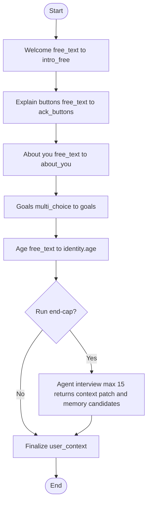

## Onboarding Graph — Quickstart (V1)

Build a deterministic onboarding flow in LangGraph that supports mid‑flow categorical chips and an optional, bounded finance micro‑interview. The flow produces a compact `user_context` record (see `07_Data_and_Persistence_Layer.md`) that will be injected by the main chat system after onboarding. This onboarding graph is independent from the production Orchestrator.

### What you build
- **Server graph**: a dedicated onboarding graph (separate from general chat).
- **Deterministic steps**: ordered list with types `free_text | single_choice | multi_choice | agent_interview`.
- **Streaming UX**: prompts and options are streamed over SSE.
- **Finalize**: upsert `user_context` in Postgres and mark onboarding ready.
- **Registered‑only**: same flow for all users; no tier gating.

## API (Omnichannel layer)
- **POST** `/initialize_onboarding` → `{ thread_id, welcome, sse_url }`
- **POST** `/onboarding/message` with `{ thread_id }` and one of:
  - `{ type: "text", text: string }`
  - `{ type: "choice", step_id: string, choice_ids: string[] }`
  - `{ type: "control", action: "back"|"skip" }`
- **POST** `/onboarding/done/{thread_id}` → `202 Accepted` (finalize in background)

Auth: registered users only (e.g., Cognito).

### SSE events (streamed)
- `conversation.started` { thread_id }
- `token.delta` { text }
- `step.update` { step_id, status: "presented"|"awaiting_input"|"validating"|"completed" }
- `onboarding.options` { step_id, choices: [{ id, label }] }
- `onboarding.status` { thread_id, status: "queued"|"processing"|"done"|"failed" }
- `interview.started|progress|completed` { step_id, turns, filled_fields }
- `memory.candidate|created|dropped`
- `conversation.summary`, `conversation.ended`

## State and step types (typed)
```python
from __future__ import annotations
from typing import Any, Dict, List, Literal, Optional, TypedDict
from pydantic import BaseModel, Field

StepType = Literal["free_text", "single_choice", "multi_choice", "agent_interview"]

class Choice(BaseModel):
    id: str
    label: str
    value: str
    synonyms: List[str] = Field(default_factory=list)

class InterviewSpec(BaseModel):
    agent: Literal["FinanceAgent"]
    schema_ref: str              # import path, e.g. "vera.onboarding.schemas:FinanceInterview"
    max_turns: int = 6
    instructions: str = ""

class Step(BaseModel):
    id: str
    type: StepType
    prompt: str
    target_key: str              # where the answer goes in answers map
    required: bool = True
    choices: List[Choice] = Field(default_factory=list)
    multi_min: int = 0
    multi_max: int = 99
    interview: Optional[InterviewSpec] = None

class OnboardingState(TypedDict, total=False):
    user_id: str
    thread_id: str
    cursor: int
    steps: List[Step]
    answers: Dict[str, Any]
```

## Minimal steps config (includes a categorical middle step)
```json
[
  { "id": "welcome", "type": "free_text",
    "prompt": "Nice to meet you! How about a quick chat so I can get to know you?",
    "target_key": "intro_free" },

  { "id": "explain_buttons", "type": "free_text",
    "prompt": "You’ll sometimes see buttons as quick shortcuts. You can always type anything.",
    "target_key": "ack_buttons" },

  { "id": "about_you", "type": "free_text",
    "prompt": "Tell me a bit about your daily life, your work, your family, or whatever.",
    "target_key": "about_you" },

  { "id": "goals", "type": "multi_choice",
    "prompt": "And what money goals are on your mind? Big dreams or small wins, I’m all ears.",
    "target_key": "goals", "multi_min": 1,
    "choices": [
      { "id": "save_more", "label": "Save more money", "value": "save_more_money",
        "synonyms": ["save money", "build savings"] },
      { "id": "big_purchase", "label": "Make a big purchase", "value": "make_big_purchase" },
      { "id": "track_better", "label": "Track my money better", "value": "track_my_money_better" },
      { "id": "build_habits", "label": "Build better habits", "value": "build_better_habits" },
      { "id": "learn_finance", "label": "Learn about finances", "value": "learn_about_finances" }
    ] },

  { "id": "age", "type": "free_text",
    "prompt": "How old are you, if you don’t mind me asking?",
    "target_key": "identity.age" }
]
```

## Graph skeleton
```python
from langgraph.graph import StateGraph, END

def present_step(state: OnboardingState) -> OnboardingState:
    step = state["steps"][state["cursor"]]
    # emit prompt + onboarding.options via channel adapter
    return state

def ingest_input(state: OnboardingState, user_input: Dict[str, Any]) -> OnboardingState:
    step = state["steps"][state["cursor"]]
    value = normalize_input(step, user_input)  # choice normalization or raw text
    state.setdefault("answers", {})[step.target_key] = value
    return state

def advance_or_finish(state: OnboardingState) -> OnboardingState:
    state["cursor"] += 1
    return state

def should_continue(state: OnboardingState) -> str:
    return "present_step" if state["cursor"] < len(state["steps"]) else "finalize_user_context"

graph = StateGraph(OnboardingState)
graph.add_node("present_step", present_step)
graph.add_node("ingest_input", ingest_input)
graph.add_node("advance_or_finish", advance_or_finish)
graph.add_node("finalize_user_context", lambda s: s)  # persist & emit done

graph.set_entry_point("present_step")
graph.add_edge("present_step", "ingest_input")
graph.add_edge("ingest_input", "advance_or_finish")

graph.add_conditional_edges(
    "advance_or_finish",
    should_continue,
    {
        "present_step": "present_step",
        "finalize_user_context": "finalize_user_context",
    },
)

graph.add_edge("finalize_user_context", END)
```

## Onboarding step flow (Mermaid)


## Optional finance micro‑interview (bounded)
- Step type: `agent_interview` pauses the flow and runs a short conversation with a dedicated `FinanceInterviewAgent` micrograph (part of onboarding, not the Orchestrator).
- Constraints: the micrograph exposes a single tool that accepts the interview schema; only that tool can be called.
- Completion: when the tool is invoked with all required fields.
- Availability: enabled for all registered users; identical behavior across tiers.

Schema example:
```python
from pydantic import BaseModel
from typing import List, Literal, Optional

class FinanceInterview(BaseModel):
    income_source: Literal["salary","hourly","self_employed","benefits","other"]
    pay_frequency: Literal["weekly","biweekly","semi_monthly","monthly","irregular","unknown"]
    monthly_take_home_usd: Optional[float] = None
    has_debt: bool
    top_goals: List[str] = []
```

## Final "Anything else?" bounded micro‑interview (context finisher)
- Goal: complete any missing `user_context` fields; any extra information becomes memory candidates, not part of `user_context`.
- How: append a final `agent_interview` step that returns a partial context patch and optional memory candidates. Capped at 15 turns; stop early on decline.

Append to steps config:
```json
{
  "id": "anything_else",
  "type": "agent_interview",
  "prompt": "Before we wrap, anything else I should capture to complete your profile?",
  "target_key": "noop",
  "interview": {
    "agent": "FinanceAgent",
    "schema_ref": "vera.onboarding.schemas:ContextCompletion",
    "max_turns": 15,
    "instructions": "Ask concise follow-ups to complete any missing fields in user_context (identity, safety, style, location, locale, goals, income, housing, tier, accessibility, budget_posture, household, assets_high_level). For details that do not belong in user_context, emit them as memory candidates. Stop immediately if the user declines or you are satisfied."
  }
}
```

Tool schema returned by the micrograph:
```python
from pydantic import BaseModel
from typing import Any, Dict, List

class ContextCompletion(BaseModel):
    patch: Dict[str, Any] = {}
    memory_candidates: List[str] = []
```

Semantics:
- `patch` contains dot‑path keys limited to allowed `user_context` fields, for example: `"identity.preferred_name"`, `"style.verbosity"`, `"locale.currency_code"`, `"goals"`, `"income"`, `"housing"`, `"tier"`, `"accessibility.reading_level_hint"`, `"budget_posture.active_budget"`, `"household.dependents_count"`, `"assets_high_level"`.
- The graph merges `patch` into `state.answers` and proceeds to finalize.
- Each string in `memory_candidates` is emitted via `memory.candidate` and can be created or dropped by the memory service; none of these are persisted to `user_context`.

## Mapping to `user_context` (Postgres)
- `goals` ← canonical values from the `goals` step.
- `identity.age` ← parsed integer.
- If interview used: `income` fields ← `FinanceInterview` object.
- Keep heavy/live data out; compute `locale.local_now_iso` server‑side.
 - Finalization: expand `answers[target_key]` (dot‑path keys) into a nested object and merge any `ContextCompletion.patch` before upsert.

## Eligibility
Onboarding is identical for all tiers and requires an authenticated, registered user.

## Storage
- Work‑in‑progress `OnboardingState` by `thread_id` in DynamoDB/Redis (TTL ~24h).
- Final `user_context` upsert in Postgres per `07_Data_and_Persistence_Layer.md`.

## Frontend integration (SSE‑driven)
- Session lifecycle:
  - Call `POST /initialize_onboarding` → `{ thread_id, welcome, sse_url }`.
  - Open an `EventSource(sse_url)` and render streamed tokens as they arrive (`token.delta`).
  - Maintain `thread_id`.
- Rendering prompts and options:
  - Listen for `step.update` to track `presented|awaiting_input|validating|completed`.
  - Listen for `onboarding.options` and render quick‑reply chips for single/multi choice.
  - Always allow free text; typed text must be normalized server‑side against `synonyms`.
- Sending input:
  - Text: `POST /onboarding/message` with `{ thread_id, type: "text", text }`.
  - Choice: `{ thread_id, type: "choice", step_id, choice_ids }`.
  - Controls: `{ thread_id, type: "control", action: "back"|"skip" }`.
- Micro‑interview UX (`agent_interview`):
  - Show a transient sub‑thread UI while `interview.started|progress` events stream.
  - Treat user replies as regular `text` messages until `interview.completed` emits.
  - When completed, the main graph resumes at the next step or finalization.
- Ending / finalize:
  - After the last step (including the "Anything else?" cap), call `POST /onboarding/done/{thread_id}`.
  - Show background progress via `onboarding.status` → `queued|processing|done|failed`.
  - Close the `EventSource` after `done` and redirect to the main chat, passing `user_context` availability.

## Testing checklist
- Choice normalization: chips vs typed text.
- Step loop: next/back/skip.
- Finalization: `user_context` record created and injected on first general chat turn.
- SSE snapshots for `onboarding.options` and prompt text.
- End‑cap loop: early finish on decline, hard stop at 15 turns, proper resumption to finalize.


