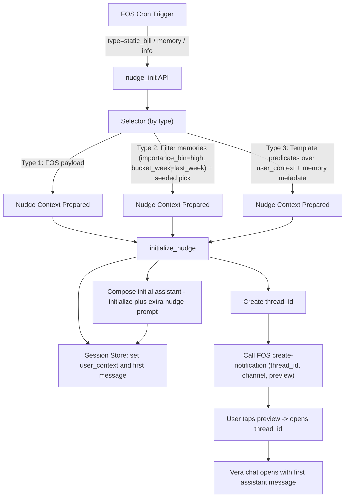

## Nudge System Implementation Plan

This document outlines the concrete changes and flows needed to implement Nudges in Vera using the existing architecture and stores. It avoids new databases and extra LLM calls, and keeps selection deterministic.

### Goals and Constraints
- No new persistent tables; reuse existing stores (user_context, S3 Vectors memories, session store).
- No extra LLM calls beyond the memory hotpath you already run each turn.
- FOS orchestrates timing via cron; we pre-create threads and insert the first assistant message.
- Deterministic selection for types 2 and 3 via metadata-only filters and seeded choice.

---

## 1) Files and Components to Touch

- `app/agents/supervisor/memory/hotpath.py`
  - Extend the semantic memory output schema to include deterministic metadata on write (in the same single LLM call you already use):
    - `topic_key` (e.g., bill, goal, spending_pattern, subscription, rent_increase)
    - `importance_bin` (derived from importance: high|med|low)
    - `bucket_week` (YYYY-WW from created_at)
    - Optional flags for nudge eligibility/cooldown (e.g., `nudge_tag_spending_pattern`, `nudge_cooldown_until`)
  - Ensure these keys are included in the stored value/metadata so we can filter by equality later.

- `app/repositories/s3_vectors_store.py`
  - Ensure `put()` forwards selected value keys into the S3 Vectors metadata (e.g., `topic_key`, `importance_bin`, `bucket_week`, `nudge_*`).
  - Add a metadata-only search path (no embeddings) for nudge selection, or allow `search` to accept an empty query and use a zero-vector with a filter-only query.
  - Keep equality filters only (already supported via `_build_filter`).

- `app/services/supervisor.py`
  - Add `initialize_nudge` method that mirrors the existing `initialize` flow and:
    - Creates a `thread_id` and queue.
    - Loads/snapshots `user_context` into the session (same as existing initialize).
    - Computes the first assistant message using the same code path as today, but with an additional single "nudge prompt line" appended to the prompt so the response is on-topic.
    - Inserts that assistant message as `conversation_messages[0]`.
    - Returns `thread_id`.
  - No extra state is persisted beyond the normal session updates (no `nudge_context` persistence required).

- `app/services/external_context` (new small client)
  - Add `notifications` client to call FOS “create-notification” endpoint with: `thread_id`, `channel`, and `preview_text` for the app to display.

- `app/services/nudges/selector.py` (new)
  - Type 2 (memory-based) selector: metadata-only filter then deterministic seeded pick.
  - Type 3 (info-based) selector: template-driven predicates over memory metadata and `user_context` (no embeddings, no LLM).

- `app/services/nudges/templates.py` (new)
  - Declarative nudge templates (copy, variables, channel, guards like quiet-hours/cooldowns). No runtime logic here; just data definitions the selector uses.

---

## 2) Flows by Nudge Type

### Type 1 — Static Bills (FOS-Scheduled)
- Trigger: FOS cron decides timing and sends `nudge_init` request with bill payload.
- Steps:
  1) `initialize_nudge` creates `thread_id`, snapshots `user_context`.
  2) Use the existing initialize prompt logic, appending a single "nudge prompt line" built from the bill payload (label, due_date, amount) to generate the first assistant message.
  3) Insert as the first message in `conversation_messages`.
  4) Call FOS create-notification with `thread_id`, channel, and preview text.
- Determinism: fully driven by FOS; we do no selection.

### Type 2 — Memory Icebreaker (Periodic, Random High-Importance from Last Week)
- Trigger: FOS cron calls `nudge_init` with `type=memory_icebreaker`.
- Selection (deterministic, no LLM):
  - Filter S3 Vectors by metadata: `ns=(user_id, "semantic")`, `importance_bin=high`, `bucket_week=last_week`.
  - Stable seeded pick: seed = hash(user_id + todays_date); sort candidates by (`created_at` desc, key); pick `seed % len(candidates)`.
- Steps:
  1) `initialize_nudge` creates `thread_id`, snapshots `user_context`.
  2) Use the existing initialize prompt logic, appending a single "nudge prompt line" derived from the chosen memory (e.g., category + summary) to generate the first assistant message.
  3) Insert as the first message in `conversation_messages`.
  4) Call FOS create-notification with `thread_id`, channel, and preview.
- Optional dedupe: write a `nudge_cooldown_until` metadata back into that memory to avoid immediate repeats (metadata update only).

### Type 3 — Info-Based (Rule/Template Driven from Memory Metadata + User Context)
- Trigger: FOS cron calls `nudge_init` with `type=info_based` and optional `template_id`.
- Selection (deterministic, no LLM):
  - Evaluate template predicates over:
    - `user_context` fields (e.g., `budget_posture.active_budget`, `locale_info.time_zone`).
    - Memory metadata (e.g., `topic_key in {subscription, spending_pattern, goal_active}`, `valid_until >= now`, guard flags).
  - If many candidates match, apply priority sorting and seeded pick.
- Steps:
  1) `initialize_nudge` creates `thread_id`, snapshots `user_context`.
  2) Use the existing initialize prompt logic, appending a single "nudge prompt line" derived from the selected template and variables to generate the first assistant message.
  3) Insert as the first message in `conversation_messages`.
  4) Call FOS create-notification with `thread_id`, channel, and preview.
- Guards: enforce quiet-hours, caps, cooldowns at selection-time (in selector).

---

## 3) Determinism and Sync Guarantees
- No new tables: all state comes from `user_context` and memories.
- No extra LLM calls: memory metadata is produced at write-time in the existing hotpath.
- Selection is equality-filtered on metadata and seeded choice → repeatable.
- Optional dedupe uses memory metadata updates (e.g., `nudge_cooldown_until`).

---

## 4) Mermaid Diagram



---

## 5) Acceptance Notes
- Frontend must open `thread_id` and render existing `conversation_messages[0]` on entry.
- FOS needs the notification JSON to include `thread_id`, preview, and channel.
- Quiet-hours/caps/cooldowns enforced centrally in the selector for Type 2/3.
- If zero candidates exist for Type 2/3, return a no-op response to FOS.

---

## 6) Summary of Minimal Changes
- Memory hotpath: add deterministic metadata keys at write-time (same LLM pass).
- S3 Vectors store: forward metadata keys; provide filter-only search.
- Supervisor service: implement `initialize_nudge` flow that calls the existing initializer path with an extra single "nudge prompt line" to generate the first assistant message; no extra persistence beyond normal session updates.
- Add small FOS notifications client.
- Add `nudges.selector` and `nudges.templates` for clean separation of policy from glue.

---

### Type 3 — Deep Dive and Example

What it uses (no new tables, no extra LLM calls):
- `user_context` directly from the existing initialize flow.
- Semantic memories’ stored metadata/value (written during hotpath):
  - `topic_key` (e.g., subscription, spending_pattern, goal_active)
  - `importance_bin` (e.g., high)
  - `bucket_week` (YYYY-WW)
  - Optional: `valid_until`, `nudge_*` flags, simple numeric/text variables if present

Deterministic selection (selector):
1) Fetch `user_context` (already done by initialize path).
2) Build a filter over memory metadata based on the chosen rule/template (e.g., `topic_key in {...}`, `valid_until >= now`).
3) Query S3 Vectors using equality filters only (zero-vector query), namespace `(user_id, "semantic")`.
4) If candidates > 1: apply stable seeded pick: `seed = hash(user_id + YYYY-MM-DD)`; sort by (`created_at` desc, `key`), pick `seed % len(candidates)`.
5) Enforce guards (quiet-hours, per-type caps, cooldown from metadata flags if used).
6) Produce minimal variables (category, date, summary) from the chosen memory’s value/metadata.

First assistant message (initialize_nudge):
- Use your existing initialize prompt logic.
- Append one extra “nudge prompt line” so the first assistant response is on-topic.
- No additional state persisted; just write `conversation_messages[0]` as usual.

Example: Subscription renewal (info-based)
- Intent: Proactively check a subscription that renews soon.
- Filter:
  - `topic_key = "subscription"`
  - `valid_until >= now()` (e.g., renewal_date)
  - Optional memory metadata: `provider`, `plan_name`
- Selection:
  - Run the equality-filter search; if several subscriptions match, use seeded pick.
- Extra nudge prompt line (example):
  - "NUDGE_CONTEXT: The user has a subscription that renews on {renewal_date} ({provider}/{plan}). Open with a friendly reminder and offer to review/cancel or keep as is. Keep it concise."
- Flow:
  1) FOS cron → `type=info_based` (e.g., template_id=subscription_renewal)
  2) Selector finds the memory and extracts `{provider, plan, renewal_date}`
  3) `initialize_nudge` creates `thread_id`, loads `user_context`, adds extra nudge prompt line, generates first assistant message
  4) Return `thread_id` to FOS → send notification (push/in-app) with preview

Example: Spending pattern (info-based)
- Intent: Encourage review of a detected spending pattern stored as memory.
- Filter:
  - `topic_key = "spending_pattern"`
  - Optional: `nudge_tag_spending_pattern = true`, `valid_until >= now()`
- Extra nudge prompt line (example):
  - "NUDGE_CONTEXT: A spending pattern was detected in {category}. Open by offering a quick review and one actionable tip. Be supportive and concise."


---

## 7) Engineering Implementation Checklist (Actionable)

### A. Memory Hotpath metadata (deterministic, same LLM pass)
- Add these keys to semantic memory value/metadata when writing:
  - `topic_key`: string (e.g., subscription, spending_pattern, goal_active, bill, rent_increase)
  - `importance_bin`: enum {high, med, low} derived from existing `importance`
  - `bucket_week`: string `YYYY-WW` from `created_at`
  - Optional rule fields (only when safely extractable during the same pass):
    - `valid_until` (ISO date)
    - `provider`, `plan_name` (subscriptions)
    - `category` (spending pattern/goal)
    - `progress_pct` (0–100, number)
    - `trailing_30d_spend`, `baseline_30d_spend` (numbers)
    - `nudge_cooldown_until` (ISO date, optional)
- Acceptance:
  - Keys present in stored value and S3 Vectors metadata for equality filtering.
  - No extra LLM calls added.

### B. S3 Vectors store: metadata-only search
- Add a function to support filter-only queries (no text query):
  - Name: `search_by_filter(namespace: tuple[str, ...], filter: dict, limit: int, offset: int) -> list[SearchItem]`
  - Behavior: internally uses zero-vector + `_safe_query_vectors(..., filter=...)`.
  - Compose `filter` with equality keys only; include `ns_0=user_id`, `ns_1=semantic`, plus metadata keys.
- Acceptance:
  - Can list candidates by `topic_key`, `importance_bin`, `bucket_week`, `valid_until`, etc., without embeddings.
  - Logs on filter validation error and returns empty list.

### C. Nudges selector module
- Location: `app/services/nudges/selector.py`
- Functions:
  - `select_memory_icebreaker(user_id: UUID, now: datetime) -> Selected | None`
    - Filter: `topic_key` any, `importance_bin=high`, `bucket_week=last_week`.
    - Deterministic pick: seed = hash(user_id + YYYY-MM-DD) → sort (`created_at` desc, key) → pick.
  - `select_info_based(user_id: UUID, rule_id: str, now: datetime) -> Selected | None`
    - Fetch `user_context`.
    - Get candidates via `search_by_filter` per rule’s `topic_key` set and guards.
    - Evaluate rule predicate (pure boolean) per candidate.
    - If any True → priority/sort + seeded pick; else None.
- `Selected` shape:
  - `{ memory_key, variables: dict[str, str|float|int], preview_text: str, nudge_prompt_line: str }`
- Acceptance:
  - Deterministic across retries the same day.
  - Returns None if no eligible candidate.

### D. Rule registry (pure predicates)
- Location: `app/services/nudges/templates.py`
- Contents:
  - Rule metadata: `rule_id`, required metadata keys, boolean predicate signature `(user_context, memory_value, memory_meta, now) -> bool`.
  - Examples (non-exhaustive):
    - `goal_milestone_soon`: `topic_key=goal_active`, `80 <= progress_pct < 95`, `updated_within_30d`.
    - `spending_pattern_alert`: `topic_key=spending_pattern`, `trailing_30d_spend >= 200`, delta vs `baseline_30d_spend >= 30%`.
    - `education_tip_relevant`: `topic_key=education_interest`, `updated_within_60d`.
- Acceptance:
  - All predicates are side-effect free and fast.

### E. Supervisor service: initialize_nudge
- Location: `app/services/supervisor.py`
- Function: `initialize_nudge(user_id: UUID, nudge_prompt_line: str, preview_text: str, channel: str) -> thread_id`
- Behavior:
  - Create `thread_id` and SSE queue (existing path).
  - Load `user_context` into session (existing path).
  - Generate first assistant message using current initialize logic + append `nudge_prompt_line`.
  - Insert as `conversation_messages[0]` in session.
  - Return `thread_id`.
- Acceptance:
  - Produces an on-topic first message with no additional state persistence beyond normal session updates.

### F. FOS notifications client
- Location: `app/services/external_context/notifications.py`
- Function: `create_notification(thread_id: str, channel: Literal["push","in_app"], preview_text: str) -> bool`
- Payload (example):
```json
{
  "thread_id": "<uuid>",
  "channel": "push",
  "preview_text": "I noticed a useful insight to review",
  "manifestation": { "timing": "immediate" }
}
```
- Acceptance:
  - Idempotent on FOS side; returns True/False.

### G. API contract: nudge_init (server ingress)
- Endpoint (internal): `POST /nudges/init`
- Payload (examples):
```json
{ "type": "static_bill", "user_id": "<uuid>", "bill": { "label": "Internet", "due_date": "2025-09-14", "amount": 45.00 }, "channel": "push" }
```
```json
{ "type": "memory_icebreaker", "user_id": "<uuid>", "channel": "in_app" }
```
```json
{ "type": "info_based", "user_id": "<uuid>", "rule_id": "spending_pattern_alert", "channel": "push" }
```
- Response:
```json
{ "thread_id": "<uuid>", "status": "enqueued|skipped" }
```
- Acceptance:
  - Returns `skipped` when no eligible candidate for Type 2/3.

### H. Determinism and guards
- Seeded choice: `seed = sha1(user_id + YYYY-MM-DD [+ category]).hex()` → convert to int.
- Sorting: primary `created_at` desc, secondary `key` asc, tertiary `provider/plan/category` when present.
- Cooldown: if `nudge_cooldown_until` in memory metadata and `now < cooldown`, skip candidate.
- Quiet hours / caps: enforced by FOS scheduling; local hard guard optional.

### I. Observability & idempotency
- Structured logs:
  - `nudge.selector.start|end`, include user_id, type, rule_id, num_candidates, chosen_key.
  - `nudge.init.created`, include thread_id, preview hash, channel.
  - `nudge.skipped`, reason (no_candidates|guards|errors).
- Tracing: annotate Langfuse trace with `nudge_type`, `rule_id`, `memory_key` when applicable.
- Idempotency: if FOS retries with same payload id, return the same `thread_id` (cache response for short TTL or let FOS handle).

### J. Testing plan
- Unit tests:
  - Hotpath metadata mapping (keys present, bins correct, bucket_week correct).
  - `search_by_filter` returns expected sets; handles invalid filters.
  - Rule predicates (true/false cases, boundary conditions).
  - Seeded choice stability across retries/day.
- Integration tests:
  - Full Type 1/2/3 flows using test fixtures for memories and user_context.
  - Privacy: preview text contains no PII; specifics contained only in assistant message.

### K. Rollout & configuration
- Feature flags:
  - `NUDGES_ENABLED`, `NUDGES_TYPE2_ENABLED`, `NUDGES_TYPE3_ENABLED`.
- Safe defaults:
  - Start with Type 1 only; enable Type 2 for a small cohort; then Type 3 on select rules.
- Configuration:
  - Thresholds (e.g., progress_pct, spend deltas) in env config with sane defaults.

---

## 8) Known Risks and Mitigations (Quick Reference)
- Metadata gaps → Start with a small, whitelisted metadata set; add more iteratively.
- Repetition → Add cooldown metadata; include category in seed.
- Staleness → Enforce `updated_within_N_days` in predicates.
- PII in preview → Keep previews generic.
- Scale → Keep queries filter-only; batch per user; backoff on rate limits.
