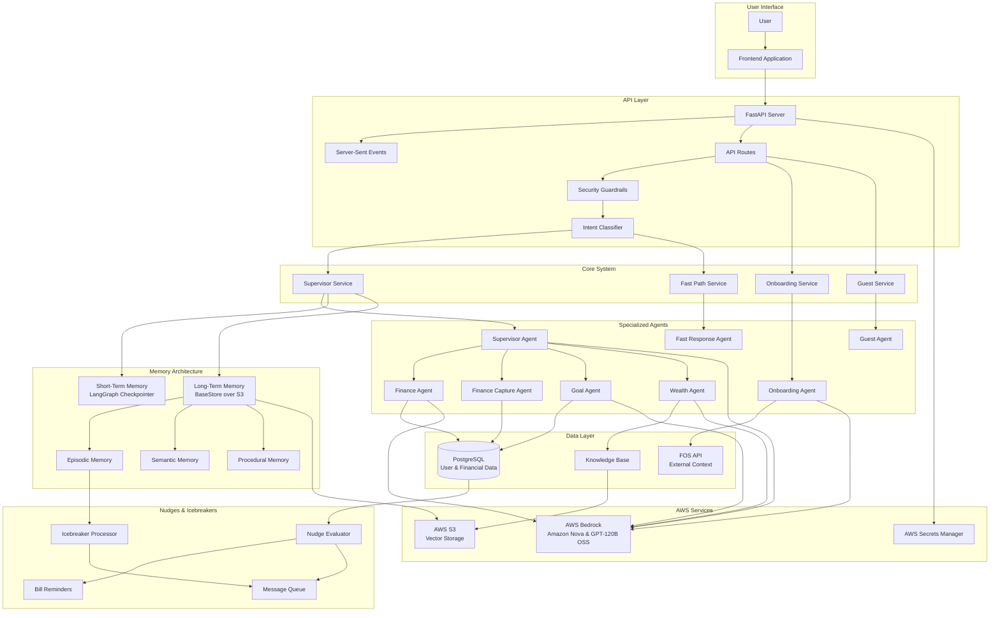
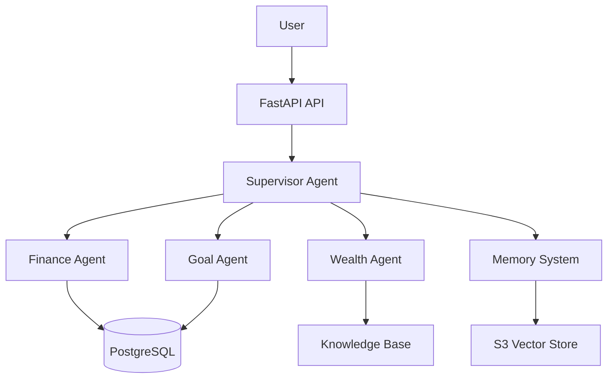
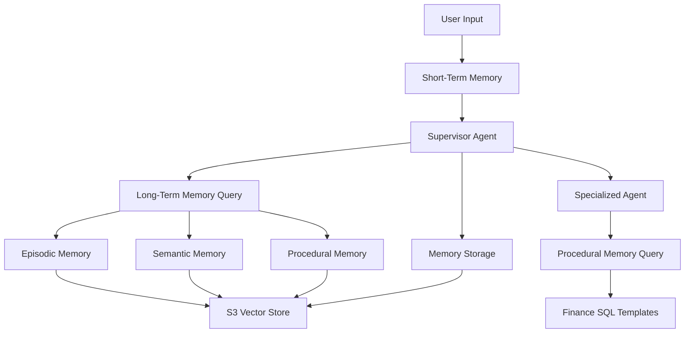
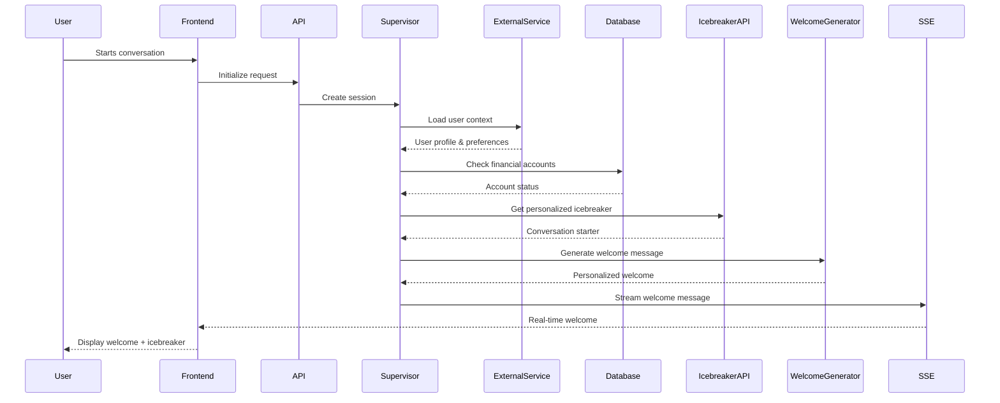
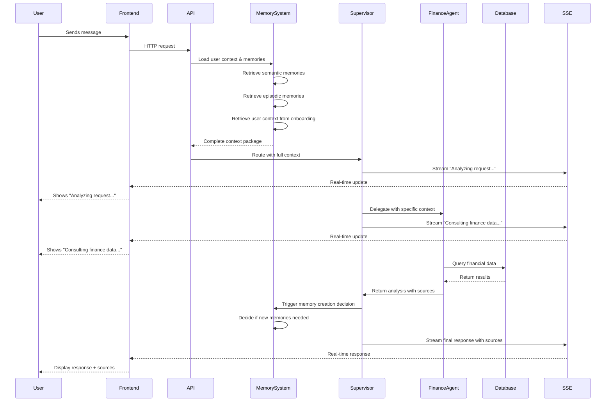
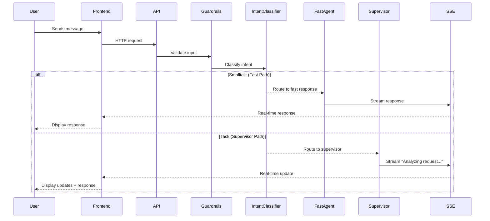

# Vera AI - High-Level Architecture Overview

## Overview

Vera represents a sophisticated multi-agent AI system built on LangGraph that delivers personalized financial assistance through a carefully orchestrated network of specialized agents managed by a central supervisor. The system's architecture is designed around the principle of delegation over execution, where specialized agents handle domain-specific tasks while the supervisor maintains conversational flow and context. This approach ensures that each interaction feels natural, personalized, and contextually aware while leveraging the full power of modern AI models and cloud infrastructure.

The system integrates seamlessly with external services, manages multiple layers of memory to create persistent user understanding, and provides real-time conversational experiences through advanced streaming technology. Vera's architecture is built for scale, reliability, and personalization, making it capable of serving thousands of users while maintaining the intimate, contextual experience that makes each conversation feel unique.

## High-Level System Architecture

## Stack & Core Technologies

Vera's technology stack is carefully chosen to support the complex requirements of a multi-agent AI system while maintaining high performance and reliability. The backend is built on FastAPI, which provides excellent async support for handling concurrent users and real-time communication. This foundation allows Vera to process multiple conversations simultaneously while maintaining responsiveness.

The core orchestration is handled by LangGraph, a powerful framework specifically designed for building multi-agent systems. LangGraph provides the infrastructure needed to coordinate between different agents, manage conversation state, and handle complex workflows that span multiple specialized components.

For AI inference, Vera leverages AWS Bedrock with a multi-model strategy that selects the most appropriate model for each task and latency profile. In practice, this includes GPT-120B OSS, Amazon Nova Micro, and Amazon Nova Pro depending on the context. This approach ensures that Vera can handle everything from simple conversations to complex financial analysis with the right level of intelligence and responsiveness. Note: The complete AWS deployment includes dev, UAT, and production environments with additional infrastructure components not covered in this document. Additional technical documentation is available in the `docs/` folder for detailed implementation guides.

Data persistence is handled through PostgreSQL for structured data and AWS S3 for vector storage and file management. This hybrid approach allows Vera to efficiently store both relational data like user accounts and financial transactions, as well as vector embeddings for semantic search and memory systems.

The system also integrates AWS Secrets Manager for centralized configuration and credentials management, ensuring that sensitive information is handled securely and can be updated without code changes. Langfuse provides comprehensive LLM observability and tracing, giving the team visibility into how the AI models are performing and where optimizations can be made.

Key libraries include LangChain for LLM framework and tools, SQLAlchemy for database operations, Pydantic for data validation, Server-Sent Events for real-time streaming, and Boto3 for AWS service integration. Each library is chosen for its specific strengths and how well it integrates with the overall architecture.

## Architecture Pattern: Multi-Agent Orchestration

Vera's architecture follows a sophisticated multi-agent orchestration MAS (Multi Agentic System) pattern that represents a significant advancement over traditional monolithic AI systems. Instead of trying to build one agent that knows everything, Vera employs a network of specialized agents, each optimized for specific domains, coordinated by a central supervisor agent.

The supervisor agent acts as the central decision maker and response coordinator, analyzing incoming requests and determining which specialized agent is best suited to handle the task. This delegation approach allows each agent to be finely tuned for its particular expertise, resulting in more accurate and relevant responses than a single general-purpose agent could provide.

The specialized agents include a finance agent that excels at SQL generation and financial data analysis, a finance capture agent that focuses on structured persistence of user-provided financial entries, a goal agent that manages financial goal setting and tracking, and a wealth agent that provides financial education through knowledge base search. The system also includes a fast path response agent for low-latency smalltalk handling. Each agent has access to domain-specific tools and knowledge, allowing them to provide deep, expert-level assistance in their areas of specialization.

The system also includes a guest agent that provides limited functionality for unauthenticated users, ensuring that everyone can experience Vera's capabilities while to encourage registration for full access. This tiered approach allows Vera to serve a broad audience while providing enhanced features for engaged users.

## Architecture Pattern: Multi-Agent Orchestration

## Intent Classification & Fast Path Optimization

While Vera's core architecture is built around a supervisor-driven multi-agent system, the runtime execution path includes an additional optimization layer that routes certain messages through a lightweight path. This intent classification layer exists to keep the user experience responsive for short, non-task messages (greetings, acknowledgments, quick confirmations) without incurring the full cost of memory injection and multi-agent orchestration.

At the start of each turn, Vera classifies the user message using a combination of structural signals (message length, punctuation, question patterns), domain-specific veto gates (finance, goal, and action markers), and fast LLM classification. If a message is determined to be smalltalk, the system routes it to a fast response agent designed specifically for low-latency conversational replies. If a message is determined to be a task, it follows the full supervisor path, including long-term memory retrieval and delegation to specialized agents.

This fast path is intentionally conservative. If the classifier is uncertain, the system defaults to the supervisor path to preserve quality and correctness.

## Agent System Design

The agent system represents the heart of Vera's intelligence, with each component designed to excel in its particular domain while working seamlessly with the overall system. This architecture implements a sophisticated variation of the traditional orchestrator pattern that uses composition and isolation of derived states to create a more efficient and scalable system.

### Orchestrator Pattern with State Isolation

Unlike traditional orchestrator patterns where the central coordinator passes the entire conversation context to every agent, Vera's approach uses intelligent state isolation and delegation. When the supervisor determines that a specialized agent is needed, it doesn't simply pass the entire conversation history. Instead, it carefully extracts only the specific information that the agent needs to perform its task effectively.

This approach works much like a well-organized company where different departments work on specific aspects of a project. The supervisor acts as the project manager who understands the overall context and user needs, then delegates specific tasks to specialized teams (agents) with only the relevant information they need to complete their work. Each specialized agent operates in its own isolated context, focused solely on its domain expertise, and then returns a comprehensive analysis to the supervisor.

The orchestrator maintains the flexibility to merge information from multiple agents and can call more than one subagent if it determines that a comprehensive response requires insights from multiple domains. This allows Vera to handle complex queries that span multiple areas of expertise while maintaining the efficiency benefits of state isolation.

### Benefits of State Isolation and Delegation

This delegation pattern with state isolation provides several critical advantages. It enables long conversations by preventing context window overflow, delivers quicker answers by allowing agents to focus on specific tasks without processing irrelevant history, and maximizes LLM context window utilization by filling each agent's context with relevant, actionable information rather than historical conversation data. The isolation also creates a more robust system where each agent can be optimized independently, making the system more maintainable and allowing for continuous improvement without system-wide changes.

### Specialized Agent Capabilities

The finance agent specializes in financial data analysis and SQL generation, using procedural memory to access pre-built SQL templates for fast and accurate analysis of spending patterns, net worth calculations, and income/expense tracking. The goal agent manages financial goal setting and tracking, helping users define and achieve their objectives with persistent state across conversations. The wealth agent focuses on financial education through knowledge base search, providing evidence-based information from authoritative sources. The guest agent offers limited functionality for unauthenticated users, providing a taste of Vera's capabilities while encouraging registration for full access.

Vera also includes a finance capture agent focused on reliably converting natural language into structured financial entries (assets, liabilities, and manual transactions). This flow is designed to be explicit and trustworthy, supporting confirmation when needed before data is persisted. In practice, the capture system supports multi-intent extraction, allowing a single user message to include multiple items that are confirmed and persisted as a cohesive operation.

The wealth agent includes an additional user experience capability: when answering questions about Vera's own app features, it can emit navigation events that guide the frontend to the most relevant UI surface (for example, connecting accounts or viewing a report). This creates a tighter loop between knowledge retrieval and product interaction, keeping answers actionable rather than purely informational.

## Memory System Architecture

Vera's memory system is designed as a two-tier architecture that handles both immediate conversation state and long-term persistent knowledge. This dual approach ensures that conversations feel natural and contextual while building up a rich understanding of each user over time.

### Short-Term Memory: Conversation State Management

The short-term memory system is built on LangGraph's checkpointer technology, which serves as the backbone for maintaining conversation continuity. When a user starts a conversation, the system creates a unique thread ID and persists the complete conversation state through a custom Redis-backed checkpointer abstraction. This includes not just the message history, but also which agent is currently active, any pending tool calls, and the overall conversation context.

When a conversation resumes after a break, the system can restore the complete state, allowing for natural continuation. The checkpointer also handles automatic cleanup, removing old sessions to prevent memory bloat while keeping active conversations responsive.

This Redis-backed approach makes session continuity resilient across multi-instance scaling and restarts, while preserving the same conceptual role described above: maintaining the full conversation state required to resume and continue a thread naturally.

### Long-Term Memory: Persistent Knowledge Storage

While short-term memory handles the immediate conversation flow, the long-term memory system is responsible for building and maintaining persistent knowledge about users across all their interactions. This system uses a BaseStore abstraction over S3 with vector embeddings, allowing for semantic search and retrieval.

The long-term memory is organized into three distinct but interconnected types, each serving a specific purpose in creating a comprehensive understanding of the user and their needs.

### Episodic Memory: Capturing Conversation Events

Episodic memory acts as Vera's "diary," capturing the important moments and outcomes from conversations. This isn't just about storing what was said, but understanding what happened and why it matters. This section stores past interactions the user had with Vera, for example "Last week we talked about how you liked pottery but it hurt your bottomline". The system uses algorithms to determine what's worth remembering, avoiding the trap of storing every trivial exchange while ensuring nothing important is lost.

The system employs a cooldown mechanism that prevents memory spam by requiring at least three turns and ten minutes between creating new episodic memories. It also uses novelty detection with a 90% similarity threshold, meaning it only stores information that's truly new and different from what's already been captured. This ensures that the memory system builds a rich, diverse understanding without redundancy.

Episodic memories are also subject to daily limits (maximum of five per day) and a merge window system where similar memories created within 48 hours are automatically merged or recreated to avoid fragmentation. This creates a clean, organized memory that tells a coherent story of the user's journey.

These values are designed as operational controls rather than hard-coded constants. In practice, the cooldown windows, daily limits, merge windows, and novelty thresholds are configurable, allowing Vera to tune memory creation rates while protecting against memory spam and preserving relevance.

### Semantic Memory: User Knowledge and Preferences

Semantic memory is where Vera builds its understanding of who the user is, what they care about, and how they prefer to interact. This goes far beyond simple preferences to include their financial goals, personal characteristics, relationship patterns, and the subtle nuances that make each conversation feel personal and relevant.

The system uses importance scoring on a 1-5 scale to prioritize memories, ensuring that the most significant information about the user is always readily available. Memories are organized into categories like Finance, Goals, Personal, and Education, making it easy to retrieve contextually relevant information.

One of the most sophisticated aspects of semantic memory is its merge logic, which automatically combines or recreates similar memories to maintain a clean, coherent understanding. The system also includes a fallback mechanism that gracefully degrades when primary memory operations fail, ensuring reliability even under stress.

### Procedural Memory: Few-Shot Sampling and Pattern Injection

Procedural memory serves as Vera's library of proven patterns, templates, and examples that enable few-shot sampling for improved performance. Instead of relying solely on the model's training data, Vera can inject specific, relevant patterns into the context based on the user's current question, providing the model with concrete examples of how to handle similar situations.

This system is used in two key places within Vera's architecture. First, the orchestrator uses procedural memory to help with routing decisions, accessing patterns that show how similar requests were handled in the past. This helps the supervisor make more informed decisions about which specialized agent to delegate to and how to structure the delegation.

Second, the finance agent leverages procedural memory extensively for SQL query generation. When a user asks about their spending patterns, the system retrieves relevant SQL templates and query patterns from procedural memory, then injects these as few-shot examples into the finance agent's context. This approach dramatically reduces the time needed to generate complex queries and improves accuracy by providing the model with proven patterns rather than requiring it to generate everything from scratch.

The procedural memory system uses semantic retrieval to find the most relevant patterns based on the specific question and context, ensuring that the injected examples are directly applicable to the current task. This makes the system more intelligent and adaptive, as it can learn from successful patterns and apply them to new but similar situations.

Procedural memory is treated as a system-wide capability, not user-specific personal data. This allows Vera to maintain a shared library of best practices (such as routing examples and finance SQL templates) that improves consistency and quality across all user conversations.

### Hot Path and Cold Path Memory Processing

To keep Vera responsive, the memory pipeline separates retrieval from creation. Memory retrieval happens on the critical path of the conversation turn, loading relevant episodic, semantic, and procedural context before the supervisor reasons about the user's request. Memory creation and merge decisions, however, can be more expensive and are handled asynchronously after the user receives a response.

This hot/cold split makes the system feel fast while still building deep personalization over time. The cold path processes memory creation in the background, applying novelty detection, importance scoring, merge logic, and storage updates without blocking the main user interaction loop.

### Profile Synchronization

As semantic memory evolves, Vera also maintains a structured representation of user context in the primary database. When the memory system learns or updates stable user attributes (preferences, location, tone, goals), the system synchronizes these changes back into the persisted user context. This ensures that personalization remains consistent across both the memory layer and the structured data layer, and that key user attributes are reliably available even when full memory retrieval is constrained.

### Memory Flow Architecture

## Data Flow

Vera's data flow operates through a initialization and processing system that provides complete transparency to users. The system shows real-time updates about what's happening behind the scenes, from initial setup through final response delivery.

### System Initialization and Startup

Before any user interaction, Vera performs comprehensive system initialization. During application startup, the system warms up AWS clients to avoid first-request latency, initializes database connections, and starts background cleanup tasks for cached agents. This pre-computation ensures that when users interact with Vera, the system is ready to respond immediately without cold-start delays.

The system also loads configuration from AWS Secrets Manager, including model fallback configurations and guardrail settings, ensuring that all agents have the necessary context and safety measures in place from the moment the application starts.

During initialization, Vera also prepares key knowledge and memory assets used at runtime. This includes verifying Redis connectivity, preparing background executors, and seeding procedural memories that power routing patterns and finance SQL template injection. These steps reduce the chance of first-request delays and ensure that the system's most important guidance data is immediately available.

### User Session Initialization

When a user first starts a conversation, Vera performs a comprehensive initialization sequence. The system creates a State object that's cached and reused with already injected user information, making subsequent interactions quicker. This state is persisted in Redis for scalability and persistence, with ongoing work captured in an open pull request to complete the rollout and harden operational behavior.

The initialization process loads the user's complete context from external services, checks for existing financial accounts, retrieves personalized icebreaker hints to start conversations naturally, and generates a customized welcome message. For users with financial accounts, the system also pre-fetches financial data samples in the background to ensure fast response times for financial queries.

### Message Processing Flow

Once initialized, each user message follows a detailed processing sequence:

**Step-by-Step Breakdown:**

1. **User Input & Memory Injection**: User sends message → API loads three types of context before routing to supervisor:
   - **Semantic memories**: Structured knowledge about the user's preferences and important information
   - **Episodic memories**: Past conversation events and outcomes that are relevant
   - **User context**: Pre-determined important user fields created during onboarding but updated each turn
2. **Supervisor Processing**: Supervisor receives complete context package and streams "Analyzing request..."
3. **Agent Delegation**: Supervisor determines which specialized agent is needed and delegates with relevant context
4. **Specialized Processing**: Finance agent queries database and processes data with source attribution
5. **Memory Decision**: System decides whether to create new memories based on the conversation
6. **Final Response**: Complete answer with sources is streamed back to user

### Fast Path Execution for Smalltalk

In addition to the main supervisor path described above, Vera can route certain messages through a fast path when they are classified as smalltalk. This path is designed for speed and reduces unnecessary overhead for non-task interactions.

### Real-Time Transparency and Source Attribution

Throughout the entire process, Vera provides complete transparency by streaming real-time updates about what's happening. Users see live updates like "Analyzing your request...", "Consulting your financial data...", or "Searching knowledge base..." as the system works through their question.

This transparency builds user trust by showing that Vera is actively working on their behalf. The system remembers each user's context and history, ensuring responses are personalized and relevant. When Vera provides answers, it always includes the sources used - whether from the user's personal data, financial records, or authoritative knowledge bases - so users understand where the information comes from.

The system also performs intelligent pre-computation, such as fetching financial samples for users with accounts during initialization, ensuring that subsequent financial queries can be processed quickly without additional database round-trips.

## Onboarding System

Vera's onboarding system is a deterministic flow that gathers essential user information while maintaining a conversational experience. The system creates the foundational user context that powers Vera's personalization capabilities.

### Onboarding Flow

The system operates as a state machine with predefined steps that build a comprehensive user profile while allowing users to skip non-essential questions. The flow includes:

1. **Presentation & Name Collection**: Vera introduces herself and asks what the user would like to be called
2. **User Choice**: Users can choose to answer questions or skip directly to open chat
3. **Age Verification**: Date of birth collection to ensure users are 18+ (with graceful handling for underage users)
4. **Location Gathering**: City and state information to understand local living costs
5. **Housing Information**: Monthly rent or mortgage details (optional)
6. **Money Feelings Assessment**: Understanding the user's emotional relationship with money
7. **Income Information**: Either exact income or income range selection
8. **Account Connection**: Option to connect bank accounts for automatic data import
9. **Subscription Notice**: Clear communication about the free trial and subscription model

### Intelligent Processing

The onboarding system combines LLM-powered extraction with rule-based validation for natural language inputs like names and locations. It includes intelligent skip logic, allowing users to bypass non-essential questions while maintaining data quality. The system provides real-time streaming updates and maintains conversation state, ensuring users can resume if interrupted.

Upon completion, the system creates a comprehensive user context including demographic information, financial details, emotional preferences, and user choices that inform how Vera interacts with the user in future conversations. This ensures every user interaction with Vera is personalized from the very first conversation, while respecting user privacy and choice throughout the process.

## Nudges and Icebreakers System

Vera's nudges and icebreakers system provides proactive, personalized engagement that keeps users connected to their financial goals and maintains ongoing conversations through intelligent evaluation strategies.

### Nudges System

The system processes different types of financial events and user behaviors to generate timely, relevant notifications through a strategy-based architecture. Key nudge types include:

1. **Bill Reminders**: Monitors upcoming payments with priority-based notifications (overdue, due today, etc.)
2. **Memory Icebreakers**: Converts episodic memories into conversation starters

The system employs evaluation logic that considers user conditions, prevents over-nudging through activity counting, and prioritizes based on urgency and importance. Nudges are delivered through multiple channels with deduplication logic and expiration times to ensure relevant, timely delivery.

### Icebreakers Integration

The icebreaker system converts episodic memories into natural conversation starters. When users start new conversations, the system retrieves the highest-priority memory icebreaker and incorporates it into the welcome message, creating continuity between conversations and helping users remember important discussions or goals.

This creates a proactive user experience where Vera reaches out to users with relevant information and reminders, rather than waiting for users to initiate conversations.

## Global State Management and Layered Architecture

Vera employs a singleton pattern for global state management combined with a layered architecture pattern (routers → services → repositories) that ensures efficient resource utilization, intelligent caching, and optimal performance across the entire system.

### Layered Architecture Pattern

The system follows a clean layered architecture where routers handle HTTP requests and route them to appropriate services, services contain business logic and orchestrate operations, and repositories manage data access and persistence. This separation of concerns ensures maintainability, testability, and scalability while providing clear boundaries between different layers of the application.

### Singleton State Management

The system uses a comprehensive singleton pattern implemented in `app_state.py` that manages critical resources including agent instances, AWS clients, session queues, and multi-level caching systems. This pattern ensures that expensive resources like LLM agents and database connections are created once and reused efficiently across all user interactions.

Key singleton-managed components include agent instances (supervisor, finance, wealth, goal, and onboarding agents), AWS clients (Bedrock, S3, S3Vectors), session management (SSE queues, thread locks), and caching systems for both user-specific data and agent instances.

### Multi-Level Caching and Resource Optimization

The system implements intelligent multi-level caching with configurable TTL periods for agent instances and finance data samples, automatic cleanup mechanisms to prevent memory bloat, and AWS client pooling with connection pooling (20 connections), retry logic, and warmup procedures during startup.

This centralized state management approach provides the foundation for Vera's scalability and reliability, ensuring that the system can efficiently serve thousands of users while maintaining optimal performance and resource utilization.

## Key Design Decisions

The architecture of Vera reflects several key design decisions that prioritize scalability, maintainability, and user experience. The multi-agent approach represents a fundamental shift from traditional monolithic AI systems, recognizing that specialization leads to better performance and more accurate responses. By allowing each agent to focus on its area of expertise, the system can provide deeper, more relevant assistance while maintaining a cohesive user experience through the supervisor's coordination.

The memory-first architecture recognizes that personalization is the key to effective AI assistance. By maintaining multiple layers of memory, from immediate conversation context to long-term user understanding, Vera creates a sense of continuity and personal relationship that makes each conversation more valuable than the last. This approach ensures that users don't have to repeat information and that the system can provide increasingly relevant and helpful responses over time.

The AWS secrets management and model fallback system provides enterprise-grade reliability and flexibility. By centralizing configuration through AWS Secrets Manager and implementing automatic failover between ACTIVE and STANDBY regions, Vera can handle infrastructure failures gracefully while maintaining service availability. The integration of GPT-120B OSS alongside the Amazon Nova family gives the system flexibility to choose the most appropriate model for each task, ensuring optimal performance across different types of requests.

Event-driven communication enables real-time, responsive interactions that feel natural and engaging. Through server-sent events and asynchronous processing, Vera can stream responses in real-time, handle complex multi-step operations without blocking, and manage background tasks efficiently. This creates a conversational experience that feels immediate and alive, rather than the delayed, batch-processed responses that characterize many AI systems.

## Knowledge Base and Vector Services

Vera's knowledge base system supports both user-facing financial education and internal product guidance about Vera itself. While the high-level architecture is often described as \"Knowledge Base over S3 vectors,\" the operational system includes a synchronization and orchestration layer that keeps the vector store consistent across multiple sources.

External knowledge sources are discovered and managed through the FOS API rather than through a local JSON configuration file. Internal documents can also be synced from S3 as first-class sources, supporting team-managed knowledge artifacts and product guidance content. A unified synchronization service orchestrates these inputs, performing crawling or file ingestion, chunking, hash-based change detection, embedding generation, and storage into the S3-backed vector store.

This approach allows Vera to maintain a single retrieval interface for internal and external knowledge while keeping the source-of-truth flexible and operationally manageable.

## Security and Guardrails System

Vera includes a comprehensive guardrails system designed to protect user privacy, maintain safe outputs, and harden the application against adversarial inputs. This system sits close to the point of ingress and is reinforced during streaming response delivery.

On input, Vera performs validation to detect common prompt injection patterns, blocked topics, and PII-like content. On output, Vera validates generated content during streaming to prevent accidental disclosure of sensitive context, and applies additional safety classification for high-risk categories. These controls are configurable and designed to balance safety with user experience, avoiding unnecessary false positives while ensuring that privacy and safety remain first-class system concerns.

## Configuration Architecture

Vera's configuration architecture is designed to provide flexibility, security, and reliability. The AWS Secrets Manager integration provides centralized configuration management with nested secret support, allowing for complex configuration scenarios while maintaining security. The system can load secrets from multiple sources, with Aurora credentials and FOS_AI secrets handled with proper priority and fallback mechanisms.

The dynamic reloading capability allows the system to update configuration at runtime without requiring restarts. This is particularly valuable for a production system where downtime needs to be minimized. The fallback system provides ACTIVE and STANDBY model regions with automatic switching, ensuring that the system can handle infrastructure changes and failures gracefully.

Environment variable overrides allow for local development and testing while maintaining the security of production configurations. The system's configuration validation ensures that all required settings are present and valid before the system starts, preventing runtime errors due to misconfiguration.

The model configuration system supports multiple models (GPT-120B OSS and the Amazon Nova family, including Nova Micro and Nova Pro) with per-agent configuration, allowing each agent to be optimized for its specific use case. Guardrail management is centralized with fallback capabilities, ensuring that content safety is maintained even when primary guardrails fail. The reasoning effort levels are configurable per agent, allowing the system to balance performance and accuracy based on the specific requirements of each use case.

In practice, operations also rely on built-in runtime inspection and reload mechanisms. Vera exposes health signals for key dependencies (database, Redis, and procedural memory readiness) and supports controlled configuration reload workflows for secrets and prompt configuration updates. This operational tooling is a key part of running the system reliably across environments while iterating on agent behavior safely.
