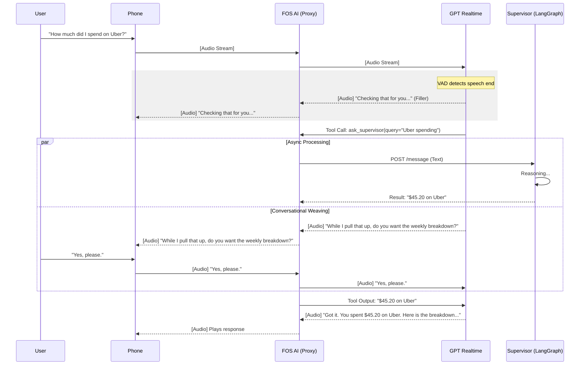
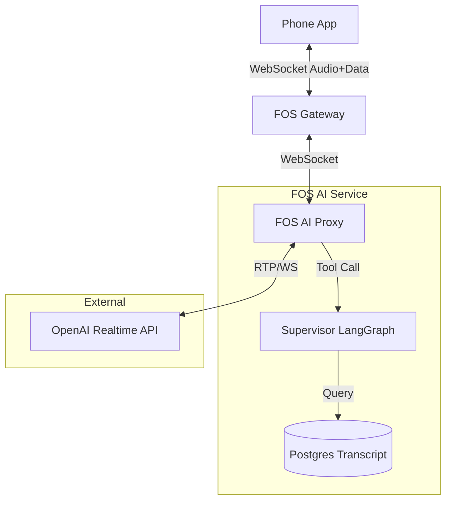

## Problem Statement & Assumptions

- Add a Voice Mode to Vera that delivers low-latency, bidirectional, full-duplex conversations with the existing Supervisor orchestration stack.
- Voice experience must reuse the Supervisor (LangGraph) pipeline for all authoritative reasoning, finance actions, and context.
- Sidecar/voice agent may handle small talk and UX-level dialogue but cannot bypass Supervisor for data or state changes.
- Sessions today are single-thread-per-user; voice mode should keep that invariant unless explicitly extended.

## Current Architecture (Text Mode)

1. Client posts final text turns to `POST /supervisor/message`.
2. Supervisor runs LangGraph (state in Redis checkpointer) and streams SSE events (`token.delta`, `tool.*`, `message.completed`) over `GET /supervisor/sse/{thread_id}`.
3. Client renders text; audio is synthesized optionally via `/audio/sse/{thread_id}` using Bedrock/OpenAI TTS after Supervisor finishes.
4. Conversation transcript is stored in `InMemorySessionStore` for UI and summary; Redis checkpointer persists graph state.

## Requirements for Voice Mode

- Streaming audio input from client to voice stack.
- Streaming audio output back to client with <500ms token-to-speech latency.
- Ability to interleave small talk + progress updates without blocking Supervisor.
- Support for session start/stop, idle timeout (~5 min), max duration (~30 min), reconnect/resume semantics.
- Error, cancellation, and human-review flows consistent with existing Supervisor policies.
- Frontend POC needs explicit protocols, headers, codecs, and SSE/WebSocket expectations.

## Recommended Architecture: Audio Proxy (FOS AI)

### High-Level Design

FOS AI acts as a **secure WebSocket bridge** between the FOS backend and OpenAI Realtime API. It proxies audio streams and intercepts tool calls to query the internal Supervisor.

**Key Design Decisions:**
- **Intelligence:** **OpenAI Realtime API (Audio-to-Audio)** selected for native interruptibility, emotional intelligence, and sub-second latency.
- **Orchestration:** FOS AI manages the session, injecting Supervisor data as async tool outputs.
- **TTS/STT:** Handled entirely by OpenAI Realtime (no local models) for maximum naturalness.
- **History:** Unified transcript stored in Postgres (User Audio Transcript + Assistant Audio Transcript).

### Components

1.  **Client (Phone App):**
    - Connects to FOS (Auth/Gateway).
    - Captures/plays Audio (PCM/Opus).
    - "Push-to-talk" or VAD-enabled microphone.

2.  **FOS Backend (Auth/Routing):**
    - Authenticates user (Clerk).
    - Proxies WebSocket connection to FOS AI.

3.  **FOS AI Service (The Bridge):**
    - **Voice Agent Module:**
        - Establishes WebSocket to OpenAI Realtime.
        - Proxies Audio Bidirectionally.
        - Defines `ask_supervisor` tool in session config.
        - Handling: When OpenAI calls tool, FOS AI executes it against the local Supervisor instance.
    - **Supervisor Module:** Existing LangGraph engine (unchanged).
    - **Transcript Store:** Postgres table logging the *communicated* conversation (for text-mode consistency).

### Sequence Diagram: The "Weaving" Flow



### Component Diagram



### Data Flow

1.  **Audio Up:** Phone → FOS → FOS AI → OpenAI Realtime.
2.  **Tool Interception:** OpenAI emits `function_call` → FOS AI executes Supervisor → FOS AI sends `function_output`.
3.  **Audio Down:** OpenAI generates audio (with answer) → FOS AI → Phone.
4.  **Visuals/Data:** FOS AI pushes non-audio events (tables, confirmation modals) down the same WebSocket to the Phone.
5.  **History:** FOS AI logs the *text transcript* provided by OpenAI events (`response.audio_transcript.done`) to Postgres.

### Integration Requirements

- **Endpoints:**
  - `WS /voice/stream` (Authenticated via FOS).
  - `/voice/history/{thread_id}` (Fetch unified transcript).
- **Protocols:**
  - **Transport:** Secure WebSocket (WSS).
  - **Audio:** Bi-directional stream (G.711 PCM or Opus).
  - **Data:** JSON messages for `tool.visual_update` (e.g., showing a chart while speaking).
- **Tool Definition:**
  ```json
  {
    "type": "function",
    "name": "ask_supervisor",
    "description": "Query financial data or perform actions via the Supervisor agent.",
    "parameters": { "type": "object", "properties": { "query": { "type": "string" } } }
  }
  ```
- **Front-end Constraints:**
  - **Mode Locking:** UI must prevent switching to Text Mode while a Voice turn is processing to avoid state desync.
  - **Visual Sync:** App listens for specific JSON events on the WebSocket to trigger native UI elements (modals, graphs) synchronized with the audio.

## Risks & Open Questions

- **Concurrency:** Supervisor currently supports one active turn per thread; voice sidecar must serialize POSTs or create dedicated thread IDs per mode.
- **Fan-out SSE:** need multi-subscriber queue so text UI and voice agent can read simultaneously without drop.
- **Transcript storage:** determine source of truth (Postgres vs Redis); ensure GDPR compliance for audio/text logs.
- **Authentication:** voice mode likely runs in same auth context; must guard against token hijack when streaming from browsers.
- **Vendor lock-in:** evaluate cost/perf of OpenAI Realtime vs local STT/TTS.
- **Cancellation:** no `/cancel` yet; voice UX must communicate inability to interrupt long-running operations until feature is added.
- **Human review:** `confirm.request` triggers both verbal explanation AND UI modal; user can confirm via either channel. Voice agent must wait for confirmation before proceeding.
- **Voice rendering rules:** Need explicit mapping for each Supervisor event type → spoken output. Tables, charts, and structured data require summarization logic.

## Implementation Plan (High-Level)

1. **Phase 0 – Foundations**
   - Migrate SSE stack to **AWS Pub/Sub** for multi-subscriber/container support.
   - Implement transcript persistence (Postgres) with voice/text mode metadata.
   - Document Supervisor session lifecycle and expose `/voice/transcript`.
2. **Phase 1 – Voice Proxy Implementation**
   - Build **FOS AI Proxy Service**: WebSocket server authenticating via FOS backend.
   - Integrate **OpenAI Realtime API** (WebSockets) for audio streaming.
   - Implement `ask_supervisor` tool:
     - Map tool call arguments to internal Supervisor API (`POST /message`).
     - Handle async tool outputs and inject back to OpenAI stream.
   - Build **Transcript Logger**: Capture `response.audio_transcript` events to Postgres.
3. **Phase 2 – Orchestration & UX**
   - Refine "Weaving" behaviors: Filler phrases, interruption handling.
   - Implement visual sync (pushing tables/modals to frontend via FOS socket).
   - Add session management (start/stop, idle timeout, heartbeats).
   - Logging, monitoring, cost telemetry.
4. **Phase 3 – Harden & Launch**
   - Security review, auth flows, rate limiting.
   - Scalability tests (N concurrent sessions), latency instrumentation.
   - Rollout plan + feature flag.

## Recommendation Summary

- **Adopt Audio Proxy architecture (FOS AI)**: Leverages OpenAI Realtime for best-in-class conversational UX while keeping Supervisor authoritative.
- **FOS AI as the Bridge**: Handles authentication, session management, and the critical `ask_supervisor` tool integration.
- **Unified History**: Postgres store ensures seamless text/voice switching.
- **Async "Weaving"**: Delivers natural, non-blocking answers even for complex queries.

